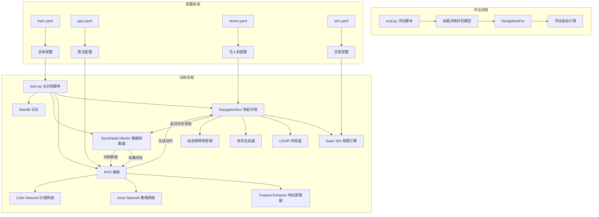
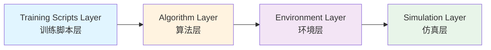
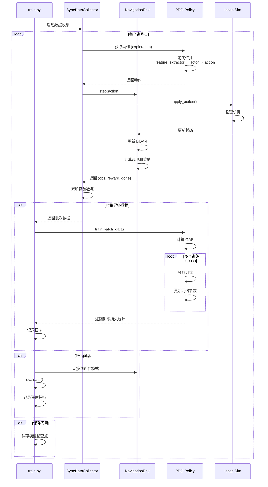
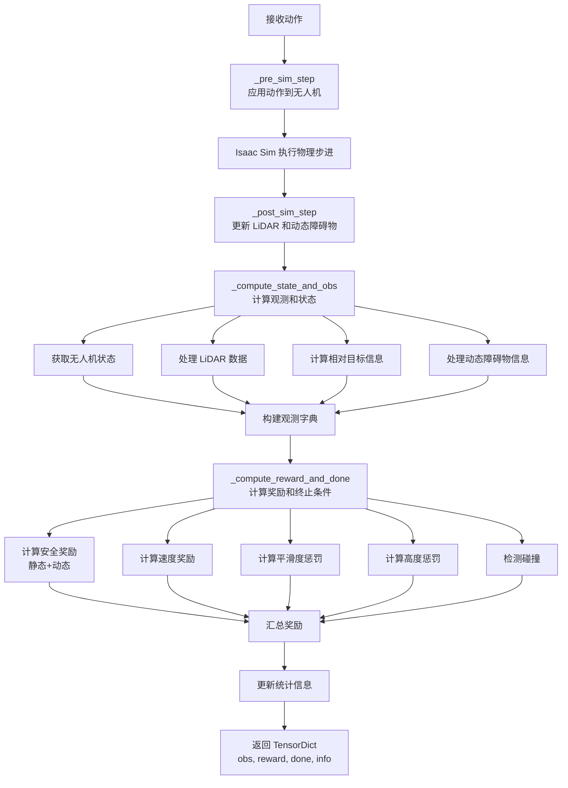

# NavRL 无人机导航强化学习训练系统 - 总体架构

## 🆕 重要说明：新旧架构并存

本系统支持**两种并行架构**：

| 维度 | 原始架构（CNN+Beta） | 新架构（Graph+Transformer） |
|------|-------------------|----------------------|
| **触发方式** | `python train.py` 或 `mode=ppo` | `python train.py mode=graph_ppo` |
| **文档** | [00-05]本文件及以下 | [06-11]详见新架构总览 |
| **特征提取** | CNN卷积特征 | 拓扑图表示 |
| **策略输出** | Beta分布→连续速度 | 离散节点选择 |
| **安全保障** | 训练依赖 | QP优化器 |
| **实时性** | 单频率 | 分层多速率 |

**如何选择**：
- 启动原始系统：`python train.py headless=True` （默认）
- 启动新架构：`python train.py headless=True mode=graph_ppo` 
- 详细配置：见 [06-新架构总览](./06-新架构总览-拓扑图导航系统.md) 的阶段式改造计划

---

## 1. 项目概述

NavRL 是一个基于强化学习的无人机自主导航训练系统。该系统使用 PPO（Proximal Policy Optimization）算法训练无人机在复杂三维环境中完成点到点导航任务，避开静态和动态障碍物。

### 1.1 核心特性（原始架构）
- **基于 Isaac Sim 的物理仿真环境**
- **PPO 强化学习算法**
- **LiDAR 传感器模拟**（144维观测）
- **静态地形和动态障碍物**
- **分布式训练支持（多环境并行）**
- **Wandb 实验追踪**

### 1.1.1 新架构增强特性
若采用新架构（`mode=graph_ppo`），额外特性包括：
- **拓扑图表示**（10-20维稀疏表示，原144维降维11-14倍）
- **图Transformer推理**（结构感知的长程信息融合）
- **离散节点选择**（可解释的中间目标）
- **软约束QP安全盾**（实时碰撞规避保证）
- **分层多速率控制**（规划10Hz、控制62.5Hz解耦）

## 2. 整体系统架构

### 2.1 架构图



### 2.2 模块层次结构



## 3. 数据流图

### 3.1 训练循环数据流



### 3.2 环境步进数据流



## 4. 核心组件说明

### 4.1 训练脚本层 (Training Scripts Layer)

| 文件 | 功能 | 主要职责 |
|------|------|----------|
| **train.py** | 主训练脚本 | 初始化环境、策略、数据收集器，执行训练循环 |
| **eval.py** | 评估脚本 | 加载检查点，评估策略性能 |

### 4.2 算法层 (Algorithm Layer)

| 文件 | 功能 | 主要职责 |
|------|------|----------|
| **ppo.py** | PPO 算法实现 | 定义策略网络、价值网络、损失函数和优化器 |
| **utils.py** | 工具函数 | GAE计算、价值归一化、坐标转换等辅助功能 |

### 4.3 环境层 (Environment Layer)

| 文件 | 功能 | 主要职责 |
|------|------|----------|
| **env.py** | 导航环境 | 定义观测空间、动作空间、奖励函数、终止条件 |

### 4.4 配置层 (Configuration Layer)

| 文件 | 功能 | 配置内容 |
|------|------|----------|
| **train.yaml** | 主配置 | 训练总参数、环境数量、评估间隔 |
| **ppo.yaml** | 算法配置 | 学习率、裁剪比率、熵系数 |
| **drone.yaml** | 无人机配置 | 无人机模型、传感器参数 |
| **sim.yaml** | 仿真配置 | 物理参数、GPU设置、求解器配置 |

## 5. 关键技术点

### 5.1 观测空间设计

本系统使用混合观测空间：

1. **LiDAR 点云数据**：`(1, H, W)` 的深度图像
   - 水平分辨率：36 个方向（10° 间隔）
   - 垂直分辨率：4 个光束
   - 量程：4 米

2. **无人机内部状态**：8 维向量
   - 相对目标方向（单位向量）：3维
   - 水平距离：1维
   - 垂直距离：1维
   - 速度（目标坐标系）：3维

3. **动态障碍物信息**：`(1, N, 10)` 其中 N=5
   - 相对位置（归一化）：3维
   - 2D距离、Z距离：2维
   - 相对速度：3维
   - 宽度类别、高度类别：2维

### 5.2 动作空间

- **类型**：连续动作空间
- **维度**：3 (x, y, z 方向的速度命令)
- **范围**：[-2.0, 2.0] m/s (可在配置中调整)
- **分布**：Beta分布（保证动作在有界范围内）
- **坐标系**：相对于目标方向的局部坐标系，最后转换到世界坐标系

### 5.3 奖励函数设计

复合奖励函数包含以下组件：

```
R = R_vel + R_safety_static + R_safety_dynamic - P_smooth - P_height + R_terminal
```

| 组件 | 公式 | 权重 | 说明 |
|------|------|------|------|
| **速度奖励** | v · d̂ | 1.0 | 鼓励朝向目标移动 |
| **静态安全** | log(距离) | 1.0 | 鼓励远离静态障碍物 |
| **动态安全** | log(距离) | 1.0 | 鼓励远离动态障碍物 |
| **平滑惩罚** | ‖Δv‖ | 0.1 | 惩罚加速度变化 |
| **高度惩罚** | (Δh)² | 8.0 | 惩罚过高/过低飞行 |
| **终止奖励** | - | - | 到达目标或碰撞 |

### 5.4 坐标系转换

系统使用目标导向的局部坐标系：
- **X轴**：指向目标的方向
- **Y轴**：垂直于X轴的水平方向
- **Z轴**：竖直向上

这种设计使得策略学习更加高效，因为输入总是以"前往目标"为参考。

### 5.5 动态障碍物管理

- 支持两种类型：3D障碍物（立方体）和2D障碍物（长圆柱）
- 障碍物按大小分为 4×2=8 个类别
- 每个类别均匀分布多个障碍物
- 障碍物以随机速度在局部范围内移动
- 每2秒更新一次移动速度

## 6. 训练配置说明

### 6.1 默认训练参数

```yaml
最大训练帧数: 12亿帧
环境数量: 2 (可扩展到数百个)
最大回合长度: 2200 步
评估间隔: 每 1000 步
保存间隔: 每 1000 步
静态障碍物: 350 个
动态障碍物: 80 个
```

### 6.2 PPO 超参数

```yaml
学习率: 5e-4
训练 epoch: 4
Mini-batch 数量: 16
每次收集帧数: 32 × 环境数
裁剪比率: 0.1
熵系数: 1e-3
GAE λ: 0.95
折扣因子 γ: 0.99
```

## 7. 使用流程

### 7.1 训练流程

```bash
# 1. 进入训练脚本目录
cd training/scripts

# 2. 启动训练（修改配置文件后）
python train.py

# 3. 监控训练（通过 Wandb）
# 访问 wandb.ai 查看实时训练曲线
```

### 7.2 评估流程

```bash
# 1. 编辑 eval.py，设置检查点路径
checkpoint = "/path/to/checkpoint_final.pt"

# 2. 运行评估
python eval.py

# 3. 查看评估结果（在 Wandb 中）
```

## 8. 扩展性说明

### 8.1 可配置项

- 环境数量（并行训练）
- 障碍物数量和分布
- LiDAR 参数（量程、分辨率）
- 奖励函数权重
- 网络架构
- 无人机模型

### 8.2 可扩展方向

- 添加新的传感器（相机、IMU等）
- 实现其他RL算法（SAC, TD3等）
- 多智能体协同导航
- 动态目标追踪
- 地形自适应

## 9. 性能优化

### 9.1 GPU 加速

- 使用 GPU 管线进行物理仿真
- 张量运算全部在 GPU 上执行
- 支持 CUDA 设备

### 9.2 并行化

- 多环境并行仿真
- 批量数据处理
- 向量化环境操作

### 9.3 内存管理

- 使用 flatcache 减少内存占用
- 原地更新 TensorDict
- 优化 GPU 缓冲区配置

## 10. 依赖关系

### 10.1 核心依赖

```
- Isaac Sim (NVIDIA Omniverse)
- PyTorch
- TorchRL
- TensorDict
- OmniDrones (自定义无人机库)
- Isaac Orbit
- Hydra (配置管理)
- Wandb (实验追踪)
```

### 10.2 第三方库

项目依赖 `third_party/` 目录下的库：
- `OmniDrones/`: 无人机模型和控制器
- `orbit/`: Isaac 仿真框架扩展
- `rl/`: TorchRL 库
- `tensordict/`: 张量字典数据结构
- `warp/`: 高性能计算库

---

## 文档导航

- [01-环境模块详解](./01-环境模块详解.md)
- [02-PPO算法详解](./02-PPO算法详解.md)
- [03-训练脚本详解](./03-训练脚本详解.md)
- [04-工具函数详解](./04-工具函数详解.md)
- [05-配置说明](./05-配置说明.md)
