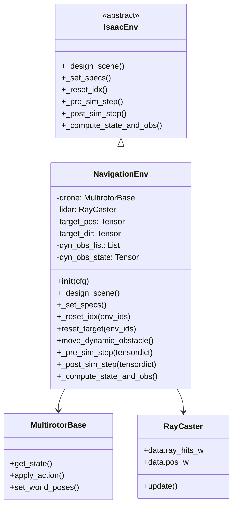
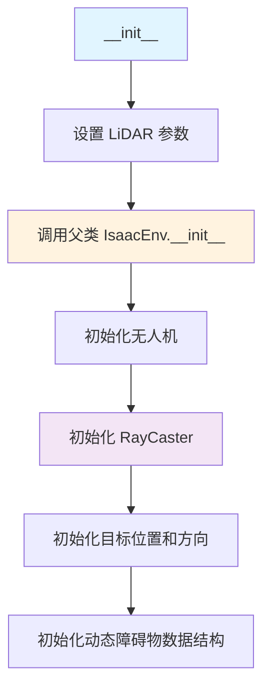
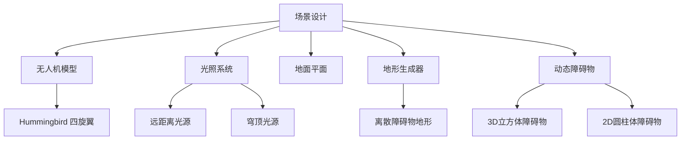
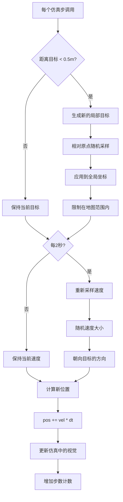
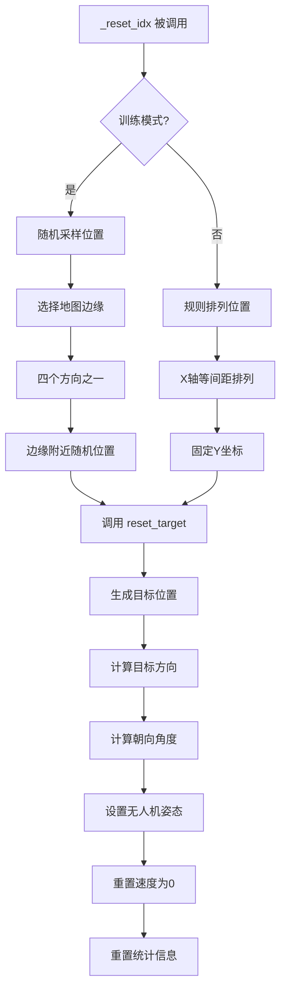
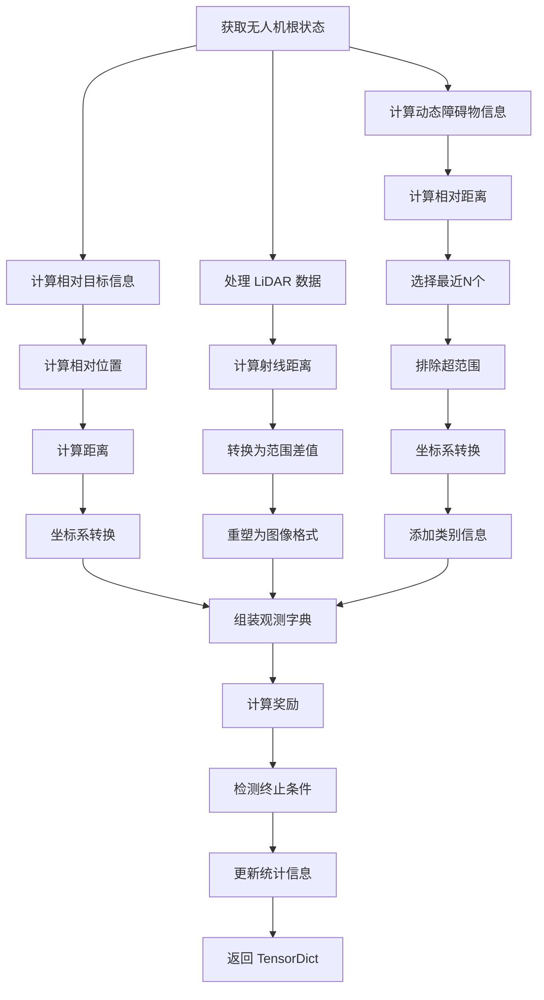
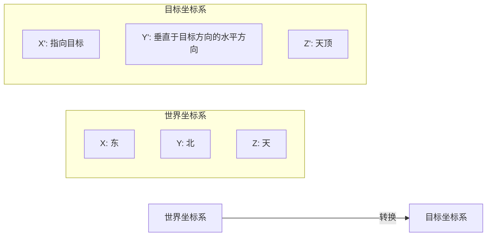

# NavRL 环境模块详解 (env.py)

## 1. 模块概述

`NavigationEnv` 是整个训练系统的核心环境，继承自 `IsaacEnv`，负责：
- 定义三维导航任务
- 管理 LiDAR 传感器
- 生成地形和障碍物
- 计算观测、奖励和终止条件
- 管理动态障碍物运动

## 2. 类结构



## 3. 初始化过程

### 3.1 构造函数流程



### 3.2 初始化函数详解

```python
def __init__(self, cfg):
    """
    初始化导航环境
    
    参数:
        cfg: Hydra 配置对象，包含所有环境参数
        
    初始化内容:
        1. LiDAR 传感器参数
        2. 无人机实例
        3. 目标位置和方向
        4. 动态障碍物管理器
    """
```

**关键参数说明**：

| 参数 | 类型 | 说明 |
|------|------|------|
| `lidar_range` | float | LiDAR 最大探测距离 (4.0m) |
| `lidar_vfov` | tuple | 垂直视场角 (-10°, 20°) |
| `lidar_vbeams` | int | 垂直光束数量 (4) |
| `lidar_hres` | float | 水平角度分辨率 (10°) |
| `lidar_hbeams` | int | 水平光束数量 (360/hres = 36) |

## 4. 场景设计 (_design_scene)

### 4.1 场景组成



### 4.2 函数详解

```python
def _design_scene(self):
    """
    设计仿真场景，包括所有静态和动态物体
    
    创建内容:
        1. 无人机模型 (Hummingbird)
        2. 光照系统 (DistantLight + DomeLight)
        3. 地面平面 (300m x 300m)
        4. 地形生成器 (TerrainImporter)
           - 使用 HfDiscreteObstaclesTerrainCfg
           - 生成随机高度的障碍物
        5. 动态障碍物管理器
           - 立方体: 3D可飞越障碍物
           - 圆柱体: 2D必须绕行障碍物
    
    地形参数:
        - 尺寸: 40m x 40m x 4.5m
        - 静态障碍物数量: 350 (可配置)
        - 障碍物高度: [1.0, 1.5, 2.0, 4.0, 6.0]
        - 障碍物宽度: [0.4, 1.1]
    """
```

### 4.3 动态障碍物分类

动态障碍物按大小和类型分为8个类别：

```
类别矩阵 (宽度 × 高度):
┌─────────────────────────────────────┐
│ 宽度区间 (4个) | 高度类型 (2个)      │
├─────────────────────────────────────┤
│ [0.00, 0.25]   | 3D (<1.0m) 可飞越  │
│ [0.25, 0.50]   | 2D (>1.0m) 绕行    │
│ [0.50, 0.75]   |                     │
│ [0.75, 1.00]   |                     │
└─────────────────────────────────────┘
```

**动态障碍物数据结构**：

```python
self.dyn_obs_list: List[RigidObject]  # 障碍物实例列表
self.dyn_obs_state: Tensor[N, 13]     # 当前状态 (位置、姿态等)
self.dyn_obs_goal: Tensor[N, 3]       # 目标位置
self.dyn_obs_origin: Tensor[N, 3]     # 初始位置
self.dyn_obs_vel: Tensor[N, 3]        # 当前速度
self.dyn_obs_size: Tensor[N, 3]       # 尺寸 (宽、高、深)
```

## 5. 动态障碍物运动 (move_dynamic_obstacle)

### 5.1 运动逻辑流程



### 5.2 函数详解

```python
def move_dynamic_obstacle(self):
    """
    更新所有动态障碍物的位置和速度
    
    步骤:
        1. 检查哪些障碍物需要新目标
           - 条件: 距离当前目标 < 0.5m
           
        2. 为需要的障碍物生成新目标
           - 在局部范围内随机采样
           - local_range: [5.0, 5.0, 4.5] m
           - 限制在地图边界内
           
        3. 每2秒更新速度
           - 速度范围: [0.5, 1.5] m/s
           - 方向: 指向当前目标
           
        4. 更新位置
           - 公式: pos_new = pos_old + vel * dt
           
        5. 同步到仿真引擎
           - 调用 write_root_state_to_sim()
           - 调用 write_data_to_sim()
           - 调用 update(dt)
    
    性能: 所有操作都是向量化的，在GPU上并行执行
    """
```

## 6. 规格定义 (_set_specs)

### 6.1 观测空间

```python
observation_spec = {
    "agents": {
        "observation": {
            "state": (8,),              # 无人机内部状态
            "lidar": (1, 36, 4),        # LiDAR 深度图
            "direction": (1, 3),        # 目标方向向量
            "dynamic_obstacle": (1, 5, 10)  # 动态障碍物信息
        }
    }
}
```

**各维度详解**：

#### 6.1.1 状态向量 (state: 8维)

| 索引 | 内容 | 说明 | 范围 |
|------|------|------|------|
| 0-2 | 相对位置方向 | 目标坐标系下的单位方向向量 | [-1, 1] |
| 3 | 水平距离 | 2D平面距离 | [0, ∞) |
| 4 | 垂直距离 | Z轴距离 | (-∞, ∞) |
| 5-7 | 速度 | 目标坐标系下的速度 | (-∞, ∞) |

#### 6.1.2 LiDAR 数据 (lidar: 1×36×4)

- **维度1**: 批次维度 (始终为1)
- **维度2**: 水平方向36个角度 (0°, 10°, 20°, ..., 350°)
- **维度3**: 垂直方向4个角度 (-10°, -3.33°, 3.33°, 20°)
- **数值**: `range - distance`，表示障碍物的"接近程度"

#### 6.1.3 方向向量 (direction: 1×3)

- 从当前位置指向目标的方向
- Z分量设为0（仅保留水平方向）
- 用于坐标系转换的参考

#### 6.1.4 动态障碍物 (dynamic_obstacle: 1×5×10)

每个障碍物的10维特征：

| 索引 | 内容 | 说明 |
|------|------|------|
| 0-2 | 相对位置方向 | 归一化的方向向量 |
| 3 | 水平距离 | 2D距离 |
| 4 | 垂直距离 | Z轴距离 |
| 5-7 | 相对速度 | 目标坐标系 |
| 8 | 宽度类别 | [0, 1, 2, 3] |
| 9 | 高度类别 | 0=2D, >0=3D |

**选择策略**: 选择距离最近的5个障碍物（在LiDAR范围内）

### 6.2 动作空间

```python
action_spec = {
    "agents": {
        "action": (4,)  # 四个电机的推力 (实际上策略输出3维速度命令)
    }
}
```

**动作处理流程**：
```
策略输出(3D) → VelController → 电机推力(4D) → 无人机执行
  速度命令         位置控制器        PWM信号
```

### 6.3 奖励规格

```python
reward_spec = {
    "agents": {
        "reward": (1,)  # 标量奖励
    }
}
```

### 6.4 完成条件规格

```python
done_spec = {
    "done": bool,        # 总体完成标志
    "terminated": bool,  # 提前终止 (碰撞、越界)
    "truncated": bool    # 超时截断
}
```

### 6.5 统计信息规格

```python
stats_spec = {
    "return": float,        # 累积回报
    "episode_len": float,   # 回合长度
    "reach_goal": float,    # 是否到达目标
    "collision": float,     # 是否碰撞
    "truncated": float      # 是否截断
}
```

## 7. 重置逻辑 (_reset_idx)

### 7.1 重置流程



### 7.2 函数详解

```python
def _reset_idx(self, env_ids: torch.Tensor):
    """
    重置指定环境的状态
    
    参数:
        env_ids: 需要重置的环境ID列表
        
    重置内容:
        1. 无人机状态
        2. 目标位置
        3. 目标方向
        4. 朝向角度 (yaw)
        5. 速度
        6. 高度范围记录
        7. 统计信息
    
    训练模式 vs 评估模式:
        训练: 
            - 起点和终点都随机
            - 从四个方向随机选择
            - 高度随机 [0.5, 2.5]m
        评估:
            - 起点和终点规则排列
            - 便于可复现的评估
    """
```

### 7.3 目标生成策略

**训练模式**：
```python
# 选择一个边缘
edges = [
    (mask=[1,0,1], shift=[0, 24, 0]),   # 北边缘
    (mask=[1,0,1], shift=[0, -24, 0]),  # 南边缘
    (mask=[0,1,1], shift=[24, 0, 0]),   # 东边缘
    (mask=[0,1,1], shift=[-24, 0, 0])   # 西边缘
]

# 在边缘附近随机采样
pos = random(-24, 24) * mask + shift
pos.z = random(0.5, 2.5)
```

## 8. 状态和观测计算 (_compute_state_and_obs)

### 8.1 计算流程



### 8.2 坐标系转换详解

本系统的核心设计是使用**目标导向的局部坐标系**：

#### 8.2.1 坐标系定义



#### 8.2.2 转换函数

```python
def vec_to_new_frame(vec, goal_direction):
    """
    将向量从世界坐标系转换到目标坐标系
    
    参数:
        vec: 世界坐标系下的向量
        goal_direction: 从起点指向终点的方向
        
    返回:
        目标坐标系下的向量
        
    算法:
        1. 计算目标坐标系的三个轴
           x' = goal_direction / ||goal_direction||
           y' = z × x' / ||z × x'||
           z' = x' × y' / ||x' × y'||
           
        2. 投影到新坐标系
           vec' = [vec·x', vec·y', vec·z']
    """
```

**优势**：
- 策略不需要学习绝对方向
- 输入特征始终以"前方=目标"为参考
- 泛化能力更强

### 8.3 LiDAR 数据处理

```python
# 原始数据: ray_hits_w (世界坐标系的击中点)
# 传感器位置: pos_w

# 计算距离
distance = ||ray_hits_w - pos_w||

# 限制在最大范围内
distance = min(distance, lidar_range)

# 转换为"接近度"表示
lidar_scan = lidar_range - distance
```

**数据格式**：
```
形状: (num_envs, 1, 36, 4)
值域: [0, lidar_range]
0: 无障碍物 (或最远距离)
lidar_range: 紧贴障碍物
```

### 8.4 动态障碍物处理

#### 8.4.1 筛选最近障碍物

```python
# 1. 计算所有障碍物的2D距离
dyn_obs_distance_2d = ||obs_pos[:, :2] - drone_pos[:, :2]|| 
# 形状: (num_envs, num_obstacles)

# 2. 选择最近的N个
closest_idx = torch.topk(dyn_obs_distance_2d, k=5, largest=False)

# 3. 标记超出范围的
mask = dyn_obs_distance_2d > lidar_range
```

#### 8.4.2 特征提取

```python
# 相对位置（归一化）
rpos_normalized = (obs_pos - drone_pos) / distance

# 速度（目标坐标系）
vel_goal_frame = transform_to_goal_frame(obs_vel)

# 尺寸类别
width_category = width / 0.25 - 1  # [0, 1, 2, 3]
height_category = 0 if height > 1.0 else height
```

## 9. 奖励函数详解

### 9.1 奖励组成

```python
reward = (
    reward_vel +           # 速度奖励
    1.0 +                  # 存活奖励
    reward_safety_static * 1.0 +   # 静态障碍物安全
    reward_safety_dynamic * 1.0 +  # 动态障碍物安全
    - penalty_smooth * 0.1 +       # 平滑度惩罚
    - penalty_height * 8.0         # 高度惩罚
)
```

### 9.2 各项奖励详解

#### 9.2.1 速度奖励

```python
reward_vel = v · d̂
```
- `v`: 无人机当前速度向量
- `d̂`: 指向目标的单位方向向量
- **作用**: 鼓励朝向目标快速移动
- **范围**: [-速度上限, +速度上限]

#### 9.2.2 静态安全奖励

```python
reward_safety_static = mean(log(lidar_range - lidar_scan))
```
- 对所有LiDAR光束求平均
- `log`: 对数函数，距离越近惩罚越大
- **作用**: 鼓励远离静态障碍物
- **特性**: 非线性，接近障碍物时惩罚急剧增加

#### 9.2.3 动态安全奖励

```python
distance_to_obs = ||obs_pos - drone_pos|| - obs_radius
reward_safety_dynamic = mean(log(distance_to_obs))
```
- 考虑障碍物的实际尺寸
- 对最近的5个障碍物求平均
- **作用**: 鼓励远离动态障碍物

#### 9.2.4 平滑度惩罚

```python
penalty_smooth = ||v_t - v_{t-1}||
```
- 计算速度变化的L2范数
- **作用**: 惩罚剧烈的加速度变化
- **权重**: 0.1 (相对较小)
- **效果**: 使飞行轨迹更平滑

#### 9.2.5 高度惩罚

```python
penalty_height = 0  # 默认

if drone_z > target_max_z + 0.2:
    penalty_height = (drone_z - target_max_z - 0.2)²
    
if drone_z < target_min_z - 0.2:
    penalty_height = (target_min_z - 0.2 - drone_z)²
```
- `target_max_z`, `target_min_z`: 起点和终点的最大/最小高度
- **作用**: 限制无人机在合理的高度范围内飞行
- **权重**: 8.0 (较大，强制约束)
- **容忍度**: ±0.2m

### 9.3 终止条件

#### 9.3.1 成功到达

```python
reach_goal = ||drone_pos - target_pos|| < 0.5
```
- 距离阈值: 0.5m
- 不给予额外奖励（通过累积奖励体现）

#### 9.3.2 碰撞检测

**静态碰撞**：
```python
static_collision = max(lidar_scan) > (lidar_range - 0.3)
```
- 任何LiDAR光束检测到0.3m内有障碍物

**动态碰撞**：
```python
# 2D平面检测
collision_2d = distance_2d < (obs_width/2 + 0.3)

# 垂直方向检测
collision_z = |distance_z| < (obs_height/2 + 0.3)

# 综合判断
dynamic_collision = collision_2d AND collision_z
```

**总碰撞**：
```python
collision = static_collision OR dynamic_collision
```

#### 9.3.3 越界检测

```python
below_bound = drone_z < 0.2  # 距离地面太近
above_bound = drone_z > 4.0  # 飞得太高
```

#### 9.3.4 超时截断

```python
truncated = progress_buf >= max_episode_length
# max_episode_length = 2200 步
# 对应时间 = 2200 * 0.016 ≈ 35.2 秒
```

### 9.4 统计信息更新

```python
self.stats["return"] += self.reward         # 累积回报
self.stats["episode_len"][:] = self.progress_buf  # 当前步数
self.stats["reach_goal"] = reach_goal.float()     # 是否到达
self.stats["collision"] = collision.float()       # 是否碰撞
self.stats["truncated"] = self.truncated.float()  # 是否截断
```

## 10. 仿真步进钩子

### 10.1 预步进 (_pre_sim_step)

```python
def _pre_sim_step(self, tensordict: TensorDictBase):
    """
    在物理仿真步进之前调用
    
    功能:
        从 tensordict 中提取动作并应用到无人机
        
    数据流:
        tensordict["agents", "action"] → drone.apply_action()
    """
    actions = tensordict[("agents", "action")] 
    self.drone.apply_action(actions)
```

### 10.2 后步进 (_post_sim_step)

```python
def _post_sim_step(self, tensordict: TensorDictBase):
    """
    在物理仿真步进之后调用
    
    功能:
        1. 更新动态障碍物位置
        2. 更新 LiDAR 数据
        
    调用顺序:
        move_dynamic_obstacle() → lidar.update()
    """
    if self.cfg.env_dyn.num_obstacles != 0:
        self.move_dynamic_obstacle()
    self.lidar.update(self.dt)
```

## 11. 性能优化技巧

### 11.1 向量化操作

所有环境操作都是批量处理的：
```python
# 不好的做法 (循环)
for i in range(num_envs):
    reward[i] = calculate_reward(obs[i])

# 好的做法 (向量化)
reward = calculate_reward_batch(obs)  # 在 GPU 上并行
```

### 11.2 GPU 加速

- 所有张量都在 GPU 上创建和操作
- 避免 CPU-GPU 数据传输
- 使用 `torch.device` 上下文管理器

```python
with torch.device(self.device):
    self.target_pos = torch.zeros(self.num_envs, 1, 3)
```

### 11.3 内存管理

- 使用原地操作 (`+=`, `.copy_()`)
- 预分配张量避免动态分配
- 复用临时缓冲区

## 12. 调试和可视化

### 12.1 LiDAR 可视化

```python
if self._should_render(0):
    self.debug_draw.clear()
    x = self.lidar.data.pos_w[0]
    v = (self.lidar.data.ray_hits_w[0] - x).reshape(*self.lidar_resolution, 3)
    self.debug_draw.vector(x.expand_as(v[:, 0])[0], v[0, 0])
```

### 12.2 调试技巧

1. **打印张量形状**：
```python
print("obs shape:", obs["lidar"].shape)
print("reward:", self.reward.mean().item())
```

2. **检查数值范围**：
```python
assert torch.isfinite(self.reward).all(), "Reward contains NaN/Inf"
```

3. **可视化轨迹**：
```python
# 在 Wandb 中记录轨迹
wandb.log({"trajectory": wandb.plot.line_series(
    xs=time_steps, ys=[x_pos, y_pos, z_pos]
)})
```

## 13. 常见问题和解决方案

### 13.1 LiDAR 数据异常

**问题**: LiDAR 扫描全是 0 或全是最大值

**原因**:
- 场景未正确加载
- LiDAR 配置错误
- mesh_prim_paths 不正确

**解决**:
```python
# 检查 LiDAR 配置
ray_caster_cfg = RayCasterCfg(
    prim_path="/World/envs/env_.*/Hummingbird_0/base_link",
    mesh_prim_paths=["/World/ground"],  # 确保路径正确
    debug_vis=True  # 启用可视化调试
)
```

### 13.2 动态障碍物不动

**问题**: 动态障碍物停滞不动

**原因**:
- 未调用 `move_dynamic_obstacle()`
- `num_obstacles` 设置为 0
- 速度范围配置错误

**解决**:
```python
# 确保在 _post_sim_step 中调用
def _post_sim_step(self, tensordict):
    if self.cfg.env_dyn.num_obstacles != 0:
        self.move_dynamic_obstacle()  # 必须调用
```

### 13.3 奖励爆炸

**问题**: 奖励值变得极大或极小

**原因**:
- `log()` 函数输入接近 0
- 距离计算错误

**解决**:
```python
# 使用 clamp 限制范围
distance = distance.clamp(min=1e-6, max=lidar_range)
reward_safety = torch.log(distance)
```

## 14. 扩展建议

### 14.1 添加新传感器

```python
# 例如添加相机
camera_cfg = CameraCfg(
    prim_path="/World/envs/env_.*/Hummingbird_0/camera",
    resolution=(640, 480),
    ...
)
self.camera = Camera(camera_cfg)
```

### 14.2 修改奖励函数

```python
# 添加新的奖励项
reward_energy = -torch.norm(actions, dim=-1) * 0.01

self.reward = (
    reward_vel + 
    reward_safety_static + 
    reward_energy +  # 新增
    ...
)
```

### 14.3 自定义地形

```python
terrain_cfg = TerrainGeneratorCfg(
    sub_terrains={
        "my_terrain": MyCustomTerrainCfg(
            # 自定义地形参数
        )
    }
)
```

---

## 相关文档

- [返回总体架构](./00-总体系统架构.md)
- [PPO算法详解](./02-PPO算法详解.md)
- [训练脚本详解](./03-训练脚本详解.md)
