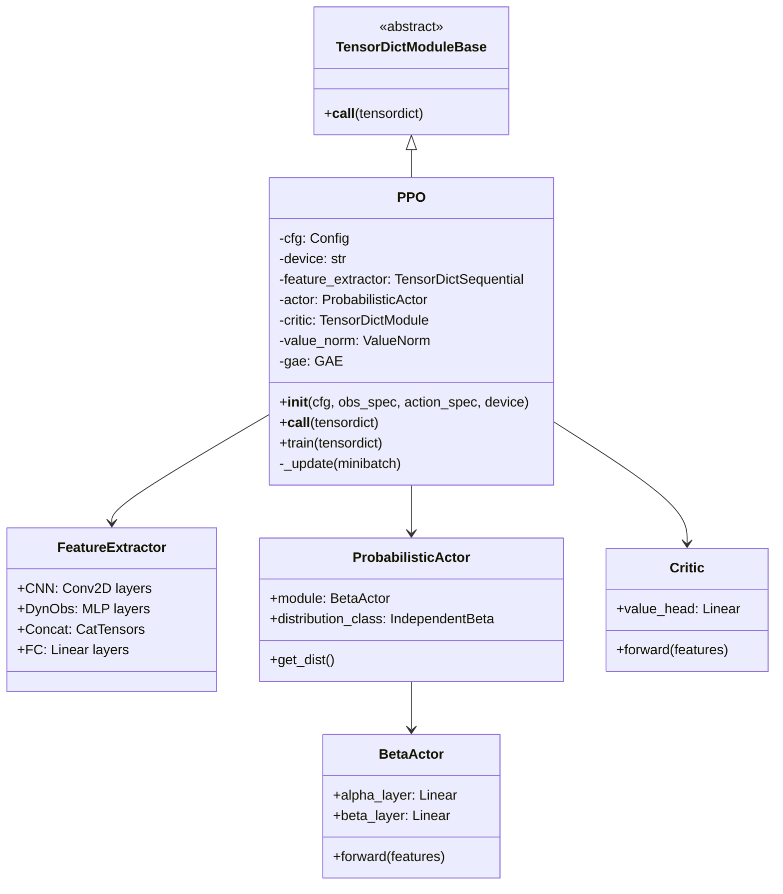
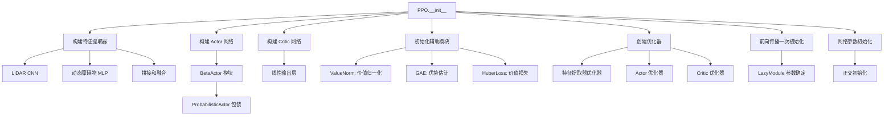
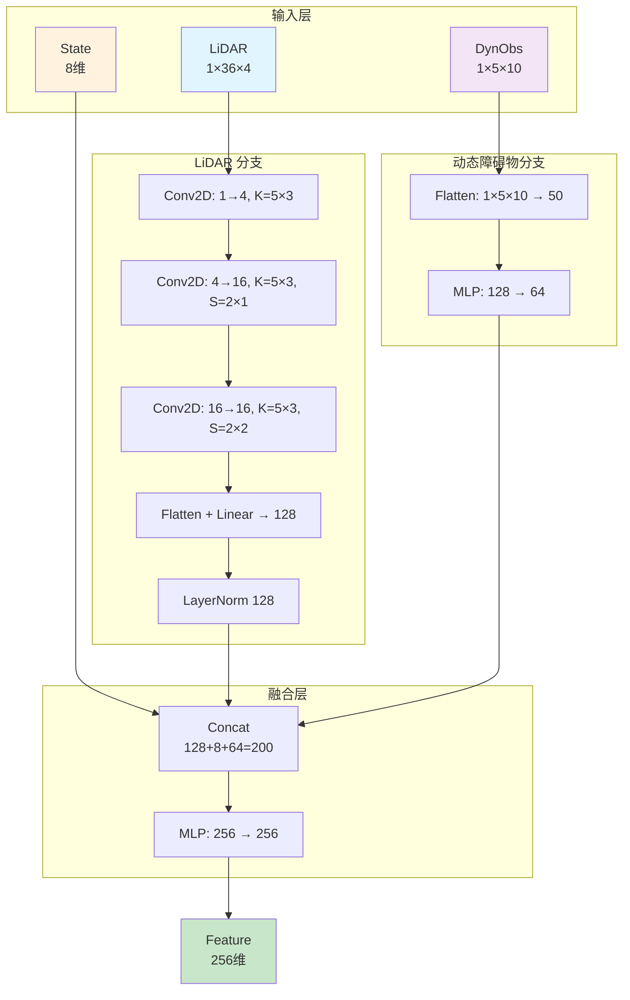
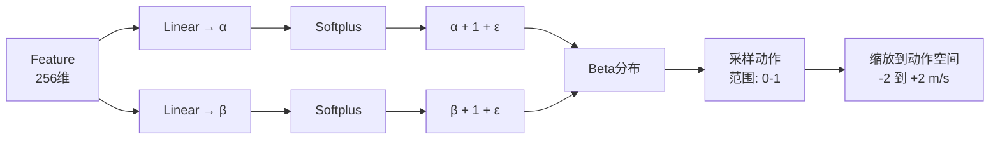
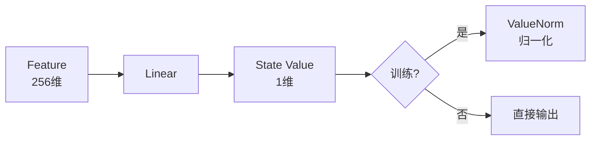
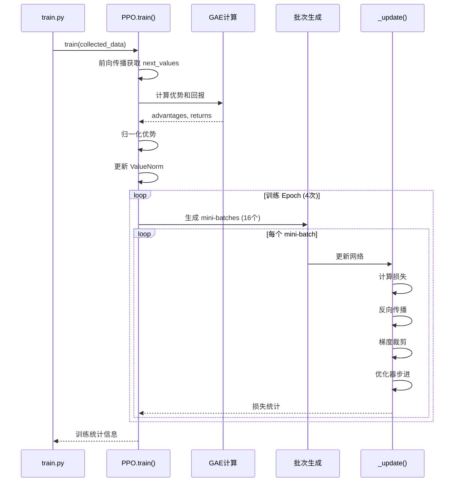
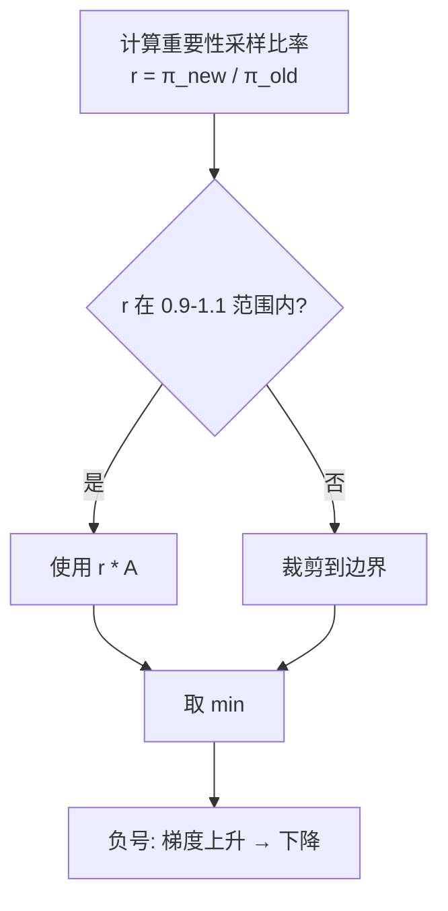
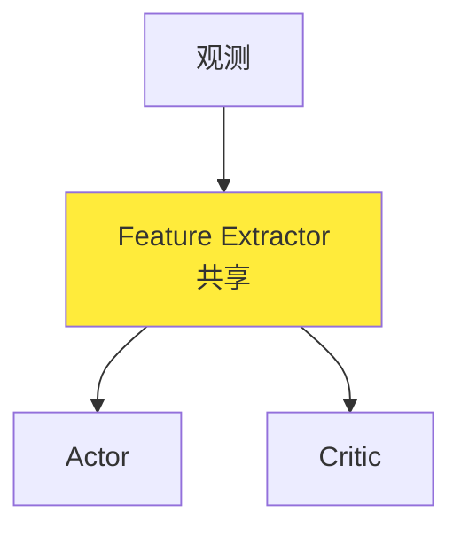

# NavRL PPO 算法详解 (ppo.py)

## 1. 模块概述

PPO (Proximal Policy Optimization) 是本系统使用的强化学习算法。该模块实现了完整的 PPO 算法，包括：
- 特征提取网络（LiDAR + 状态 + 动态障碍物）
- Actor 网络（策略网络）使用 Beta 分布
- Critic 网络（价值网络）
- PPO 损失函数和优化器

## 2. 类结构



## 3. 初始化过程

### 3.1 初始化流程图



### 3.2 构造函数详解

```python
def __init__(self, cfg, observation_spec, action_spec, device):
    """
    初始化 PPO 策略
    
    参数:
        cfg: 算法配置对象
        observation_spec: 观测空间规格
        action_spec: 动作空间规格
        device: 计算设备 ('cuda:0' 或 'cpu')
    """
```

## 4. 特征提取器

### 4.1 网络架构



### 4.2 LiDAR CNN 详解

```python
feature_extractor_network = nn.Sequential(
    # 第一层卷积: 提取低级特征
    nn.LazyConv2d(
        out_channels=4,      # 输出4个特征图
        kernel_size=[5, 3],  # 5×3 卷积核
        padding=[2, 1]       # 保持尺寸
    ), 
    nn.ELU(),  # 激活函数
    
    # 第二层卷积: 空间下采样
    nn.LazyConv2d(
        out_channels=16,     # 输出16个特征图
        kernel_size=[5, 3], 
        stride=[2, 1],       # 水平方向下采样2倍
        padding=[2, 1]
    ), 
    nn.ELU(),
    
    # 第三层卷积: 进一步压缩
    nn.LazyConv2d(
        out_channels=16,
        kernel_size=[5, 3],
        stride=[2, 2],       # 两个方向都下采样2倍
        padding=[2, 1]
    ), 
    nn.ELU(),
    
    # 展平并全连接
    Rearrange("n c w h -> n (c w h)"),  # 展平空间维度
    nn.LazyLinear(128),                  # 压缩到128维
    nn.LayerNorm(128),                   # 归一化
)
```

**尺寸变化**：
```
输入: (B, 1, 36, 4)
Conv1: (B, 4, 36, 4)   # padding='same'
Conv2: (B, 16, 18, 4)  # stride=(2,1)
Conv3: (B, 16, 9, 2)   # stride=(2,2)
Flatten: (B, 16*9*2) = (B, 288)
Linear: (B, 128)
```

### 4.3 动态障碍物 MLP

```python
dynamic_obstacle_network = nn.Sequential(
    Rearrange("n c w h -> n (c w h)"),  # (B, 1, 5, 10) → (B, 50)
    make_mlp([128, 64])                  # 两层MLP: 50→128→64
)
```

**make_mlp 定义**：
```python
def make_mlp(num_units):
    """
    创建多层感知机
    
    每层包含:
        - LazyLinear: 线性变换
        - LeakyReLU: 激活函数
        - LayerNorm: 层归一化
    """
    layers = []
    for n in num_units:
        layers.append(nn.LazyLinear(n))
        layers.append(nn.LeakyReLU())
        layers.append(nn.LayerNorm(n))
    return nn.Sequential(*layers)
```

### 4.4 特征拼接和融合

```python
self.feature_extractor = TensorDictSequential(
    # 步骤1: LiDAR 特征提取
    TensorDictModule(
        feature_extractor_network, 
        in_keys=[("agents", "observation", "lidar")], 
        out_keys=["_cnn_feature"]
    ),
    
    # 步骤2: 动态障碍物特征提取
    TensorDictModule(
        dynamic_obstacle_network, 
        in_keys=[("agents", "observation", "dynamic_obstacle")], 
        out_keys=["_dynamic_obstacle_feature"]
    ),
    
    # 步骤3: 拼接所有特征
    CatTensors(
        in_keys=[
            "_cnn_feature",                          # 128维
            ("agents", "observation", "state"),      # 8维
            "_dynamic_obstacle_feature"              # 64维
        ], 
        out_key="_feature",                          # 总共200维
        del_keys=False
    ), 
    
    # 步骤4: 进一步融合
    TensorDictModule(
        make_mlp([256, 256]),                        # 200→256→256
        in_keys=["_feature"], 
        out_keys=["_feature"]
    ),
)
```

## 5. Actor 网络 (策略网络)

### 5.1 Beta Actor 架构



### 5.2 BetaActor 实现

```python
class BetaActor(nn.Module):
    def __init__(self, action_dim: int):
        """
        使用 Beta 分布的 Actor 网络
        
        优势:
            - 自然有界输出 (0, 1)
            - 比 Tanh 挤压更平滑
            - 支持多模态分布
        """
        super().__init__()
        self.alpha_layer = nn.LazyLinear(action_dim)
        self.beta_layer = nn.LazyLinear(action_dim)
        self.alpha_softplus = nn.Softplus()
        self.beta_softplus = nn.Softplus()
    
    def forward(self, features: torch.Tensor):
        # 计算 Beta 分布的两个参数
        alpha = 1. + self.alpha_softplus(self.alpha_layer(features)) + 1e-6
        beta = 1. + self.beta_softplus(self.beta_layer(features)) + 1e-6
        return alpha, beta
```

**为什么选择 Beta 分布？**

| 特性 | Gaussian + Tanh | Beta 分布 |
|------|-----------------|-----------|
| 输出范围 | 需要 Tanh 挤压 | 天然 (0, 1) |
| 边界行为 | 在边界处梯度消失 | 平滑接近边界 |
| 多模态 | 单峰 | 可以双峰 |
| 采样效率 | 需要截断和重采样 | 直接采样 |

### 5.3 IndependentBeta 分布

```python
class IndependentBeta(torch.distributions.Independent):
    """
    独立的 Beta 分布（多维动作）
    
    特性:
        - 每个动作维度独立
        - 共享特征但独立参数
    """
    def __init__(self, alpha, beta, validate_args=None):
        beta_dist = torch.distributions.Beta(alpha, beta)
        super().__init__(beta_dist, 1, validate_args=validate_args)
```

### 5.4 ProbabilisticActor 包装

```python
self.actor = ProbabilisticActor(
    # 策略模块
    TensorDictModule(
        BetaActor(self.action_dim), 
        in_keys=["_feature"], 
        out_keys=["alpha", "beta"]
    ),
    
    # 分布参数
    in_keys=["alpha", "beta"],
    out_keys=[("agents", "action_normalized")],  # 输出 (0, 1) 范围
    distribution_class=IndependentBeta,
    return_log_prob=True  # 返回对数概率用于训练
)
```

### 5.5 动作后处理

```python
def __call__(self, tensordict):
    """
    前向传播并处理动作
    
    流程:
        1. 特征提取: obs → features (256维)
        2. 策略输出: features → (α, β)
        3. 采样动作: Beta(α, β) → action_normalized ∈ (0, 1)
        4. 缩放动作: action = 2 * action_normalized * limit - limit
        5. 坐标转换: local → world
    """
    self.feature_extractor(tensordict)
    self.actor(tensordict)
    self.critic(tensordict)

    # 从 (0, 1) 缩放到 (-limit, +limit)
    actions = (
        2 * tensordict["agents", "action_normalized"] * self.cfg.actor.action_limit
    ) - self.cfg.actor.action_limit
    
    # 坐标系转换: 目标坐标系 → 世界坐标系
    actions_world = vec_to_world(
        actions, 
        tensordict["agents", "observation", "direction"]
    )
    
    tensordict["agents", "action"] = actions_world
    return tensordict
```

## 6. Critic 网络 (价值网络)

### 6.1 网络结构



### 6.2 Critic 实现

```python
self.critic = TensorDictModule(
    nn.LazyLinear(1),      # 简单的线性层输出价值
    in_keys=["_feature"],  # 使用共享特征
    out_keys=["state_value"] 
)
```

**设计简单的原因**：
- 价值函数不需要复杂的非线性
- 主要依赖特征提取器的质量
- 过度参数化容易过拟合

### 6.3 ValueNorm 价值归一化

```python
class ValueNorm(nn.Module):
    """
    运行时价值归一化
    
    功能:
        - 维护回报的运行均值和方差
        - 归一化价值函数输出
        - 提高训练稳定性
    
    原理:
        V_normalized = (V - μ) / √σ²
        
    更新:
        μ_t = β * μ_{t-1} + (1-β) * mean(returns)
        σ²_t = β * σ²_{t-1} + (1-β) * mean(returns²)
    """
    def __init__(self, input_shape, beta=0.995, epsilon=1e-5):
        self.beta = beta  # 指数移动平均系数
        # ... (完整实现见 utils.py)
```

**为什么需要价值归一化？**

1. **回报尺度变化**：训练过程中回报分布会改变
2. **梯度稳定性**：归一化的价值函数梯度更稳定
3. **学习效率**：相同学习率下收敛更快

## 7. 训练过程

### 7.1 训练流程图



### 7.2 train() 函数详解

```python
def train(self, tensordict):
    """
    训练 PPO 策略
    
    参数:
        tensordict: 收集的经验数据
            形状: (num_envs, num_frames, ...)
            
    返回:
        训练损失统计字典
    """
```

#### 7.2.1 计算 GAE 优势

```python
# 获取下一个状态的价值
next_tensordict = tensordict["next"]
with torch.no_grad():
    next_tensordict = torch.vmap(self.feature_extractor)(next_tensordict)
    next_values = self.critic(next_tensordict)["state_value"]

# 提取奖励和完成标志
rewards = tensordict["next", "agents", "reward"]
dones = tensordict["next", "terminated"]
values = tensordict["state_value"]

# 反归一化价值（恢复到原始尺度）
values = self.value_norm.denormalize(values)
next_values = self.value_norm.denormalize(next_values)

# 计算 GAE
adv, ret = self.gae(rewards, dones, values, next_values)
```

**GAE (Generalized Advantage Estimation)**：

$$
A_t = \sum_{l=0}^{\infty} (\gamma \lambda)^l \delta_{t+l}
$$

其中：
- $\delta_t = r_t + \gamma V(s_{t+1}) - V(s_t)$ (TD误差)
- $\gamma = 0.99$ (折扣因子)
- $\lambda = 0.95$ (GAE参数)

**GAE 的优势**：
- 平衡偏差和方差
- $\lambda=0$: 低方差，高偏差 (TD(0))
- $\lambda=1$: 高方差，低偏差 (蒙特卡洛)
- $\lambda=0.95$: 实践中的良好折中

#### 7.2.2 优势归一化

```python
# 归一化优势
adv_mean = adv.mean()
adv_std = adv.std()
adv = (adv - adv_mean) / adv_std.clip(1e-7)
```

**为什么归一化优势？**
- 使不同回合的优势具有可比性
- 提高训练稳定性
- 避免某些回合主导梯度更新

#### 7.2.3 更新价值归一化

```python
self.value_norm.update(ret)  # 更新运行统计
ret = self.value_norm.normalize(ret)  # 归一化回报
```

#### 7.2.4 多 Epoch 训练

```python
infos = []
for epoch in range(self.cfg.training_epoch_num):  # 默认4个epoch
    batch = make_batch(tensordict, self.cfg.num_minibatches)  # 16个mini-batch
    for minibatch in batch:
        infos.append(self._update(minibatch))
```

### 7.3 _update() 函数详解

```python
def _update(self, tensordict):
    """
    单个 mini-batch 的更新
    
    步骤:
        1. 重新计算特征和动作概率
        2. 计算三个损失: actor, critic, entropy
        3. 反向传播和梯度裁剪
        4. 更新所有网络参数
    """
```

#### 7.3.1 重新前向传播

```python
# 重新计算特征
self.feature_extractor(tensordict)

# 获取当前策略的动作分布
action_dist = self.actor.get_dist(tensordict)

# 计算新策略下的对数概率
log_probs = action_dist.log_prob(tensordict[("agents", "action_normalized")])
```

#### 7.3.2 Actor 损失 (PPO-Clip)

```python
# 重要性采样比率
ratio = torch.exp(log_probs - tensordict["sample_log_prob"]).unsqueeze(-1)

# 两个目标函数
surr1 = advantage * ratio
surr2 = advantage * ratio.clamp(
    1. - self.cfg.actor.clip_ratio,  # 0.9
    1. + self.cfg.actor.clip_ratio   # 1.1
)

# PPO 裁剪损失
actor_loss = -torch.mean(torch.min(surr1, surr2)) * self.action_dim
```

**PPO-Clip 原理**：



**裁剪的作用**：
- 限制策略更新幅度
- 防止破坏性更新
- 保持训练稳定性

#### 7.3.3 Entropy 损失

```python
# 计算熵
action_entropy = action_dist.entropy()

# 熵损失（鼓励探索）
entropy_loss = -self.cfg.entropy_loss_coefficient * torch.mean(action_entropy)
```

**熵的作用**：
- 鼓励探索
- 防止策略过早收敛
- 系数较小 (1e-3) 避免过度随机

#### 7.3.4 Critic 损失 (Clipped Value Loss)

```python
# 旧价值（数据收集时的）
b_value = tensordict["state_value"]

# 新价值（当前网络的）
value = self.critic(tensordict)["state_value"]

# 裁剪新价值
value_clipped = b_value + (value - b_value).clamp(
    -self.cfg.critic.clip_ratio,  # -0.1
    self.cfg.critic.clip_ratio     # +0.1
)

# 两个损失
critic_loss_clipped = self.critic_loss_fn(ret, value_clipped)
critic_loss_original = self.critic_loss_fn(ret, value)

# 取较大的损失
critic_loss = torch.max(critic_loss_clipped, critic_loss_original)
```

**Huber Loss**：
```python
self.critic_loss_fn = nn.HuberLoss(delta=10)
```

- 结合 L1 和 L2 损失
- 对离群点鲁棒
- delta=10: 较大的线性区域

#### 7.3.5 总损失和优化

```python
# 总损失
loss = entropy_loss + actor_loss + critic_loss

# 清空梯度
self.feature_extractor_optim.zero_grad()
self.actor_optim.zero_grad()
self.critic_optim.zero_grad()

# 反向传播
loss.backward()

# 梯度裁剪（防止梯度爆炸）
actor_grad_norm = nn.utils.clip_grad.clip_grad_norm_(
    self.actor.parameters(), max_norm=5.
)
critic_grad_norm = nn.utils.clip_grad.clip_grad_norm_(
    self.critic.parameters(), max_norm=5.
)

# 更新参数
self.feature_extractor_optim.step()
self.actor_optim.step()
self.critic_optim.step()
```

## 8. 关键技术点

### 8.1 共享特征提取器



**优势**：
- 减少参数数量
- Actor 和 Critic 学习互补
- 提高样本效率

**劣势**：
- 可能存在梯度冲突
- 需要仔细调整学习率

### 8.2 分离的优化器

```python
self.feature_extractor_optim = torch.optim.Adam(
    self.feature_extractor.parameters(), 
    lr=cfg.feature_extractor.learning_rate  # 5e-4
)
self.actor_optim = torch.optim.Adam(
    self.actor.parameters(), 
    lr=cfg.actor.learning_rate  # 5e-4
)
self.critic_optim = torch.optim.Adam(
    self.critic.parameters(), 
    lr=cfg.actor.learning_rate  # 5e-4
)
```

**为什么分离？**
- 可以为每个部分设置不同学习率
- 提供更细粒度的控制
- 便于调试特定组件

### 8.3 网络初始化

```python
def init_(module):
    if isinstance(module, nn.Linear):
        nn.init.orthogonal_(module.weight, 0.01)  # 正交初始化
        nn.init.constant_(module.bias, 0.)        # 偏置置零

self.actor.apply(init_)
self.critic.apply(init_)
```

**正交初始化的优势**：
- 保持梯度范数
- 避免梯度消失/爆炸
- 加速收敛

**gain=0.01 的作用**：
- 初始策略接近均匀分布
- 鼓励早期探索
- 避免初始策略过于确定

## 9. 超参数调优指南

### 9.1 学习率

| 参数 | 默认值 | 调优建议 |
|------|--------|----------|
| 特征提取器 | 5e-4 | 如果不稳定降低到 1e-4 |
| Actor | 5e-4 | 通常与特征提取器相同 |
| Critic | 5e-4 | 可以略高于 Actor |

### 9.2 PPO 特定参数

| 参数 | 默认值 | 作用 | 调优建议 |
|------|--------|------|----------|
| clip_ratio | 0.1 | 限制策略更新 | 0.1-0.3，保守时用0.1 |
| entropy_coefficient | 1e-3 | 探索程度 | 初期可用1e-2，后期降低 |
| gae_lambda | 0.95 | 优势估计 | 0.9-0.99，通常不变 |
| gamma | 0.99 | 折扣因子 | 长期任务用0.99-0.999 |

### 9.3 训练配置

| 参数 | 默认值 | 作用 | 调优建议 |
|------|--------|------|----------|
| training_epoch_num | 4 | 每批数据训练次数 | 3-10，数据少时增大 |
| num_minibatches | 16 | Mini-batch数量 | 8-32，GPU大时增大 |
| training_frame_num | 32 | 每次收集帧数 | > max_episode_length/4 |

## 10. 常见问题和解决方案

### 10.1 策略不更新

**症状**：Actor loss 接近0，策略不变

**原因**：
- 裁剪比率过小
- 学习率过低
- 优势全为0（奖励设计问题）

**解决**：
```python
# 1. 增大裁剪比率
clip_ratio: 0.2  # 从 0.1 增大

# 2. 检查优势分布
print("Advantage stats:", adv.mean(), adv.std())

# 3. 调整学习率
actor_lr: 1e-3  # 从 5e-4 增大
```

### 10.2 价值函数过拟合

**症状**：Critic loss 很小但评估表现差

**原因**：
- 价值网络过于复杂
- 训练 epoch 过多
- 价值裁剪比率过大

**解决**：
```python
# 1. 简化 Critic
self.critic = nn.Linear(256, 1)  # 不要加多余的层

# 2. 减少 epoch
training_epoch_num: 2  # 从 4 减少

# 3. 调整裁剪
critic.clip_ratio: 0.05  # 从 0.1 减小
```

### 10.3 训练不稳定

**症状**：Loss 突然爆炸或出现 NaN

**原因**：
- 学习率过高
- 梯度裁剪失效
- 动作分布异常

**解决**：
```python
# 1. 降低学习率
learning_rate: 1e-4

# 2. 加强梯度裁剪
max_grad_norm: 1.0  # 从 5.0 降低

# 3. 检查 Beta 参数
print("Alpha:", alpha.mean(), alpha.min(), alpha.max())
print("Beta:", beta.mean(), beta.min(), beta.max())
assert (alpha > 0).all() and (beta > 0).all()
```

### 10.4 探索不足

**症状**：策略很快收敛到次优解

**原因**：
- 熵系数过小
- Beta 分布过于尖锐
- 初始化不当

**解决**：
```python
# 1. 增大熵系数
entropy_loss_coefficient: 5e-3  # 从 1e-3 增大

# 2. 调整初始化
nn.init.orthogonal_(module.weight, gain=0.1)  # 从 0.01 增大

# 3. 使用温度参数
alpha = (1 + self.alpha_softplus(...)) * temperature
```

## 11. 性能优化

### 11.1 计算效率

```python
# 优化1: 使用 torch.vmap 进行批量操作
next_values = torch.vmap(self.critic)(next_tensordict)

# 优化2: 原地操作
self.feature_extractor_optim.zero_grad(set_to_none=True)  # 更快

# 优化3: 混合精度训练
with torch.cuda.amp.autocast():
    features = self.feature_extractor(obs)
```

### 11.2 内存优化

```python
# 优化1: 梯度累积（减少batch size，累积多次）
for i, minibatch in enumerate(batch):
    loss = self._compute_loss(minibatch) / accumulation_steps
    loss.backward()
    if (i + 1) % accumulation_steps == 0:
        optimizer.step()
        optimizer.zero_grad()

# 优化2: 删除中间变量
del tensordict["_cnn_feature"]  # 不再需要的中间结果
```

## 12. 扩展方向

### 12.1 添加新的输入模态

```python
# 例如添加相机图像
camera_cnn = nn.Sequential(
    nn.Conv2d(3, 32, kernel_size=8, stride=4),
    nn.ReLU(),
    nn.Conv2d(32, 64, kernel_size=4, stride=2),
    nn.ReLU(),
    nn.Flatten(),
    nn.Linear(64 * 7 * 7, 256)
)

# 融合多模态特征
feature_fusion = CatTensors(
    ["_lidar_feature", "_camera_feature", "_state"],
    "_feature"
)
```

### 12.2 尝试其他算法

```python
# SAC (Soft Actor-Critic)
class SAC:
    def __init__(...):
        self.actor = GaussianActor(...)  # 连续动作
        self.critic1 = QNetwork(...)
        self.critic2 = QNetwork(...)  # 双 Q 网络
        self.target_critic1 = copy.deepcopy(self.critic1)
        self.target_critic2 = copy.deepcopy(self.critic2)
```

### 12.3 多智能体扩展

```python
# MAPPO (Multi-Agent PPO)
class MAPPO(PPO):
    def __init__(self, num_agents, ...):
        self.agents = nn.ModuleList([
            self._create_agent() for _ in range(num_agents)
        ])
        self.communication = AttentionModule(...)
```

---

## 相关文档

- [返回总体架构](./00-总体系统架构.md)
- [环境模块详解](./01-环境模块详解.md)
- [训练脚本详解](./03-训练脚本详解.md)
- [工具函数详解](./04-工具函数详解.md)
