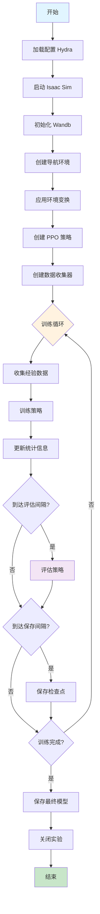
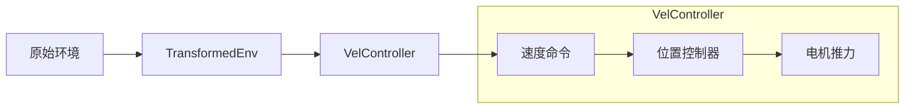
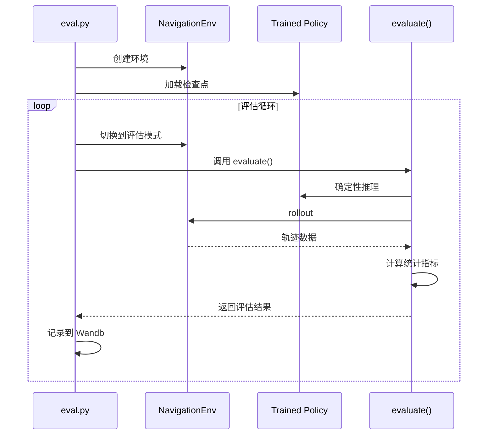
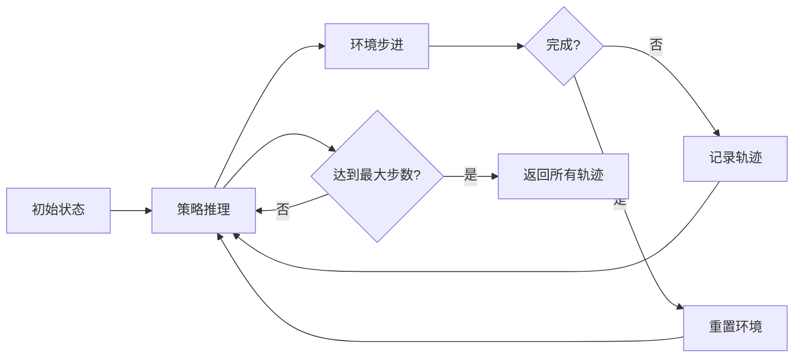

# NavRL 训练脚本详解 (train.py & eval.py)

## 1. 模块概述

训练脚本是整个系统的入口点，负责：
- 初始化仿真环境和实验追踪
- 配置强化学习组件
- 执行训练循环
- 定期评估和保存模型

## 2. train.py - 主训练脚本

### 2.1 整体流程图



### 2.2 主函数详解

```python
@hydra.main(config_path=FILE_PATH, config_name="train", version_base=None)
def main(cfg):
    """
    主训练函数
    
    参数:
        cfg: Hydra 配置对象，自动从 YAML 文件加载
        
    Hydra 特性:
        - 自动解析命令行参数
        - 支持配置组合和覆盖
        - 提供工作目录管理
    """
```

### 2.3 初始化阶段

#### 2.3.1 仿真应用初始化

```python
# Simulation App
sim_app = SimulationApp({
    "headless": cfg.headless,      # 无头模式（不显示GUI）
    "anti_aliasing": 1             # 抗锯齿级别
})
```

**参数说明**：
- `headless=True`: 服务器训练时使用，节省资源
- `headless=False`: 本地开发时可视化调试
- `anti_aliasing`: 渲染质量，1-4 级别

#### 2.3.2 Wandb 实验追踪

```python
if (cfg.wandb.run_id is None):
    # 新实验
    run = wandb.init(
        project=cfg.wandb.project,              # 项目名称
        name=f"{cfg.wandb.name}/{timestamp}",   # 运行名称
        entity=cfg.wandb.entity,                # 团队/用户名
        config=cfg,                             # 保存配置
        mode=cfg.wandb.mode,                    # online/offline
        id=wandb.util.generate_id(),            # 生成唯一ID
    )
else:
    # 恢复实验
    run = wandb.init(
        project=cfg.wandb.project,
        entity=cfg.wandb.entity,
        config=cfg,
        mode=cfg.wandb.mode,
        id=cfg.wandb.run_id,                    # 使用已有ID
        resume="must"                           # 必须恢复
    )
```

**Wandb 模式**：
| 模式 | 说明 | 使用场景 |
|------|------|----------|
| `online` | 实时上传数据 | 网络稳定时 |
| `offline` | 本地保存，稍后同步 | 服务器训练 |
| `disabled` | 完全关闭 | 调试时 |

#### 2.3.3 环境创建和变换

```python
# 1. 创建基础环境
from env import NavigationEnv
env = NavigationEnv(cfg)

# 2. 创建控制器
controller = LeePositionController(9.81, env.drone.params).to(cfg.device)
vel_transform = VelController(controller, yaw_control=False)

# 3. 应用变换包装
transforms = [vel_transform]
transformed_env = TransformedEnv(env, Compose(*transforms)).train()
transformed_env.set_seed(cfg.seed)
```

**环境变换链**：



**VelController 的作用**：
- 将高层速度命令转换为底层控制信号
- 内部使用 Lee Position Controller
- 简化策略学习（不需要学习底层控制）

**为什么不控制 Yaw？**
```python
yaw_control=False  # 无人机自动调整朝向以适应速度方向
```

#### 2.3.4 策略和数据收集器

```python
# PPO 策略
policy = PPO(
    cfg.algo, 
    transformed_env.observation_spec, 
    transformed_env.action_spec, 
    cfg.device
)

# 可选：加载检查点
# checkpoint = "/path/to/checkpoint.pt"
# policy.load_state_dict(torch.load(checkpoint))

# Episode 统计收集器
episode_stats_keys = [
    k for k in transformed_env.observation_spec.keys(True, True) 
    if isinstance(k, tuple) and k[0]=="stats"
]
episode_stats = EpisodeStats(episode_stats_keys)

# RL 数据收集器
collector = SyncDataCollector(
    transformed_env,
    policy=policy, 
    frames_per_batch=cfg.env.num_envs * cfg.algo.training_frame_num,  # 2 * 32 = 64 帧
    total_frames=cfg.max_frame_num,                                     # 12亿帧
    device=cfg.device,
    return_same_td=True,           # 原地更新（节省内存）
    exploration_type=ExplorationType.RANDOM,  # 从分布采样
)
```

**SyncDataCollector 参数**：
| 参数 | 说明 | 默认值 |
|------|------|--------|
| `frames_per_batch` | 每次收集的帧数 | num_envs × 32 |
| `total_frames` | 总训练帧数 | 12亿 |
| `return_same_td` | 原地更新TensorDict | True |
| `exploration_type` | RANDOM: 采样, MEAN: 确定性 | RANDOM |

### 2.4 训练循环

```python
for i, data in enumerate(collector):
    """
    主训练循环
    
    变量:
        i: 训练步数（每次收集算一步）
        data: 收集的经验数据 TensorDict
              形状: (num_envs, frames_per_batch, ...)
    """
```

#### 2.4.1 信息记录

```python
# 基础信息
info = {
    "env_frames": collector._frames,  # 累积仿真帧数
    "rollout_fps": collector._fps      # 数据收集速度（帧/秒）
}
```

#### 2.4.2 策略训练

```python
# 训练策略
train_loss_stats = policy.train(data)
info.update(train_loss_stats)  # 添加损失统计
```

**返回的统计信息**：
```python
{
    "actor_loss": float,          # Actor 损失
    "critic_loss": float,         # Critic 损失
    "entropy": float,             # 熵损失
    "actor_grad_norm": float,     # Actor 梯度范数
    "critic_grad_norm": float,    # Critic 梯度范数
    "explained_var": float        # 解释方差
}
```

#### 2.4.3 训练统计

```python
# 累积 episode 数据
episode_stats.add(data)

# 当所有环境都完成至少一个 episode
if len(episode_stats) >= transformed_env.num_envs:
    stats = {
        "train/" + (".".join(k) if isinstance(k, tuple) else k): 
        torch.mean(v.float()).item() 
        for k, v in episode_stats.pop().items(True, True)
    }
    info.update(stats)
```

**Episode 统计内容**：
```python
{
    "train/return": float,         # 平均回报
    "train/episode_len": float,    # 平均回合长度
    "train/reach_goal": float,     # 到达目标比例
    "train/collision": float,      # 碰撞比例
    "train/truncated": float       # 超时比例
}
```

#### 2.4.4 定期评估

```python
if i % cfg.eval_interval == 0:  # 默认每1000步评估一次
    print("[NavRL]: start evaluating policy at training step: ", i)
    
    # 切换到评估模式
    env.enable_render(True)  # 启用渲染（录制视频）
    env.eval()               # 评估模式
    
    # 执行评估
    eval_info = evaluate(
        env=transformed_env, 
        policy=policy,
        seed=cfg.seed, 
        cfg=cfg,
        exploration_type=ExplorationType.MEAN  # 确定性策略
    )
    
    # 恢复训练模式
    env.enable_render(not cfg.headless)
    env.train()
    env.reset()
    
    info.update(eval_info)
    print("\n[NavRL]: evaluation done.")
```

**评估模式 vs 训练模式**：
| 项目 | 训练模式 | 评估模式 |
|------|----------|----------|
| 起点/终点 | 随机 | 规则排列 |
| 动作选择 | 采样 | 均值（确定性） |
| 渲染 | 可选 | 开启（录视频） |
| 环境重置 | 自动 | 手动控制 |

#### 2.4.5 模型保存

```python
if i % cfg.save_interval == 0:  # 默认每1000步
    ckpt_path = os.path.join(run.dir, f"checkpoint_{i}.pt")
    torch.save(policy.state_dict(), ckpt_path)
    print("[NavRL]: model saved at training step: ", i)
```

**检查点内容**：
```python
{
    "feature_extractor": state_dict,  # 特征提取器参数
    "actor": state_dict,              # Actor 参数
    "critic": state_dict,             # Critic 参数
    "value_norm": state_dict          # ValueNorm 状态
}
```

#### 2.4.6 记录到 Wandb

```python
run.log(info)  # 上传所有统计信息
```

### 2.5 训练结束

```python
# 保存最终模型
ckpt_path = os.path.join(run.dir, "checkpoint_final.pt")
torch.save(policy.state_dict(), ckpt_path)

# 关闭 Wandb
wandb.finish()

# 关闭仿真
sim_app.close()
```

## 3. eval.py - 评估脚本

### 3.1 与训练脚本的差异

```python
# 主要差异：
checkpoint = "/path/to/checkpoint_final.pt"
policy.load_state_dict(torch.load(checkpoint))  # 加载训练好的模型

# 训练循环中注释掉训练部分
# train_loss_stats = policy.train(data)  # 不训练
# Save Model ...  # 不保存
```

### 3.2 评估流程



### 3.3 评估函数详解

```python
@torch.no_grad()
def evaluate(
    env,
    policy,
    cfg,
    seed: int=0, 
    exploration_type: ExplorationType=ExplorationType.MEAN
):
    """
    评估策略性能
    
    参数:
        env: 环境实例
        policy: 策略实例
        cfg: 配置对象
        seed: 随机种子
        exploration_type: MEAN(确定性) 或 RANDOM(随机)
        
    返回:
        评估统计信息字典
    """
```

#### 3.3.1 环境准备

```python
env.enable_render(True)  # 启用视频录制
env.eval()               # 评估模式（规则化初始位置）
env.set_seed(seed)       # 设置随机种子（可复现）
```

#### 3.3.2 渲染回调

```python
render_callback = RenderCallback(interval=2)
```

**RenderCallback 功能**：
- 定期捕获仿真画面
- 存储为视频数组
- 用于生成 Wandb 视频

#### 3.3.3 执行 Rollout

```python
with set_exploration_type(exploration_type):
    trajs = env.rollout(
        max_steps=env.max_episode_length,  # 最大2200步
        policy=policy,                      # 策略函数
        callback=render_callback,           # 渲染回调
        auto_reset=True,                    # 自动重置完成的环境
        break_when_any_done=False,          # 全部完成才停止
        return_contiguous=False,            # 不要求连续内存
    )
```

**rollout 过程**：


#### 3.3.4 提取第一个 Episode

```python
done = trajs.get(("next", "done")) 
first_done = torch.argmax(done.long(), dim=1).cpu()  # 每个环境第一次完成的索引

def take_first_episode(tensor: torch.Tensor):
    """提取每个环境的第一个完整 episode"""
    indices = first_done.reshape(first_done.shape+(1,)*(tensor.ndim-2))
    return torch.take_along_dim(tensor, indices, dim=1).reshape(-1)
```

**为什么只取第一个 Episode？**
- 保证所有环境在相同初始条件下评估
- 避免后续 episode 受到之前的影响
- 统计更加公平和可重复

#### 3.3.5 计算评估指标

```python
traj_stats = {
    k: take_first_episode(v)
    for k, v in trajs[("next", "stats")].cpu().items()
}

info = {
    "eval/stats." + k: torch.mean(v.float()).item() 
    for k, v in traj_stats.items()
}
```

**评估指标**：
```python
{
    "eval/stats.return": float,       # 平均回报
    "eval/stats.episode_len": float,  # 平均长度
    "eval/stats.reach_goal": float,   # 成功率
    "eval/stats.collision": float,    # 碰撞率
    "eval/stats.truncated": float     # 超时率
}
```

#### 3.3.6 生成视频

```python
info["recording"] = wandb.Video(
    render_callback.get_video_array(axes="t c h w"),  # 时间×通道×高×宽
    fps=0.5 / (cfg.sim.dt * cfg.sim.substeps),        # 帧率计算
    format="mp4"
)
```

**帧率计算**：
```python
fps = 0.5 / (dt * substeps)
    = 0.5 / (0.016 * 1)
    = 31.25 fps    # 接近实时速度
```

## 4. 命令行使用

### 4.1 基本训练

```bash
# 默认配置训练
python train.py

# 修改特定参数
python train.py headless=true device=cuda:1

# 修改环境数量
python train.py env.num_envs=128

# 修改算法参数
python train.py algo.actor.learning_rate=1e-3
```

### 4.2 恢复训练

```bash
# 方法1: 指定 run_id
python train.py wandb.run_id=abc123xyz

# 方法2: 加载检查点后继续
# (需要在代码中取消注释加载部分)
```

### 4.3 Hydra 配置覆盖

```bash
# 多参数覆盖
python train.py \
    env.num_envs=64 \
    algo.actor.learning_rate=5e-4 \
    max_frame_num=1e9 \
    headless=true

# 使用配置组
python train.py \
    drone=firefly \
    algo=sac

# 添加新配置
python train.py \
    +new_param=value
```

### 4.4 评估

```bash
# 评估训练好的模型
python eval.py

# 注意：需要在 eval.py 中设置检查点路径
```

## 5. 监控和调试

### 5.1 Wandb 面板

**关键指标监控**：

1. **训练性能**
   - `train/return`: 训练回报（应该上升）
   - `train/reach_goal`: 成功率（应该上升）
   - `train/collision`: 碰撞率（应该下降）

2. **损失曲线**
   - `actor_loss`: Actor 损失
   - `critic_loss`: Critic 损失
   - `entropy`: 熵（逐渐下降）

3. **评估性能**
   - `eval/stats.return`: 评估回报
   - `eval/stats.reach_goal`: 评估成功率
   - `recording`: 视频录像

4. **系统指标**
   - `env_frames`: 累积帧数
   - `rollout_fps`: 收集速度

### 5.2 本地调试

```python
# 添加调试打印
print("Data shape:", data.shape)
print("Reward mean:", data["next", "agents", "reward"].mean().item())

# 检查梯度
for name, param in policy.named_parameters():
    if param.grad is not None:
        print(f"{name}: {param.grad.norm().item()}")

# 可视化观测
import matplotlib.pyplot as plt
lidar = data["agents", "observation", "lidar"][0, 0, 0]  # 第一个环境第一帧
plt.imshow(lidar.cpu())
plt.show()
```

### 5.3 性能分析

```python
import time

# 测量收集速度
start = time.time()
for i, data in enumerate(collector):
    if i >= 100:
        break
elapsed = time.time() - start
print(f"Collection speed: {100 * frames_per_batch / elapsed} fps")

# 测量训练速度
start = time.time()
policy.train(data)
elapsed = time.time() - start
print(f"Training time: {elapsed:.3f}s per batch")
```

## 6. 常见问题和解决方案

### 6.1 OOM (内存不足)

**症状**：`RuntimeError: CUDA out of memory`

**解决方案**：
```python
# 1. 减少环境数量
env.num_envs: 32  # 从 128 减少

# 2. 减少每批帧数
algo.training_frame_num: 16  # 从 32 减少

# 3. 减少 mini-batch 数量
algo.num_minibatches: 8  # 从 16 减少

# 4. 清理缓存
torch.cuda.empty_cache()
```

### 6.2 训练速度慢

**症状**：rollout_fps 很低（<100）

**解决方案**：
```python
# 1. 使用 GPU 管线
sim.use_gpu_pipeline: true

# 2. 减少渲染开销
headless: true

# 3. 减少 LiDAR 分辨率
sensor.lidar_hres: 15  # 从 10 增大（减少光束）
sensor.lidar_vbeams: 3  # 从 4 减少

# 4. 使用 flatcache
sim.use_flatcache: true
```

### 6.3 Wandb 同步失败

**症状**：offline 模式下无法同步

**解决方案**：
```bash
# 手动同步
wandb sync wandb/offline-run-xxxxx

# 批量同步
wandb sync --sync-all

# 配置为 online 模式
wandb.mode: online
```

### 6.4 检查点加载失败

**症状**：`KeyError` 或维度不匹配

**原因**：
- 网络结构改变
- 配置不匹配
- 检查点损坏

**解决方案**：
```python
# 方法1: 严格加载
policy.load_state_dict(torch.load(ckpt_path), strict=True)

# 方法2: 部分加载
state_dict = torch.load(ckpt_path)
policy.load_state_dict(state_dict, strict=False)

# 方法3: 手动匹配
own_state = policy.state_dict()
for name, param in state_dict.items():
    if name in own_state:
        own_state[name].copy_(param)
```

## 7. 高级技巧

### 7.1 课程学习

```python
# 随着训练进行增加难度
class CurriculumScheduler:
    def __init__(self):
        self.num_obstacles = 100
        
    def step(self, training_step):
        # 每10000步增加50个障碍物
        if training_step % 10000 == 0:
            self.num_obstacles = min(self.num_obstacles + 50, 500)
        return self.num_obstacles

# 在训练循环中
scheduler = CurriculumScheduler()
for i, data in enumerate(collector):
    if i % 100 == 0:
        env.cfg.env.num_obstacles = scheduler.step(i)
        env.reset()  # 重新生成环境
```

### 7.2 多实验并行

```bash
# 使用不同超参数启动多个实验
for lr in 1e-4 5e-4 1e-3; do
    python train.py \
        algo.actor.learning_rate=$lr \
        wandb.name="lr_${lr}" &
done
wait
```

### 7.3 分布式训练

```python
# 使用多 GPU
python -m torch.distributed.launch \
    --nproc_per_node=4 \
    train.py \
    device=cuda:0
```

### 7.4 自动超参数搜索

```python
# 使用 Wandb Sweep
sweep_config = {
    'method': 'random',
    'parameters': {
        'algo.actor.learning_rate': {
            'values': [1e-4, 5e-4, 1e-3]
        },
        'algo.entropy_loss_coefficient': {
            'values': [1e-3, 5e-3, 1e-2]
        }
    }
}

sweep_id = wandb.sweep(sweep_config, project="NavRL")
wandb.agent(sweep_id, function=main)
```

## 8. 最佳实践

### 8.1 实验命名

```python
# 好的命名
name: "ppo_lr5e-4_entropy1e-3_envs128"

# 不好的命名
name: "test1"
```

### 8.2 配置管理

```yaml
# 使用配置组
defaults:
  - drone: hummingbird
  - algo: ppo
  - _self_

# 方便切换
python train.py drone=firefly algo=sac
```

### 8.3 检查点策略

```python
# 保存多个检查点
save_interval: 1000  # 每1000步
# 结果：checkpoint_1000.pt, checkpoint_2000.pt, ...

# 只保留最好的
if eval_return > best_return:
    torch.save(policy.state_dict(), "checkpoint_best.pt")
    best_return = eval_return
```

### 8.4 日志级别

```python
import logging

# 训练时减少日志
logging.getLogger("omni").setLevel(logging.WARNING)

# 调试时详细日志
logging.getLogger("omni").setLevel(logging.DEBUG)
```

---

## 相关文档

- [返回总体架构](./00-总体系统架构.md)
- [环境模块详解](./01-环境模块详解.md)
- [PPO算法详解](./02-PPO算法详解.md)
- [工具函数详解](./04-工具函数详解.md)
- [配置说明](./05-配置说明.md)
