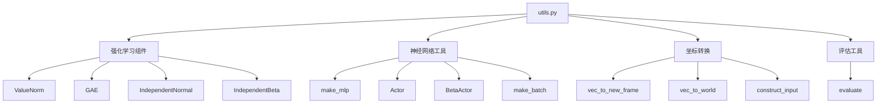
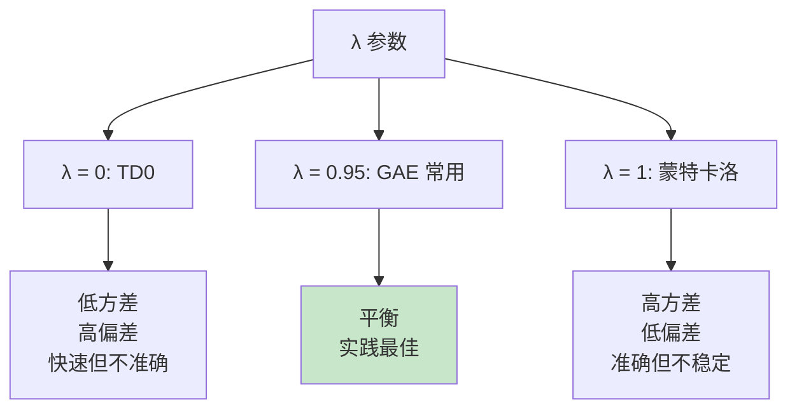
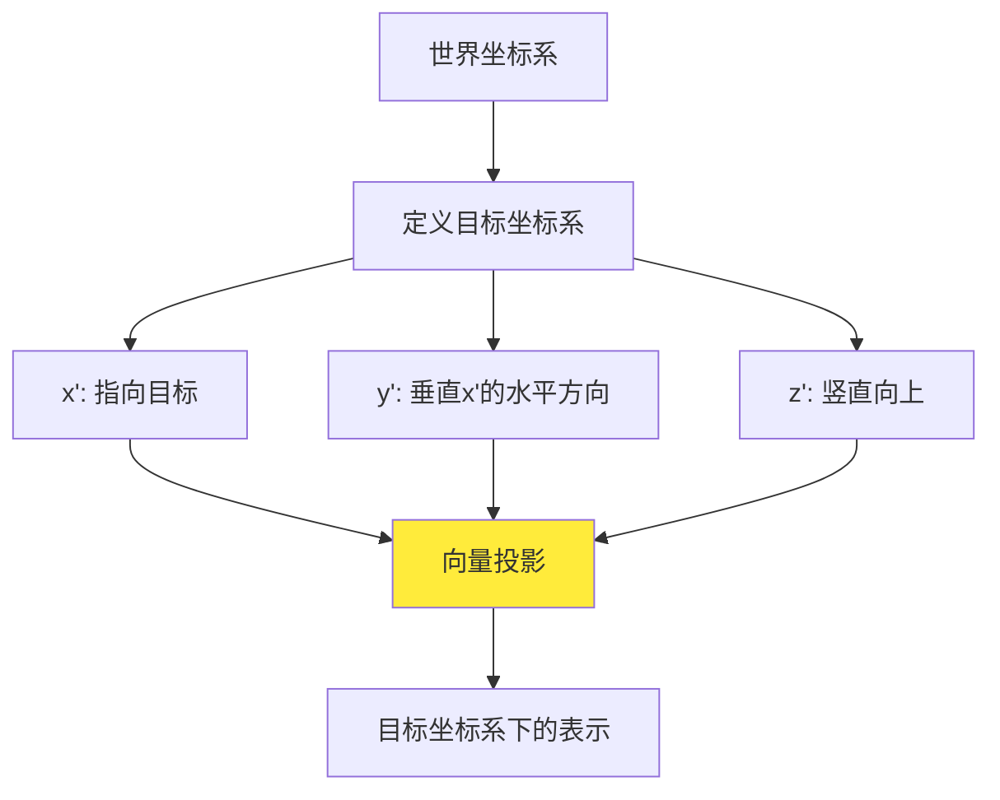

# NavRL 工具函数详解 (utils.py)

## 1. 模块概述

`utils.py` 提供了训练过程中使用的各种辅助工具，包括：
- 价值函数归一化
- GAE（广义优势估计）
- 概率分布定义
- 神经网络构建工具
- 坐标系转换函数
- 评估工具

## 2. 函数和类分类



## 3. 强化学习组件

### 3.1 ValueNorm - 价值归一化

#### 3.1.1 类概述

```python
class ValueNorm(nn.Module):
    """
    运行时价值归一化模块
    
    目的:
        - 稳定价值函数训练
        - 适应回报分布的变化
        - 提高学习效率
        
    方法:
        - 维护回报的运行均值和方差
        - 使用指数移动平均更新统计量
        - 提供归一化和反归一化接口
    """
```

#### 3.1.2 数学原理

**归一化公式**：
$$
V_{\text{normalized}} = \frac{V - \mu}{\sqrt{\sigma^2 + \epsilon}}
$$

**反归一化公式**：
$$
V = V_{\text{normalized}} \cdot \sqrt{\sigma^2} + \mu
$$

**统计量更新**（指数移动平均）：
$$
\begin{align}
\mu_t &= \beta \cdot \mu_{t-1} + (1 - \beta) \cdot \text{mean}(G_t) \\
\sigma^2_t &= \beta \cdot \sigma^2_{t-1} + (1 - \beta) \cdot \text{mean}(G_t^2) \\
d_t &= \beta \cdot d_{t-1} + (1 - \beta)
\end{align}
$$

其中：
- $\beta = 0.995$: 移动平均系数
- $G_t$: 当前批次的回报
- $d_t$: 去偏项（debiasing term）

#### 3.1.3 实现详解

```python
class ValueNorm(nn.Module):
    def __init__(self, input_shape, beta=0.995, epsilon=1e-5):
        """
        初始化
        
        参数:
            input_shape: 输入形状（通常是1）
            beta: 移动平均系数（接近1表示更平滑）
            epsilon: 数值稳定性常数
        """
        super().__init__()
        self.epsilon = epsilon
        self.beta = beta
        
        # 注册为缓冲区（不参与梯度计算，但会被保存）
        self.register_buffer("running_mean", torch.zeros(input_shape))
        self.register_buffer("running_mean_sq", torch.zeros(input_shape))
        self.register_buffer("debiasing_term", torch.tensor(0.0))
        
        self.reset_parameters()
    
    def reset_parameters(self):
        """重置统计量"""
        self.running_mean.zero_()
        self.running_mean_sq.zero_()
        self.debiasing_term.zero_()
    
    def running_mean_var(self):
        """
        计算去偏的均值和方差
        
        返回:
            debiased_mean: 去偏均值
            debiased_var: 去偏方差
        """
        # 去偏
        debiased_mean = self.running_mean / self.debiasing_term.clamp(min=self.epsilon)
        debiased_mean_sq = self.running_mean_sq / self.debiasing_term.clamp(min=self.epsilon)
        
        # 计算方差: Var[X] = E[X²] - E[X]²
        debiased_var = (debiased_mean_sq - debiased_mean**2).clamp(min=1e-2)
        
        return debiased_mean, debiased_var
    
    @torch.no_grad()
    def update(self, input_vector: torch.Tensor):
        """
        更新运行统计量
        
        参数:
            input_vector: 当前批次的回报
        """
        # 计算批次统计
        dim = tuple(range(input_vector.dim() - len(self.input_shape)))
        batch_mean = input_vector.mean(dim=dim)
        batch_sq_mean = (input_vector**2).mean(dim=dim)
        
        # 指数移动平均更新
        weight = self.beta
        self.running_mean.mul_(weight).add_(batch_mean * (1.0 - weight))
        self.running_mean_sq.mul_(weight).add_(batch_sq_mean * (1.0 - weight))
        self.debiasing_term.mul_(weight).add_(1.0 * (1.0 - weight))
    
    def normalize(self, input_vector: torch.Tensor):
        """归一化输入"""
        mean, var = self.running_mean_var()
        out = (input_vector - mean) / torch.sqrt(var)
        return out
    
    def denormalize(self, input_vector: torch.Tensor):
        """反归一化"""
        mean, var = self.running_mean_var()
        out = input_vector * torch.sqrt(var) + mean
        return out
```

#### 3.1.4 使用示例

```python
# 初始化
value_norm = ValueNorm(1)

# 训练步骤
for batch in dataloader:
    # 1. 计算回报
    returns = compute_returns(rewards, values, next_values)
    
    # 2. 更新统计量
    value_norm.update(returns)
    
    # 3. 归一化回报用于训练
    returns_normalized = value_norm.normalize(returns)
    
    # 4. 训练价值网络
    values_normalized = critic(states)
    loss = F.mse_loss(values_normalized, returns_normalized)
    
    # 5. 推理时反归一化
    values = value_norm.denormalize(values_normalized)
```

### 3.2 GAE - 广义优势估计

#### 3.2.1 类概述

```python
class GAE(nn.Module):
    """
    广义优势估计 (Generalized Advantage Estimation)
    
    论文: High-Dimensional Continuous Control Using Generalized Advantage Estimation
          (Schulman et al., 2016)
    
    目的:
        - 减少优势估计的方差
        - 控制偏差-方差权衡
        - 提高策略梯度稳定性
    """
```

#### 3.2.2 数学原理

**TD 误差**：
$$
\delta_t = r_t + \gamma V(s_{t+1}) \cdot (1 - d_t) - V(s_t)
$$

其中：
- $r_t$: 即时奖励
- $\gamma$: 折扣因子
- $V(s)$: 状态价值函数
- $d_t$: 终止标志（1表示终止）

**GAE 公式**：
$$
A_t^{\text{GAE}(\gamma, \lambda)} = \sum_{l=0}^{\infty} (\gamma \lambda)^l \delta_{t+l}
$$

**递归形式**：
$$
A_t = \delta_t + \gamma \lambda (1 - d_t) A_{t+1}
$$

**回报**：
$$
G_t = A_t + V(s_t)
$$

#### 3.2.3 实现详解

```python
class GAE(nn.Module):
    def __init__(self, gamma, lmbda):
        """
        初始化
        
        参数:
            gamma: 折扣因子（0.99）
            lmbda: GAE 参数（0.95）
        """
        super().__init__()
        self.register_buffer("gamma", torch.tensor(gamma))
        self.register_buffer("lmbda", torch.tensor(lmbda))
    
    def forward(
        self, 
        reward: torch.Tensor,        # (num_envs, num_steps)
        terminated: torch.Tensor,    # (num_envs, num_steps)
        value: torch.Tensor,         # (num_envs, num_steps)
        next_value: torch.Tensor     # (num_envs, num_steps)
    ):
        """
        计算 GAE 优势和回报
        
        返回:
            advantages: GAE 优势
            returns: 目标回报
        """
        num_steps = terminated.shape[1]
        advantages = torch.zeros_like(reward)
        not_done = 1 - terminated.float()
        
        gae = 0
        # 从后向前计算
        for step in reversed(range(num_steps)):
            # TD 误差
            delta = (
                reward[:, step] 
                + self.gamma * next_value[:, step] * not_done[:, step] 
                - value[:, step]
            )
            
            # GAE 递归
            advantages[:, step] = gae = (
                delta + 
                self.gamma * self.lmbda * not_done[:, step] * gae
            )
        
        # 计算回报
        returns = advantages + value
        
        return advantages, returns
```

#### 3.2.4 不同 λ 的效果



| λ | 特性 | 偏差 | 方差 | 适用场景 |
|---|------|------|------|----------|
| 0.0 | TD(0) | 高 | 低 | 短期任务 |
| 0.95 | GAE | 中 | 中 | **通用推荐** |
| 1.0 | MC | 低 | 高 | 低噪声环境 |

### 3.3 概率分布

#### 3.3.1 IndependentNormal

```python
class IndependentNormal(torch.distributions.Independent):
    """
    独立正态分布（用于连续动作空间）
    
    特性:
        - 每个动作维度独立
        - 对数概率是各维度之和
        - 支持多维动作
    """
    def __init__(self, loc, scale, validate_args=None):
        # 确保 scale > 0
        scale = torch.clamp_min(scale, 1e-6)
        
        # 创建基础正态分布
        base_dist = torch.distributions.Normal(loc, scale)
        
        # 包装为独立分布（最后一维）
        super().__init__(base_dist, 1, validate_args=validate_args)
```

**使用场景**：
- 标准 PPO/A2C 算法
- 无界或大范围动作空间
- 需要添加 Tanh 挤压到有界范围

#### 3.3.2 IndependentBeta

```python
class IndependentBeta(torch.distributions.Independent):
    """
    独立 Beta 分布（用于有界动作空间）
    
    优势:
        - 天然有界 (0, 1)
        - 边界处行为良好
        - 支持双峰分布
    """
    def __init__(self, alpha, beta, validate_args=None):
        # 创建 Beta 分布
        beta_dist = torch.distributions.Beta(alpha, beta)
        
        # 包装为独立分布
        super().__init__(beta_dist, 1, validate_args=validate_args)
```

**Beta 分布的形状**：

| α, β | 形状 | 说明 |
|------|------|------|
| α=β=1 | 均匀 | 完全随机 |
| α>1, β>1 | 单峰（中间） | 趋向中间值 |
| α<1, β<1 | 双峰（两端） | 趋向边界 |
| α>β | 左偏 | 倾向较大值 |
| α<β | 右偏 | 倾向较小值 |

## 4. 神经网络工具

### 4.1 make_mlp

```python
def make_mlp(num_units: List[int]):
    """
    构建多层感知机
    
    参数:
        num_units: 每层的神经元数量列表
                   例如 [128, 64] 表示两层 MLP
    
    返回:
        nn.Sequential: MLP 模块
        
    每层包含:
        1. LazyLinear: 线性变换（自动推断输入维度）
        2. LeakyReLU: 激活函数（斜率0.01）
        3. LayerNorm: 层归一化
    """
    layers = []
    for n in num_units:
        layers.append(nn.LazyLinear(n))
        layers.append(nn.LeakyReLU())
        layers.append(nn.LayerNorm(n))
    return nn.Sequential(*layers)
```

**使用示例**：
```python
# 创建 256 → 128 → 64 的 MLP
mlp = make_mlp([128, 64])

# 输入形状可以是任意的（LazyLinear 自动适配）
input = torch.randn(32, 256)
output = mlp(input)  # 输出形状: (32, 64)
```

**为什么使用 LazyLinear？**
- 不需要预先知道输入维度
- 简化代码
- 第一次前向传播时自动初始化

**为什么使用 LeakyReLU？**
```python
# LeakyReLU vs ReLU
ReLU: f(x) = max(0, x)           # 负数梯度为0
LeakyReLU: f(x) = max(0.01x, x)  # 负数也有小梯度
```
- 缓解"死亡ReLU"问题
- 保持负数的微小梯度
- 在深度网络中更稳定

### 4.2 Actor 网络类

#### 4.2.1 GaussianActor

```python
class Actor(nn.Module):
    """
    高斯策略网络
    
    输出:
        loc: 动作均值
        scale: 动作标准差（可学习或固定）
    """
    def __init__(self, action_dim: int):
        super().__init__()
        self.actor_mean = nn.LazyLinear(action_dim)
        self.actor_std = nn.Parameter(torch.zeros(action_dim))  # 可学习的对数标准差
    
    def forward(self, features: torch.Tensor):
        loc = self.actor_mean(features)
        scale = torch.exp(self.actor_std).expand_as(loc)  # exp 保证正数
        return loc, scale
```

**可学习标准差的优势**：
- 自动调整探索程度
- 训练后期逐渐减小（收敛）
- 不同维度可以有不同的探索

#### 4.2.2 BetaActor

```python
class BetaActor(nn.Module):
    """
    Beta 分布策略网络
    
    输出:
        alpha: Beta 分布的 α 参数
        beta: Beta 分布的 β 参数
    """
    def __init__(self, action_dim: int):
        super().__init__()
        self.alpha_layer = nn.LazyLinear(action_dim)
        self.beta_layer = nn.LazyLinear(action_dim)
        self.alpha_softplus = nn.Softplus()
        self.beta_softplus = nn.Softplus()
    
    def forward(self, features: torch.Tensor):
        # Softplus 保证 > 0，加 1 避免退化，加 ε 数值稳定
        alpha = 1. + self.alpha_softplus(self.alpha_layer(features)) + 1e-6
        beta = 1. + self.beta_softplus(self.beta_layer(features)) + 1e-6
        return alpha, beta
```

**为什么加 1？**
- Beta(1, 1) 是均匀分布（好的初始策略）
- 避免 α, β < 1 导致的不稳定分布
- 更容易学习

### 4.3 make_batch

```python
def make_batch(tensordict: TensorDict, num_minibatches: int):
    """
    将数据分成多个 mini-batch
    
    参数:
        tensordict: 形状 (num_envs, num_steps, ...)
        num_minibatches: 分成多少个 mini-batch
        
    生成器:
        每次 yield 一个 mini-batch
        
    用途:
        PPO 多 epoch 训练时重复使用
    """
    # 展平为 (batch_size, ...)
    tensordict = tensordict.reshape(-1)
    
    # 随机排列并分组
    perm = torch.randperm(
        (tensordict.shape[0] // num_minibatches) * num_minibatches,
        device=tensordict.device,
    ).reshape(num_minibatches, -1)
    
    # 逐个返回
    for indices in perm:
        yield tensordict[indices]
```

**使用示例**：
```python
data = TensorDict(...)  # 形状: (64, 32, ...)

# 分成 16 个 mini-batch，每个大小约 128
for minibatch in make_batch(data, num_minibatches=16):
    loss = compute_loss(minibatch)
    loss.backward()
    optimizer.step()
```

## 5. 坐标转换工具

### 5.1 vec_to_new_frame

```python
def vec_to_new_frame(vec, goal_direction):
    """
    将向量从世界坐标系转换到目标坐标系
    
    参数:
        vec: 世界坐标系下的向量 (B, ..., 3)
        goal_direction: 目标方向向量 (B, 1, 3)
        
    返回:
        vec_new: 目标坐标系下的向量
        
    算法:
        1. 定义新坐标系的三个轴:
           x': goal_direction (归一化)
           y': z × x' (垂直于x'的水平方向)
           z': x' × y' (保持右手系)
           
        2. 投影到新坐标系:
           vec_new = [vec·x', vec·y', vec·z']
    """
```

#### 5.1.1 实现详解

```python
def vec_to_new_frame(vec, goal_direction):
    if len(vec.size()) == 1:
        vec = vec.unsqueeze(0)
    
    # 步骤1: 计算新坐标系的 x' 轴（指向目标）
    goal_direction_x = goal_direction / goal_direction.norm(dim=-1, keepdim=True)
    
    # 步骤2: 计算 y' 轴（垂直于目标方向的水平方向）
    z_direction = torch.tensor([0, 0, 1.], device=vec.device)
    goal_direction_y = torch.cross(
        z_direction.expand_as(goal_direction_x), 
        goal_direction_x
    )
    goal_direction_y /= goal_direction_y.norm(dim=-1, keepdim=True)
    
    # 步骤3: 计算 z' 轴（保持右手坐标系）
    goal_direction_z = torch.cross(goal_direction_x, goal_direction_y)
    goal_direction_z /= goal_direction_z.norm(dim=-1, keepdim=True)
    
    # 步骤4: 投影到新坐标系
    n = vec.size(0)
    if len(vec.size()) == 3:
        # 批量处理多个向量
        vec_x_new = torch.bmm(vec.view(n, vec.shape[1], 3), goal_direction_x.view(n, 3, 1))
        vec_y_new = torch.bmm(vec.view(n, vec.shape[1], 3), goal_direction_y.view(n, 3, 1))
        vec_z_new = torch.bmm(vec.view(n, vec.shape[1], 3), goal_direction_z.view(n, 3, 1))
    else:
        vec_x_new = torch.bmm(vec.view(n, 1, 3), goal_direction_x.view(n, 3, 1))
        vec_y_new = torch.bmm(vec.view(n, 1, 3), goal_direction_y.view(n, 3, 1))
        vec_z_new = torch.bmm(vec.view(n, 1, 3), goal_direction_z.view(n, 3, 1))
    
    vec_new = torch.cat((vec_x_new, vec_y_new, vec_z_new), dim=-1)
    return vec_new
```

#### 5.1.2 几何解释



**实例**：
```python
# 世界坐标: 目标在东北方向
goal_direction = torch.tensor([[1., 1., 0.]])  # 东北方向
vec = torch.tensor([[1., 0., 0.]])              # 向东的速度

# 转换后
vec_new = vec_to_new_frame(vec, goal_direction)
# 结果：大部分分量在 x' (朝向目标), 小部分在 y' (偏离目标)
```

### 5.2 vec_to_world

```python
def vec_to_world(vec, goal_direction):
    """
    将向量从目标坐标系转换回世界坐标系
    
    原理:
        1. 先计算世界坐标在目标坐标系下的表示
        2. 再将目标坐标系下的向量转换回世界坐标
        
    这是 vec_to_new_frame 的逆操作
    """
    # 世界 x 轴方向
    world_dir = torch.tensor([1., 0, 0], device=vec.device).expand_as(goal_direction)
    
    # 世界坐标系的基在目标坐标系下的表示
    world_frame_new = vec_to_new_frame(world_dir, goal_direction)
    
    # 转换回世界坐标
    world_frame_vel = vec_to_new_frame(vec, world_frame_new)
    return world_frame_vel
```

**用途**：
- 策略在目标坐标系下输出动作
- 需要转换到世界坐标系执行

### 5.3 construct_input

```python
def construct_input(start: int, end: int):
    """
    构造 USD 路径的通配符字符串
    
    参数:
        start: 起始索引
        end: 结束索引（不包含）
        
    返回:
        格式化字符串用于批量选择 USD prims
        
    示例:
        construct_input(0, 3) → "(0|1|2)"
    """
    input = []
    for n in range(start, end):
        input.append(f"{n}")
    return "(" + "|".join(input) + ")"
```

**使用场景**：
```python
# 创建多个障碍物的路径
prim_path = f"/World/Origin{construct_input(0, 10)}/Cuboid"
# 结果: "/World/Origin(0|1|2|3|4|5|6|7|8|9)/Cuboid"

# 在 Isaac Sim 中，这会匹配所有 10 个障碍物
```

## 6. 评估工具

### 6.1 evaluate 函数

```python
@torch.no_grad()
def evaluate(
    env,
    policy,
    cfg,
    seed: int=0, 
    exploration_type: ExplorationType=ExplorationType.MEAN
):
    """
    评估策略并生成视频
    
    流程:
        1. 设置评估模式
        2. 执行完整 rollout
        3. 提取第一个 episode 的统计
        4. 生成视频
        
    返回:
        评估指标字典 + Wandb 视频对象
    """
```

#### 6.1.1 详细实现

```python
def evaluate(env, policy, cfg, seed=0, exploration_type=ExplorationType.MEAN):
    # 1. 环境配置
    env.enable_render(True)
    env.eval()
    env.set_seed(seed)
    
    # 2. 渲染回调
    render_callback = RenderCallback(interval=2)  # 每2步记录一帧
    
    # 3. 执行 rollout
    with set_exploration_type(exploration_type):
        trajs = env.rollout(
            max_steps=env.max_episode_length,
            policy=policy,
            callback=render_callback,
            auto_reset=True,
            break_when_any_done=False,
            return_contiguous=False,
        )
    
    # 4. 恢复训练模式
    env.enable_render(not cfg.headless)
    env.reset()
    
    # 5. 提取第一个 episode
    done = trajs.get(("next", "done"))
    first_done = torch.argmax(done.long(), dim=1).cpu()
    
    def take_first_episode(tensor):
        indices = first_done.reshape(first_done.shape+(1,)*(tensor.ndim-2))
        return torch.take_along_dim(tensor, indices, dim=1).reshape(-1)
    
    traj_stats = {
        k: take_first_episode(v)
        for k, v in trajs[("next", "stats")].cpu().items()
    }
    
    # 6. 计算统计
    info = {
        "eval/stats." + k: torch.mean(v.float()).item() 
        for k, v in traj_stats.items()
    }
    
    # 7. 生成视频
    info["recording"] = wandb.Video(
        render_callback.get_video_array(axes="t c h w"),
        fps=0.5 / (cfg.sim.dt * cfg.sim.substeps),
        format="mp4"
    )
    
    env.train()
    return info
```

#### 6.1.2 关键参数

| 参数 | 说明 | 推荐值 |
|------|------|--------|
| `seed` | 随机种子 | 固定值（可重复） |
| `exploration_type` | MEAN: 确定性, RANDOM: 随机 | 评估用MEAN |
| `interval` | 渲染间隔 | 2-4 (平衡质量和速度) |
| `max_steps` | 最大步数 | 环境的 max_episode_length |

## 7. 完整使用示例

### 7.1 训练循环中的使用

```python
# 初始化组件
value_norm = ValueNorm(1)
gae = GAE(gamma=0.99, lmbda=0.95)

# 训练步骤
for batch in collector:
    # 1. 提取数据
    rewards = batch["next", "agents", "reward"]
    dones = batch["next", "terminated"]
    values = batch["state_value"]
    next_values = compute_next_values(batch["next"])
    
    # 2. 反归一化价值
    values = value_norm.denormalize(values)
    next_values = value_norm.denormalize(next_values)
    
    # 3. 计算 GAE
    advantages, returns = gae(rewards, dones, values, next_values)
    
    # 4. 归一化优势
    advantages = (advantages - advantages.mean()) / (advantages.std() + 1e-8)
    
    # 5. 更新价值归一化
    value_norm.update(returns)
    returns_normalized = value_norm.normalize(returns)
    
    # 6. 训练
    for epoch in range(4):
        for minibatch in make_batch(batch, num_minibatches=16):
            # ... 训练代码 ...
```

### 7.2 坐标转换使用

```python
# 场景：无人机在世界坐标系下飞行，策略在目标坐标系下决策

# 1. 计算目标方向
goal_pos = torch.tensor([[10., 5., 2.]])
drone_pos = torch.tensor([[0., 0., 1.]])
goal_direction = goal_pos - drone_pos  # 世界坐标

# 2. 转换观测到目标坐标系
drone_vel_world = torch.tensor([[1., 0.5, 0.]])  # 世界坐标系速度
drone_vel_goal = vec_to_new_frame(drone_vel_world, goal_direction)

# 3. 策略决策（目标坐标系）
action_goal = policy(drone_vel_goal, ...)  # 输出目标坐标系动作

# 4. 转换回世界坐标系执行
action_world = vec_to_world(action_goal, goal_direction)
env.step(action_world)
```

## 8. 性能优化建议

### 8.1 避免重复计算

```python
# 不好
for i in range(100):
    mean, var = value_norm.running_mean_var()  # 重复计算
    
# 好
mean, var = value_norm.running_mean_var()  # 只计算一次
for i in range(100):
    use(mean, var)
```

### 8.2 批量操作

```python
# 不好：循环
results = []
for vec, goal_dir in zip(vecs, goal_dirs):
    results.append(vec_to_new_frame(vec.unsqueeze(0), goal_dir.unsqueeze(0)))
results = torch.cat(results)

# 好：批量
results = vec_to_new_frame(vecs, goal_dirs)  # 一次完成
```

### 8.3 原地操作

```python
# 不好
running_mean = running_mean * beta + batch_mean * (1 - beta)

# 好
running_mean.mul_(beta).add_(batch_mean * (1 - beta))
```

## 9. 常见问题

### 9.1 ValueNorm 统计不更新

**症状**：归一化后的值始终接近 0

**原因**：忘记调用 `update()`

**解决**：
```python
# 确保每批数据后更新
value_norm.update(returns)
```

### 9.2 GAE 优势为 0

**症状**：所有优势都是 0

**原因**：
- 奖励全为 0
- 价值函数完美拟合
- 折扣因子设置错误

**调试**：
```python
print("Rewards:", rewards.mean(), rewards.std())
print("TD errors:", (rewards + gamma * next_values - values).mean())
print("Gamma:", gae.gamma, "Lambda:", gae.lmbda)
```

### 9.3 坐标转换错误

**症状**：转换后的向量长度改变

**原因**：归一化操作错误

**检查**：
```python
vec_orig_norm = vec.norm(dim=-1)
vec_new = vec_to_new_frame(vec, goal_direction)
vec_new_norm = vec_new.norm(dim=-1)
assert torch.allclose(vec_orig_norm, vec_new_norm)  # 应该相等
```

---

## 相关文档

- [返回总体架构](./00-总体系统架构.md)
- [环境模块详解](./01-环境模块详解.md)
- [PPO算法详解](./02-PPO算法详解.md)
- [训练脚本详解](./03-训练脚本详解.md)
- [配置说明](./05-配置说明.md)
