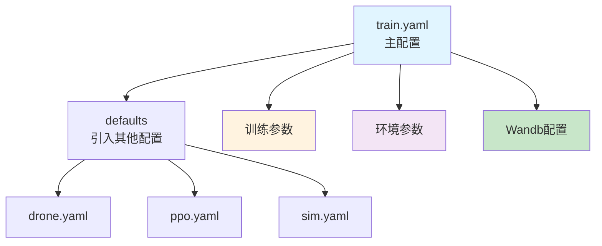
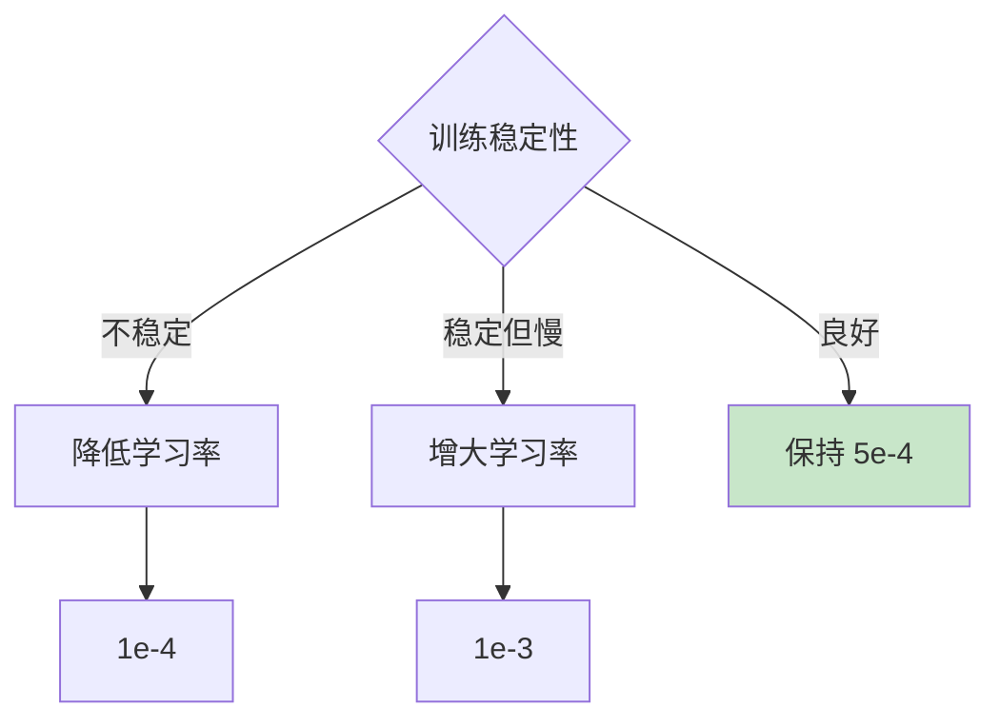

# NavRL 配置系统详解

## 1. 配置概述

NavRL 使用 [Hydra](https://hydra.cc/) 配置框架，提供灵活的层次化配置管理。配置文件位于 `training/cfg/` 目录。

### 1.1 配置文件结构

```
training/cfg/
├── train.yaml          # 主配置文件（入口）
├── drone.yaml          # 无人机配置
├── ppo.yaml            # PPO算法配置
└── sim.yaml            # 仿真配置
```

### 1.2 配置层次图



## 2. train.yaml - 主配置文件

### 2.1 完整配置

```yaml
defaults:
  - _self_              # 当前文件优先级最高
  - drone               # 引入 drone.yaml
  - ppo                 # 引入 ppo.yaml
  - sim                 # 引入 sim.yaml

# 基础设置
headless: False         # 是否无头模式（不显示GUI）
device: "cuda:0"        # 计算设备
seed: 0                 # 随机种子

# 训练总长度
max_frame_num: 12e8     # 最大训练帧数（12亿）
eval_interval: 1000     # 评估间隔（训练步）
save_interval: 1000     # 保存间隔（训练步）

# 训练环境
env:
  num_envs: 2           # 并行环境数量
  max_episode_length: 2200  # 单回合最大步数
  env_spacing: 8.0      # 环境之间的间距（米）
  num_obstacles: 350    # 静态障碍物数量

# 动态环境
env_dyn:
  num_obstacles: 80     # 动态障碍物数量（设为0则纯静态）
  vel_range: [0.5, 1.5] # 动态障碍物速度范围（米/秒）
  local_range: [5.0, 5.0, 4.5]  # 障碍物移动的局部范围（米）

# 相机视角（仅用于可视化）
viewer:
  eye: [0., 40., 40.]   # 相机位置
  lookat: [0., 2.5, 0.] # 观察点
  resolution: [960, 720] # 分辨率

# Wandb 实验追踪
wandb:
  project: NavRL        # 项目名称
  name: navigation_training  # 运行名称前缀
  entity: CERLAB-UAV-RL-Navigation  # 团队/用户名
  mode: offline         # online/offline/disabled
  run_id:               # 恢复训练时填写已有的 run_id
```

### 2.2 参数详解

#### 2.2.1 基础设置

| 参数 | 类型 | 默认值 | 说明 | 推荐设置 |
|------|------|--------|------|----------|
| `headless` | bool | False | 无头模式 | 训练时 True，调试时 False |
| `device` | str | "cuda:0" | 计算设备 | 有多GPU时可指定 "cuda:1" 等 |
| `seed` | int | 0 | 随机种子 | 可复现实验时固定，对比实验时改变 |

#### 2.2.2 训练总长度

| 参数 | 类型 | 默认值 | 说明 | 调优建议 |
|------|------|--------|------|----------|
| `max_frame_num` | float | 12e8 | 总训练帧数 | 简单任务可减少，复杂任务增加 |
| `eval_interval` | int | 1000 | 多少步评估一次 | 增大可加速训练，减小可细粒度监控 |
| `save_interval` | int | 1000 | 多少步保存一次 | 与 eval_interval 相同或倍数关系 |

**训练时间估算**：
```python
# 假设
num_envs = 128
training_frame_num = 32  # 每次收集
frames_per_batch = num_envs * training_frame_num = 4096
max_frame_num = 12e8

# 总训练步数
total_steps = max_frame_num / frames_per_batch ≈ 293,000 步

# 如果每步需要 5 秒
total_time = 293,000 * 5 / 3600 ≈ 407 小时 ≈ 17 天
```

#### 2.2.3 环境配置

| 参数 | 类型 | 默认值 | 说明 | 调优建议 |
|------|------|--------|------|----------|
| `num_envs` | int | 2 | 并行环境数 | **关键参数**，GPU允许时尽量大 |
| `max_episode_length` | int | 2200 | 回合最大步数 | = 2200 × 0.016s ≈ 35秒 |
| `env_spacing` | float | 8.0 | 环境间距 | 避免环境重叠，>= 地图宽度 |
| `num_obstacles` | int | 350 | 静态障碍物 | 增加难度时增大 |

**num_envs 设置指南**：

```python
# GPU 内存估算（粗略）
每个环境内存 ≈ 100 MB（包括物理仿真和张量）

# 对于不同显卡
RTX 3090 (24GB):  num_envs = 128-200
RTX 3080 (10GB):  num_envs = 64-96
RTX 2080 Ti (11GB): num_envs = 64-96
GTX 1080 Ti (11GB): num_envs = 32-64
```

#### 2.2.4 动态环境配置

| 参数 | 类型 | 默认值 | 说明 |
|------|------|--------|------|
| `num_obstacles` | int | 80 | 动态障碍物数量（0=纯静态环境） |
| `vel_range` | list | [0.5, 1.5] | 速度范围（米/秒） |
| `local_range` | list | [5.0, 5.0, 4.5] | 局部移动范围（X, Y, Z 米） |

**动态障碍物分类**：
```
总数: 80 = 4(宽度) × 2(高度) × 10(每类)
- 宽度类别: [0-0.25m], [0.25-0.5m], [0.5-0.75m], [0.75-1.0m]
- 高度类别: 3D(<1m 可飞越), 2D(>1m 必须绕)
```

#### 2.2.5 Wandb 配置

| 参数 | 类型 | 说明 | 使用场景 |
|------|------|------|----------|
| `project` | str | 项目名称 | 组织相关实验 |
| `name` | str | 运行名称 | 区分不同配置的实验 |
| `entity` | str | 团队/个人账户 | 多人协作 |
| `mode` | str | online/offline/disabled | 网络情况 |
| `run_id` | str | 已有运行ID | 恢复训练 |

**mode 选择**：
- `online`: 实时同步，网络稳定时使用
- `offline`: 本地保存，稍后手动同步
- `disabled`: 完全关闭，快速调试时使用

## 3. drone.yaml - 无人机配置

### 3.1 完整配置

```yaml
drone:  
  model_name: "hummingbird"  # 无人机模型

sensor:
  lidar_range: 4.0           # LiDAR 最大探测距离（米）
  lidar_vfov: [-10, 20.]     # 垂直视场角（度）
  lidar_vbeams: 4            # 垂直光束数量
  lidar_hres: 10.0           # 水平角度分辨率（度）
```

### 3.2 参数详解

#### 3.2.1 无人机模型

| 模型名称 | 说明 | 尺寸 | 质量 |
|----------|------|------|------|
| `hummingbird` | 小型四旋翼（默认） | 0.47m | 0.68kg |
| `crazyflie` | 微型四旋翼 | 0.09m | 0.03kg |
| `firefly` | 大型六旋翼 | 0.73m | 1.50kg |

**选择建议**：
- 训练: 使用 `hummingbird`（平衡性能和稳定性）
- 实物部署: 根据实际硬件选择

#### 3.2.2 LiDAR 传感器

| 参数 | 类型 | 默认值 | 说明 | 影响 |
|------|------|--------|------|------|
| `lidar_range` | float | 4.0 | 探测距离 | 更大=更远视野，但数据稀疏 |
| `lidar_vfov` | list | [-10, 20] | 垂直视场 | [-10°, 20°] 适合水平飞行 |
| `lidar_vbeams` | int | 4 | 垂直光束数 | 更多=更精细，但计算量大 |
| `lidar_hres` | float | 10.0 | 水平分辨率 | 360°/10° = 36 个方向 |

**LiDAR 数据量计算**：
```python
horizontal_beams = 360 / lidar_hres        # 36
vertical_beams = lidar_vbeams              # 4
total_rays = horizontal_beams * vertical_beams  # 144 条射线

# 数据形状
lidar_output_shape = (1, 36, 4)  # (批次, 水平, 垂直)
```

**参数权衡**：

| 配置 | 光束数 | 计算量 | 精度 | 适用场景 |
|------|--------|--------|------|----------|
| 低精度 | 36×2 = 72 | 低 | 粗略 | 快速原型 |
| **默认** | **36×4 = 144** | **中** | **良好** | **推荐** |
| 高精度 | 72×8 = 576 | 高 | 精细 | 复杂环境 |

**调优建议**：
```yaml
# 增大范围但减少精度（保持计算量）
lidar_range: 6.0     # 从 4.0 增大
lidar_hres: 15.0     # 从 10.0 增大（减少光束）

# 增加精度（需要更多计算）
lidar_vbeams: 8      # 从 4 增大
lidar_hres: 5.0      # 从 10.0 减小（更多光束）
```

## 4. ppo.yaml - PPO 算法配置

### 4.1 完整配置

```yaml
algo:
  feature_extractor:
    learning_rate: 5e-4      # 特征提取器学习率
    dyn_obs_num: 5           # 考虑的动态障碍物数量
  
  actor:
    learning_rate: 5e-4      # Actor 学习率
    clip_ratio: 0.1          # PPO 裁剪比率
    action_limit: 2.0        # 动作限制（米/秒）
  
  critic:
    learning_rate: 5e-4      # Critic 学习率
    clip_ratio: 0.1          # 价值函数裁剪比率
  
  entropy_loss_coefficient: 1e-3  # 熵损失系数
  training_frame_num: 32     # 每次收集的帧数
  training_epoch_num: 4      # 每批数据训练的 epoch 数
  num_minibatches: 16        # mini-batch 数量
```

### 4.2 参数详解

#### 4.2.1 学习率

| 组件 | 默认学习率 | 说明 | 典型范围 |
|------|-----------|------|----------|
| 特征提取器 | 5e-4 | 共享特征提取 | 1e-4 ~ 1e-3 |
| Actor | 5e-4 | 策略网络 | 1e-4 ~ 1e-3 |
| Critic | 5e-4 | 价值网络 | 1e-4 ~ 1e-3 |

**学习率调优策略**：



**学习率计划**（可选）：
```python
# 线性衰减
lr = initial_lr * (1 - step / max_steps)

# 余弦退火
lr = min_lr + 0.5 * (max_lr - min_lr) * (1 + cos(π * step / max_steps))
```

#### 4.2.2 PPO 特定参数

| 参数 | 默认值 | 说明 | 调优建议 |
|------|--------|------|----------|
| `clip_ratio` | 0.1 | 策略裁剪范围 | 保守: 0.1, 激进: 0.3 |
| `action_limit` | 2.0 | 最大速度（米/秒） | 根据无人机性能调整 |
| `entropy_coefficient` | 1e-3 | 探索程度 | 初期: 1e-2, 后期: 1e-4 |

**clip_ratio 效果**：

```
ratio = π_new(a|s) / π_old(a|s)

clip_ratio = 0.1:  ratio ∈ [0.9, 1.1]  # 保守更新
clip_ratio = 0.2:  ratio ∈ [0.8, 1.2]  # 平衡
clip_ratio = 0.3:  ratio ∈ [0.7, 1.3]  # 激进更新
```

**action_limit 设置**：
```yaml
# 根据无人机最大速度设置
hummingbird:  action_limit: 2.0   # 慢速飞行
firefly:      action_limit: 3.0   # 快速飞行

# 训练阶段调整
初期: action_limit: 1.0   # 保守探索
中期: action_limit: 2.0   # 正常速度
后期: action_limit: 3.0   # 最大性能
```

#### 4.2.3 训练配置

| 参数 | 默认值 | 说明 | 计算关系 |
|------|--------|------|----------|
| `training_frame_num` | 32 | 每环境收集帧数 | 总帧 = num_envs × 32 |
| `training_epoch_num` | 4 | 重复训练次数 | 更多 epoch = 更充分利用数据 |
| `num_minibatches` | 16 | 分批数量 | batch_size = 总帧 / 16 |

**数据使用计算**：
```python
num_envs = 128
training_frame_num = 32
training_epoch_num = 4
num_minibatches = 16

# 每次收集
total_frames = num_envs * training_frame_num = 4096

# 每个 minibatch
minibatch_size = total_frames / num_minibatches = 256

# 每次收集的总更新次数
total_updates = training_epoch_num * num_minibatches = 64
```

**参数权衡**：

| 场景 | training_frame_num | training_epoch_num | num_minibatches |
|------|-------------------|-------------------|-----------------|
| 数据丰富 | 32 | 2-3 | 32 |
| 数据稀缺 | 64 | 8-10 | 8 |
| **默认** | **32** | **4** | **16** |
| GPU 充足 | 16 | 4 | 64 |

#### 4.2.4 特征提取器配置

| 参数 | 默认值 | 说明 | 影响 |
|------|--------|------|------|
| `dyn_obs_num` | 5 | 关注的动态障碍物数 | 更多=信息丰富，计算量大 |

**dyn_obs_num 选择**：
```yaml
# 环境动态障碍物总数: 80

dyn_obs_num: 3   # 只考虑最近3个，快速但信息少
dyn_obs_num: 5   # 默认，平衡
dyn_obs_num: 10  # 更全面，但特征维度增大
```

**特征维度影响**：
```python
# 每个障碍物 10 维特征
obs_dim = 8 + (36*4) + dyn_obs_num * 10

dyn_obs_num = 3:  obs_dim = 8 + 144 + 30 = 182
dyn_obs_num = 5:  obs_dim = 8 + 144 + 50 = 202  # 默认
dyn_obs_num = 10: obs_dim = 8 + 144 + 100 = 252
```

## 5. sim.yaml - 仿真配置

### 5.1 完整配置

```yaml
sim:
  dt: 0.016                  # 仿真时间步长（秒）
  substeps: 1                # 每步的子步数
  gravity: [0, 0, -9.81]     # 重力加速度
  replicate_physics: false   # 复制物理场景
  use_flatcache: true        # 使用 flat cache
  use_gpu_pipeline: true     # GPU 物理管线
  device: "cuda:0"           # 物理计算设备

  # 求解器类型
  solver_type: 1             # 1=TGS, 0=PGS
  use_gpu: True              # 是否使用 GPU
  bounce_threshold_velocity: 0.2     # 反弹阈值速度
  friction_offset_threshold: 0.04    # 摩擦力偏移阈值
  friction_correlation_distance: 0.025  # 摩擦力相关距离
  enable_stabilization: True         # 启用稳定化
  enable_scene_query_support: true   # 场景查询支持

  # GPU 缓冲区配置
  gpu_max_rigid_contact_count: 524288
  gpu_max_rigid_patch_count: 163840
  gpu_found_lost_pairs_capacity: 4194304
  gpu_found_lost_aggregate_pairs_capacity: 33554432
  gpu_total_aggregate_pairs_capacity: 4194304
  gpu_max_soft_body_contacts: 1048576
  gpu_max_particle_contacts: 1048576
  gpu_heap_capacity: 67108864
  gpu_temp_buffer_capacity: 16777216
  gpu_max_num_partitions: 8
```

### 5.2 参数详解

#### 5.2.1 时间步长

| 参数 | 默认值 | 说明 | 影响 |
|------|--------|------|------|
| `dt` | 0.016 | 时间步长（秒） | 0.016s ≈ 60Hz |
| `substeps` | 1 | 子步数 | 更多子步=更精确，更慢 |

**时间步长选择**：
```yaml
# 实时仿真
dt: 0.016        # 60 Hz
dt: 0.020        # 50 Hz

# 高精度仿真
dt: 0.008        # 120 Hz
substeps: 2      # 实际 240 Hz

# 快速训练
dt: 0.033        # 30 Hz
```

**真实时间计算**：
```python
sim_time_per_step = dt * substeps
real_time_ratio = sim_time_per_step / actual_compute_time

# 例如
dt = 0.016
substeps = 1
actual_compute_time = 0.010  # 10ms

real_time_ratio = 0.016 / 0.010 = 1.6x  # 比实时快1.6倍
```

#### 5.2.2 物理引擎设置

| 参数 | 默认值 | 说明 | 推荐 |
|------|--------|------|------|
| `use_gpu_pipeline` | true | GPU 加速 | **必须开启** |
| `use_flatcache` | true | Flat cache | 大场景开启 |
| `solver_type` | 1 | TGS/PGS | TGS(1) 更快 |

**solver_type**：
- `0` (PGS): 投影高斯赛德尔，精确但慢
- `1` (TGS): 截断高斯赛德尔，快速但略不精确

#### 5.2.3 GPU 缓冲区

**默认值通常足够**，仅在以下情况需要调整：

| 症状 | 可能原因 | 解决方案 |
|------|----------|----------|
| 警告: "Contact buffer overflow" | 碰撞过多 | 增大 `gpu_max_rigid_contact_count` |
| 警告: "Patch buffer overflow" | 碰撞面片过多 | 增大 `gpu_max_rigid_patch_count` |
| 崩溃或卡顿 | 缓冲区不足 | 成倍增大相关缓冲区 |

**调整示例**：
```yaml
# 如果有 10000+ 障碍物
gpu_max_rigid_contact_count: 1048576   # 从 524288 加倍
gpu_max_rigid_patch_count: 327680      # 从 163840 加倍
```

## 6. Hydra 命令行覆盖

### 6.1 基本语法

```bash
# 覆盖单个参数
python train.py headless=true

# 覆盖嵌套参数
python train.py env.num_envs=128

# 覆盖多个参数
python train.py \
    env.num_envs=128 \
    algo.actor.learning_rate=1e-3 \
    headless=true

# 添加新参数
python train.py +new_param=value

# 删除参数
python train.py ~param_to_delete
```

### 6.2 常用覆盖模式

#### 6.2.1 快速原型

```bash
# 小规模快速测试
python train.py \
    env.num_envs=4 \
    max_frame_num=1e6 \
    eval_interval=100 \
    save_interval=100
```

#### 6.2.2 大规模训练

```bash
# 使用多GPU和大批量
python train.py \
    env.num_envs=256 \
    device=cuda:0 \
    headless=true \
    wandb.mode=online
```

#### 6.2.3 超参数搜索

```bash
# 不同学习率
for lr in 1e-4 5e-4 1e-3; do
    python train.py \
        algo.actor.learning_rate=$lr \
        wandb.name="lr_experiment_${lr}" &
done
```

#### 6.2.4 恢复训练

```bash
python train.py \
    wandb.run_id=abc123xyz \
    # 检查点会自动加载（如果在代码中配置）
```

### 6.3 配置组（Config Groups）

创建多个配置变体：

```
cfg/
├── train.yaml
├── drone/
│   ├── hummingbird.yaml
│   ├── firefly.yaml
│   └── crazyflie.yaml
└── algo/
    ├── ppo.yaml
    ├── sac.yaml
    └── td3.yaml
```

使用：
```bash
# 切换无人机模型
python train.py drone=firefly

# 切换算法
python train.py algo=sac

# 组合
python train.py drone=firefly algo=sac
```

## 7. 配置最佳实践

### 7.1 版本控制

```bash
# 保存配置快照
python train.py hydra.run.dir=outputs/exp_001

# 配置会自动保存到
outputs/exp_001/.hydra/config.yaml
outputs/exp_001/.hydra/overrides.yaml
```

### 7.2 配置验证

```python
# 在代码中添加验证
@hydra.main(...)
def main(cfg):
    # 验证关键参数
    assert cfg.env.num_envs > 0, "num_envs must be positive"
    assert cfg.algo.actor.clip_ratio > 0, "clip_ratio must be positive"
    
    # 警告不合理的配置
    if cfg.env.num_envs > 256:
        logging.warning("num_envs > 256 may cause OOM")
```

### 7.3 配置文档化

在配置文件中添加注释：

```yaml
env:
  num_envs: 128  # 并行环境数量
                 # 推荐范围: 32-256
                 # 取决于 GPU 内存
                 # 每个环境约需 100MB
  
  max_episode_length: 2200  # 单回合最大步数
                            # 2200 步 × 0.016 秒 ≈ 35 秒
                            # 足够飞行 40-80 米
```

### 7.4 环境特定配置

```yaml
# development.yaml (开发环境)
defaults:
  - train
  
headless: false
env:
  num_envs: 4
max_frame_num: 1e6
wandb:
  mode: disabled

# production.yaml (生产环境)
defaults:
  - train

headless: true
env:
  num_envs: 256
max_frame_num: 12e8
wandb:
  mode: online
```

使用：
```bash
python train.py --config-name=development
python train.py --config-name=production
```

## 8. 配置调优指南

### 8.1 根据硬件调优

#### 8.1.1 GPU 内存受限

```yaml
env:
  num_envs: 32              # 减少环境数
  
algo:
  training_frame_num: 16    # 减少收集帧数
  num_minibatches: 8        # 减少 batch 数
  
sensor:
  lidar_vbeams: 3           # 减少传感器分辨率
  lidar_hres: 15.0
```

#### 8.1.2 计算速度慢

```yaml
env:
  num_obstacles: 200        # 减少障碍物
  num_envs: 64              # 适中的环境数
  
env_dyn:
  num_obstacles: 40         # 减少动态障碍物
  
sim:
  dt: 0.02                  # 增大时间步长
```

#### 8.1.3 充足资源

```yaml
env:
  num_envs: 256             # 最大化并行度
  
algo:
  training_frame_num: 64    # 多收集数据
  training_epoch_num: 8     # 充分利用数据
  num_minibatches: 32       # 细粒度更新
```

### 8.2 根据任务难度调优

#### 8.2.1 简单环境

```yaml
env:
  num_obstacles: 100        # 少障碍物
  max_episode_length: 1000  # 短回合
  
env_dyn:
  num_obstacles: 0          # 纯静态

algo:
  entropy_loss_coefficient: 1e-4  # 少探索
  training_epoch_num: 2     # 少训练
```

#### 8.2.2 困难环境

```yaml
env:
  num_obstacles: 500        # 密集障碍物
  max_episode_length: 3000  # 长回合
  
env_dyn:
  num_obstacles: 120        # 多动态障碍物
  vel_range: [1.0, 2.5]     # 更快速度

algo:
  entropy_loss_coefficient: 5e-3  # 更多探索
  training_epoch_num: 8     # 充分训练
  clip_ratio: 0.2           # 允许更大更新
```

### 8.3 课程学习配置

```python
# 配置演进策略（在代码中实现）

# 阶段 1: 简单环境学习基础
phase_1_cfg = {
    "num_obstacles": 100,
    "num_dyn_obstacles": 0,
    "action_limit": 1.0,
}

# 阶段 2: 增加静态复杂度
phase_2_cfg = {
    "num_obstacles": 250,
    "num_dyn_obstacles": 0,
    "action_limit": 1.5,
}

# 阶段 3: 添加动态障碍物
phase_3_cfg = {
    "num_obstacles": 350,
    "num_dyn_obstacles": 40,
    "action_limit": 2.0,
}

# 阶段 4: 最终难度
phase_4_cfg = {
    "num_obstacles": 500,
    "num_dyn_obstacles": 80,
    "action_limit": 2.5,
}
```

## 9. 快速配置参考

### 9.1 推荐配置集合

#### 9.1.1 调试配置

```yaml
headless: false
device: "cuda:0"
env:
  num_envs: 2
  num_obstacles: 50
env_dyn:
  num_obstacles: 0
max_frame_num: 1e5
eval_interval: 10
wandb:
  mode: disabled
```

#### 9.1.2 标准训练配置

```yaml
headless: true
device: "cuda:0"
env:
  num_envs: 128
  num_obstacles: 350
env_dyn:
  num_obstacles: 80
max_frame_num: 12e8
eval_interval: 1000
wandb:
  mode: online
```

#### 9.1.3 高性能配置

```yaml
headless: true
device: "cuda:0"
env:
  num_envs: 256
  num_obstacles: 350
env_dyn:
  num_obstacles: 80
algo:
  training_frame_num: 64
  num_minibatches: 32
max_frame_num: 20e8
eval_interval: 500
wandb:
  mode: online
```

### 9.2 常用命令速查

```bash
# 本地快速测试
python train.py headless=false env.num_envs=2 wandb.mode=disabled

# 服务器训练
python train.py headless=true env.num_envs=128 wandb.mode=offline

# 恢复训练
python train.py wandb.run_id=YOUR_RUN_ID

# 超参数实验
python train.py algo.actor.learning_rate=1e-3 wandb.name="lr_1e-3"

# 评估模型
python eval.py headless=false
```

---

## 相关文档

- [返回总体架构](./00-总体系统架构.md)
- [环境模块详解](./01-环境模块详解.md)
- [PPO算法详解](./02-PPO算法详解.md)
- [训练脚本详解](./03-训练脚本详解.md)
- [工具函数详解](./04-工具函数详解.md)

---

## 附录：完整配置模板

```yaml
# ====================
# 完整训练配置模板
# ====================

defaults:
  - _self_
  - drone
  - ppo
  - sim

# ---------- 基础设置 ----------
headless: true          # 无头模式
device: "cuda:0"        # 计算设备
seed: 0                 # 随机种子

# ---------- 训练长度 ----------
max_frame_num: 12e8     # 12亿帧
eval_interval: 1000     # 评估间隔
save_interval: 1000     # 保存间隔

# ---------- 环境配置 ----------
env:
  num_envs: 128                   # 环境数量
  max_episode_length: 2200        # 最大步数
  env_spacing: 8.0                # 环境间距
  num_obstacles: 350              # 静态障碍物

env_dyn:
  num_obstacles: 80               # 动态障碍物
  vel_range: [0.5, 1.5]          # 速度范围
  local_range: [5.0, 5.0, 4.5]   # 移动范围

# ---------- 可视化 ----------
viewer:
  eye: [0., 40., 40.]
  lookat: [0., 2.5, 0.]
  resolution: [960, 720]

# ---------- 实验追踪 ----------
wandb:
  project: NavRL
  name: navigation_training
  entity: YOUR_ENTITY
  mode: online
  run_id: null
```
