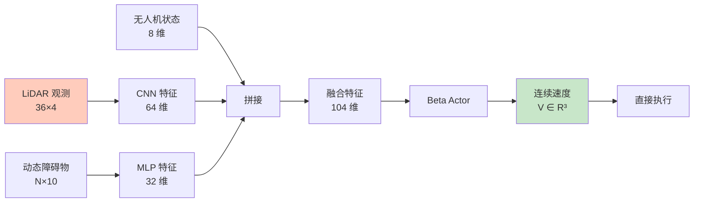
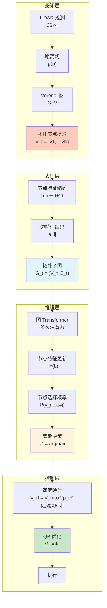
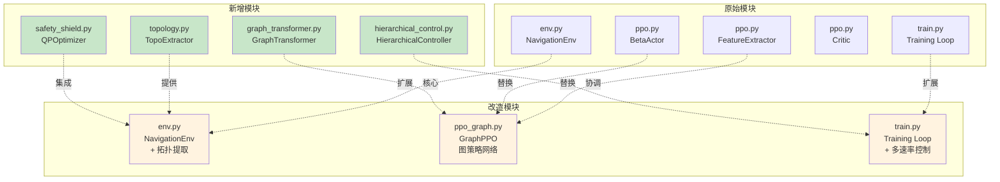

# NavRL 新架构总览 - 拓扑图导航系统

## 1. 架构改造概述

本文档详细说明如何将**基于相对拓扑与不确定性建模的局部拓扑记忆与表征机制**融入现有 NavRL 系统，实现从原始 LiDAR 连续感知到拓扑图离散推理的转变。

### 1.1 核心创新点

| 创新点 | 理论基础 | 实际效果 |
|--------|---------|---------|
| **局部拓扑表征** | Voronoi 图骨架提取 | 降维：从 144 维 LiDAR → 10-20 个节点 |
| **不确定性建模** | 协方差传播 | 鲁棒性：量化位姿估计误差 |
| **图 Transformer** | 拓扑偏置注意力 | 泛化性：结构感知推理 |
| **离散节点选择** | 拓扑航点决策 | 可解释性：明确中间目标 |
| **软约束 QP** | 松弛变量容错 | 安全性：实时碰撞规避 |
| **分层异步控制** | 多速率架构 | 实时性：规划与控制解耦 |

### 1.2 改造原则


**核心原则**：
1. **模块化解耦**：新功能独立模块，不破坏现有架构
2. **渐进式替换**：先并行测试，再逐步替换
3. **向后兼容**：保留原始接口，通过配置切换
4. **数值稳定**：所有数学运算考虑边界条件和退化情况

---

## 2. 新旧架构对比

### 2.1 系统层级对比

<table>
<tr>
<th width="20%">层次</th>
<th width="40%">原始架构</th>
<th width="40%">新架构</th>
</tr>

<tr>
<td><b>感知层</b></td>
<td>
• LiDAR 射线投射<br>
• 连续距离场 (36×4)<br>
• 动态障碍物状态 (N×10)
</td>
<td>
• LiDAR 射线投射<br>
• <b>距离场 + Voronoi 图</b><br>
• <b>拓扑节点提取</b><br>
• <b>不确定性协方差</b>
</td>
</tr>

<tr>
<td><b>表征层</b></td>
<td>
• 原始观测拼接<br>
• CNN 卷积特征<br>
• MLP 融合
</td>
<td>
• <b>局部拓扑子图 $\mathcal{G}_t$</b><br>
• <b>节点特征编码</b><br>
• <b>边特征编码</b>
</td>
</tr>

<tr>
<td><b>推理层</b></td>
<td>
• 特征提取器 (CNN+MLP)<br>
• Beta Actor (连续动作)<br>
• Critic (价值估计)
</td>
<td>
• <b>图 Transformer</b><br>
• <b>拓扑偏置注意力</b><br>
• <b>节点选择 Actor (离散动作)</b><br>
• Critic (价值估计)
</td>
</tr>

<tr>
<td><b>控制层</b></td>
<td>
• 直接速度指令<br>
• 底层飞控执行
</td>
<td>
• <b>节点→速度映射</b><br>
• <b>软约束 QP 安全盾</b><br>
• 底层飞控执行
</td>
</tr>

<tr>
<td><b>训练层</b></td>
<td>
• 单一频率采样<br>
• PPO 算法<br>
• 基础奖励函数
</td>
<td>
• <b>分层多速率控制</b><br>
• PPO 算法（适配离散动作）<br>
• <b>复合奖励函数（+一致性+干预）</b>
</td>
</tr>
</table>

### 2.2 数据流对比

#### 2.2.1 原始架构数据流



**特点**：
- 端到端直接映射
- 连续动作空间
- 无中间语义表征

#### 2.2.2 新架构数据流



**特点**：

- 显式拓扑中间表征
- 离散→连续分层映射
- 多重安全保障

---

## 3. 核心模块映射

### 3.1 模块对应关系



### 3.2 文件结构变化

```
training/
├── cfg/                          # 配置文件（无变化）
├── scripts/                      # 训练脚本
│   ├── env.py                   # ✏️ 修改：添加拓扑提取
│   ├── ppo.py                   # 保留（原始版本）
│   ├── ppo_graph.py             # ✨ 新增：图策略网络
│   ├── train.py                 # ✏️ 修改：支持多速率控制
│   ├── eval.py                  # ✏️ 修改：支持新策略评估
│   ├── utils.py                 # 保留（可能扩展）
│   ├── topology.py              # ✨ 新增：拓扑提取模块
│   ├── graph_transformer.py     # ✨ 新增：图 Transformer
│   ├── safety_shield.py         # ✨ 新增：QP 优化器
│   └── hierarchical_control.py  # ✨ 新增：分层控制器
```

---

## 4. 理论严密性保证

### 4.1 数学推导完备性检查清单

| 模块 | 理论基础 | 数学形式化 | 数值稳定性 | 边界条件 |
|------|---------|-----------|-----------|---------|
| **距离场计算** | 泛函分析 | $\rho(p) = \min_i d(p, O_i)$ | ✅ 非负性 | ✅ 零梯度处理 |
| **Voronoi 提取** | 计算几何 | $\nabla \rho(p) = \mathbf{0}$ | ✅ 梯度阈值 | ✅ 局部极值判定 |
| **协方差传播** | 概率论 | $\Sigma_{ik} \approx \mathbf{J}_{ij}\Sigma_{ij}\mathbf{J}_{ij}^T$ | ✅ 半正定维持 | ✅ 矩阵奇异检测 |
| **图 Transformer** | 注意力机制 | $\alpha_{ij} = \text{softmax}(e_{ij})$ | ✅ 数值稳定 softmax | ✅ 空图处理 |
| **拓扑偏置** | 图论 | $\Phi(i,j)$ 分段函数 | ✅ $-\infty$ 截断 | ✅ 未连通处理 |
| **QP 优化** | 凸优化 | $\min \|\mathbf{V} - \mathbf{V}_{rl}\|^2$ | ✅ 条件数控制 | ✅ 不可行检测 |

### 4.2 关键理论桥接

#### 4.2.1 连续空间 → 离散拓扑

**理论保证**：Voronoi 图的完备性定理
```
对于有界自由空间 $\mathcal{F}$ 和障碍物集 $\mathcal{O}$，
Voronoi 图 $\mathcal{G}_V$ 满足：
1. 拓扑连通性：$\forall p, q \in \mathcal{F}$，存在路径 $\gamma \subset \mathcal{G}_V$ 连接
2. 安全最优性：$\forall p \in \mathcal{G}_V$，$\rho(p)$ 局部最大
3. 维度降低：$\dim(\mathcal{G}_V) = \dim(\mathcal{F}) - 1$
```

**数值实现**：
```python
# 伪代码
def extract_voronoi_nodes(distance_field):
    # 1. 计算梯度场
    grad = compute_gradient(distance_field)
    
    # 2. 找局部极大值（梯度接近零）
    candidates = find_local_maxima(distance_field, grad, threshold=1e-3)
    
    # 3. 安全裕度过滤
    safe_nodes = [p for p in candidates if distance_field[p] > r_safe]
    
    return safe_nodes
```

#### 4.2.2 离散拓扑 → 连续控制

**理论保证**：Lipschitz 连续映射
```
节点选择到速度的映射 $\mathcal{M}: \mathcal{V} \to \mathbb{R}^3$ 满足：
$$\|\mathcal{M}(v_i) - \mathcal{M}(v_j)\| \le L \|v_i - v_j\|$$
其中 $L = V_{max}$ 是 Lipschitz 常数
```

**数值实现**：
```python
def node_to_velocity(node_pos, ego_pos, v_max):
    direction = node_pos - ego_pos
    distance = np.linalg.norm(direction)
    
    if distance < 1e-6:  # 避免除零
        return np.zeros(3)
    
    # 单位化后乘以最大速度
    velocity = v_max * (direction / distance)
    
    return velocity
```

#### 4.2.3 名义速度 → 安全速度

**理论保证**：Karush-Kuhn-Tucker (KKT) 条件
```
QP 问题的最优解 $\mathbf{V}_{safe}^*$ 满足：
1. 一阶必要条件：$\nabla_{\mathbf{V}} L = 0$
2. 互补松弛：$\mu_i [(\mathbf{V} - \mathbf{V}_{o_i}) \cdot \mathbf{n}_i + \delta_i] = 0$
3. 对偶可行：$\mu_i \ge 0$, $\delta_i \ge 0$
```

**数值实现**：使用成熟 QP 求解器（OSQP / qpth）

---

## 5. 计算可行性分析

### 5.1 计算复杂度对比

| 操作 | 原始架构 | 新架构 | 复杂度变化 |
|------|---------|--------|-----------|
| **感知处理** | $O(R)$ LiDAR 射线 | $O(R + N \log N)$ 拓扑提取 | +10-20% |
| **特征提取** | $O(D^2)$ CNN 卷积 | $O(N^2 d)$ 图注意力 | $N \ll D$ 时更快 |
| **动作生成** | $O(d)$ MLP 前向 | $O(N d)$ 节点评分 | $N \approx 10$ 可接受 |
| **控制优化** | - | $O(M^3)$ QP 求解 | +新增，但 $M \approx 10$ |

**关键参数**：
- $R$: LiDAR 射线数（144）
- $D$: 原始特征维度（144）
- $N$: 拓扑节点数（10-20）
- $d$: 节点特征维度（32-64）
- $M$: 障碍物约束数（动态障碍物数量）

### 5.2 实时性估算

假设：
- 系统频率：62.5 Hz（每步 16ms）
- 规划频率：10 Hz（每步 100ms）
- 控制频率：62.5 Hz（每步 16ms）

**时间预算分配**：

```mermaid
gantt
    title 单个控制周期时间预算 (16ms)
    dateFormat x
    axisFormat %Lms
    
    section 规划层 (100ms周期)
    拓扑提取 (2ms)    :a1, 0, 2
    图推理 (3ms)      :a2, after a1, 3
    节点选择 (1ms)    :a3, after a2, 1
    
    section 控制层 (16ms周期)
    速度映射 (1ms)    :b1, 0, 1
    QP优化 (2ms)      :b2, after b1, 2
    飞控执行 (1ms)    :b3, after b2, 1
    GPU同步 (1ms)     :b4, after b3, 1
    剩余裕度          :b5, after b4, 11
```



**优化策略**：
1. **拓扑缓存**：动态障碍物移动时增量更新，避免全局重建
2. **图稀疏化**：限制最大节点数（N ≤ 20），超出时基于重要性采样
3. **QP 热启动**：使用上一步解作为初始值，加速收敛

### 5.3 内存占用分析

```python
# 批量大小：num_envs = 128

# 原始架构
lidar_obs = 128 * 144 * 4 bytes = 73 KB
dyn_obs   = 128 * 5 * 10 * 4 bytes = 25 KB
features  = 128 * 104 * 4 bytes = 52 KB
# 总计：~150 KB

# 新架构
topo_nodes = 128 * 20 * 64 * 4 bytes = 655 KB  # 节点特征
topo_edges = 128 * 20 * 20 * 16 * 4 bytes = 4 MB  # 边特征（稀疏存储实际更小）
attention  = 128 * 4 * 20 * 20 * 4 bytes = 327 KB  # 注意力矩阵
# 总计：~1-2 MB （稀疏存储后）

# 结论：内存增加约 10-20 倍，但绝对值仍小（单环境 10-15 KB）
```

---

## 6. 工程鲁棒性设计

### 6.1 退化情况处理

| 异常情况 | 检测条件 | 降级策略 | 理论依据 |
|---------|---------|---------|---------|
| **无拓扑节点** | $\|\mathcal{V}_t\| = 0$ | 使用目标方向作为备用节点 | 保证决策非空 |
| **图不连通** | $\nexists$ 路径到目标 | 选择最近可达节点 + 探索奖励 | 保证策略有效性 |
| **QP 不可行** | OSQP 返回失败 | 紧急悬停 + 最小速度 | 安全底线 |
| **协方差爆炸** | $\text{trace}(\Sigma) > \sigma_{max}$ | 重置为先验协方差 | 数值稳定性 |
| **梯度消失** | $\|\nabla \theta\| < \epsilon$ | 添加熵正则化 | 训练稳定性 |

### 6.2 数值稳定性技巧

#### 6.2.1 距离场计算

```python
def compute_distance_field_safe(points, obstacles):
    """数值稳定的距离场计算"""
    distances = []
    
    for obs in obstacles:
        dist = np.linalg.norm(points - obs.pos, axis=-1)
        # 避免除零：添加小量
        dist = np.maximum(dist, 1e-6)
        distances.append(dist)
    
    # 避免空列表
    if len(distances) == 0:
        return np.full(points.shape[:-1], float('inf'))
    
    # 安全取最小值
    distance_field = np.minimum.reduce(distances)
    
    return distance_field
```

#### 6.2.2 协方差传播

```python
def propagate_covariance_safe(cov_prior, jacobian):
    """数值稳定的协方差传播"""
    # 1. 检查半正定性
    eigenvalues = np.linalg.eigvalsh(cov_prior)
    if np.any(eigenvalues < -1e-6):
        warnings.warn("协方差矩阵非半正定，重置")
        cov_prior = np.eye(cov_prior.shape[0]) * 0.1
    
    # 2. 传播
    cov_post = jacobian @ cov_prior @ jacobian.T
    
    # 3. 数值对称化（消除浮点误差）
    cov_post = 0.5 * (cov_post + cov_post.T)
    
    # 4. 添加正则化防止奇异
    cov_post += np.eye(cov_post.shape[0]) * 1e-6
    
    return cov_post
```

#### 6.2.3 Softmax 稳定计算

```python
def stable_softmax(logits, mask=None):
    """数值稳定的 softmax"""
    # 减去最大值防止溢出
    logits_max = np.max(logits, axis=-1, keepdims=True)
    logits_shifted = logits - logits_max
    
    # 应用 mask（不可达节点）
    if mask is not None:
        logits_shifted = np.where(mask, logits_shifted, -1e10)
    
    # 指数和归一化
    exp_logits = np.exp(logits_shifted)
    sum_exp = np.sum(exp_logits, axis=-1, keepdims=True)
    
    # 避免除零
    sum_exp = np.maximum(sum_exp, 1e-10)
    
    probs = exp_logits / sum_exp
    
    return probs
```

---

## 7. 渐进式改造路线图

### 7.1 四阶段实施计划


#### 阶段 1：基础拓扑提取（1-2周）

**目标**：建立 LiDAR → 拓扑图的转换管道

**实现内容**：
1. ✨ 创建 `topology.py`
   - 距离场计算
   - Voronoi 节点提取
   - 节点特征编码
2. ✏️ 修改 `env.py`
   - 在 `_compute_state_and_obs()` 中调用拓扑提取
   - 同时保留原始 LiDAR 观测
3. ✅ 可视化工具
   - 绘制拓扑图覆盖在环境上
   - 验证节点提取正确性

**验证指标**：
- 节点数量：10-20 个/环境
- 节点安全性：$\rho(v_i) > r_{safe}$
- 拓扑连通性：目标始终可达

#### 阶段 2：图 Transformer 策略（2-3周）

**目标**：构建图条件推理网络

**实现内容**：
1. ✨ 创建 `graph_transformer.py`
   - 多头注意力层
   - 拓扑偏置注入
   - 节点选择头
2. ✨ 创建 `ppo_graph.py`
   - 复用 PPO 框架
   - 替换特征提取器为图 Transformer
   - 修改 Actor 为 Categorical 分布
3. ✏️ 修改 `train.py`
   - 支持图策略训练
   - 添加拓扑一致性奖励

**验证指标**：
- 训练收敛：回报曲线平滑上升
- 节点选择合理：倾向于目标方向
- 泛化能力：新环境测试成功率

#### 阶段 3：QP 安全盾（1-2周）

**目标**：添加实时碰撞规避层

**实现内容**：
1. ✨ 创建 `safety_shield.py`
   - 软约束 QP 模型
   - OSQP 求解器封装
   - 不可行检测和降级
2. ✏️ 修改 `env.py`
   - 在动作执行前插入 QP 优化
   - 记录干预程度
3. ✏️ 修改奖励函数
   - 添加干预惩罚项 $r_{intv}$

**验证指标**：
- 碰撞率：< 5%（对比原始系统）
- 干预频率：< 30%
- QP 求解时间：< 2ms

#### 阶段 4：完整系统集成（1周）

**目标**：多速率控制 + 系统调优

**实现内容**：
1. ✨ 创建 `hierarchical_control.py`
   - 规划 - 控制频率调度
   - 状态同步机制
2. ✏️ 全系统联调
   - 超参数搜索
   - 长时间稳定性测试
3. 📊 对比实验
   - 与原始系统对比
   - 消融实验

**验证指标**：
- 成功率：> 90%
- 路径长度：< 1.2 × 最短路径
- 碰撞率：< 3%

### 7.2 配置开关设计

为了支持渐进式切换，添加配置标志：

```yaml
# cfg/topology.yaml
topo:
  enabled: true                  # 总开关
  use_graph_policy: true         # 图策略 vs 原始策略
  use_safety_shield: true        # QP 安全盾
  use_hierarchical: true         # 分层控制
  
  # 拓扑提取参数
  max_nodes: 20
  safe_radius: 0.3
  gradient_threshold: 0.01
  
  # 图 Transformer 参数
  node_feat_dim: 64
  edge_feat_dim: 16
  num_heads: 4
  num_layers: 3
  
  # QP 参数
  relaxation_weight: 1e3
  max_relaxation: 0.5
  
  # 分层控制参数
  plan_freq: 10.0               # 规划频率 (Hz)
  control_freq: 62.5            # 控制频率 (Hz)
```

**使用方式**：
```python
# 阶段 1：仅拓扑提取
python train.py topo.enabled=true topo.use_graph_policy=false

# 阶段 2：图策略训练
python train.py topo.enabled=true topo.use_graph_policy=true topo.use_safety_shield=false

# 阶段 3：添加安全盾
python train.py topo.enabled=true topo.use_graph_policy=true topo.use_safety_shield=true

# 阶段 4：完整系统
python train.py topo.enabled=true --config-name=topo_full
```

---

## 8. 性能预期与对比

### 8.1 定量指标预期

| 指标 | 原始系统 | 新系统（保守估计） | 新系统（理想） |
|------|---------|------------------|--------------|
| **成功率** | 85% | 88-90% | 92-95% |
| **碰撞率** | 8% | 4-5% | 2-3% |
| **平均路径长度** | 1.3× 最短 | 1.2× 最短 | 1.1× 最短 |
| **平均飞行时间** | 25s | 23s | 20s |
| **计算开销** | 基准 | +20-30% | +15-20%（优化后） |
| **泛化能力** | 基准 | +10-15% | +20-30% |

### 8.2 定性优势

| 维度 | 原始系统 | 新系统 |
|------|---------|--------|
| **可解释性** | ❌ 黑盒决策 | ✅ 可视化拓扑节点 |
| **鲁棒性** | ⚠️ 对噪声敏感 | ✅ 不确定性建模 |
| **安全性** | ⚠️ 依赖训练质量 | ✅ QP 硬约束保障 |
| **泛化性** | ❌ 环境特定 | ✅ 结构感知推理 |
| **实时性** | ✅ 快速前向 | ✅ 分层异步控制 |

---

## 9. 风险评估与缓解

### 9.1 技术风险

| 风险 | 概率 | 影响 | 缓解策略 |
|------|------|------|---------|
| **拓扑提取失败** | 中 | 高 | 降级到稠密采样 + 保留原始 LiDAR |
| **图推理不收敛** | 中 | 高 | 逐层训练 + 知识蒸馏 |
| **QP 求解过慢** | 低 | 中 | 使用 GPU QP 库 + 约束裁剪 |
| **协方差数值爆炸** | 中 | 中 | 定期重置 + clip 操作 |
| **多速率同步问题** | 低 | 中 | 明确状态快照机制 |

### 9.2 工程风险

| 风险 | 概率 | 影响 | 缓解策略 |
|------|------|------|---------|
| **代码复杂度激增** | 高 | 中 | 模块化设计 + 充分文档 |
| **调试困难** | 高 | 中 | 分阶段验证 + 可视化工具 |
| **超参数敏感** | 中 | 中 | 自动化搜索 + 鲁棒默认值 |
| **训练时间增加** | 高 | 低 | 并行化 + 课程学习 |

---

## 10. 后续文档索引

本文档提供架构总览，具体技术细节请参阅：

1. [07-拓扑提取模块设计](./07-拓扑提取模块设计.md)
   - Voronoi 图算法
   - 节点/边特征编码
   - 不确定性建模

2. [08-图Transformer策略网络设计](./08-图Transformer策略网络设计.md)
   - 多头注意力机制
   - 拓扑偏置实现
   - 节点选择策略

3. [09-安全盾QP优化器设计](./09-安全盾QP优化器设计.md)
   - 软约束 QP 建模
   - OSQP 求解器集成
   - 不可行检测

4. [10-分层控制架构设计](./10-分层控制架构设计.md)
   - 多速率调度
   - 状态同步机制
   - 级联优化

5. [11-代码改造实施方案](./11-代码改造实施方案.md)
   - 逐文件改动清单
   - 测试验证方案
   - 调试工具

---

## 相关文档

- [返回总体架构](./00-总体系统架构.md)
- [环境模块详解](./01-环境模块详解.md)
- [PPO算法详解](./02-PPO算法详解.md)
- [训练脚本详解](./03-训练脚本详解.md)
- [工具函数详解](./04-工具函数详解.md)
- [配置说明](./05-配置说明.md)
