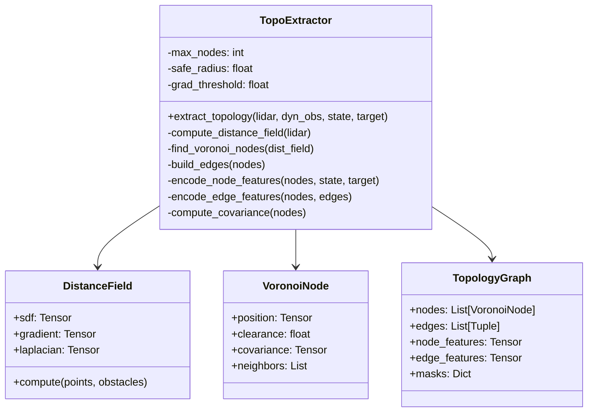
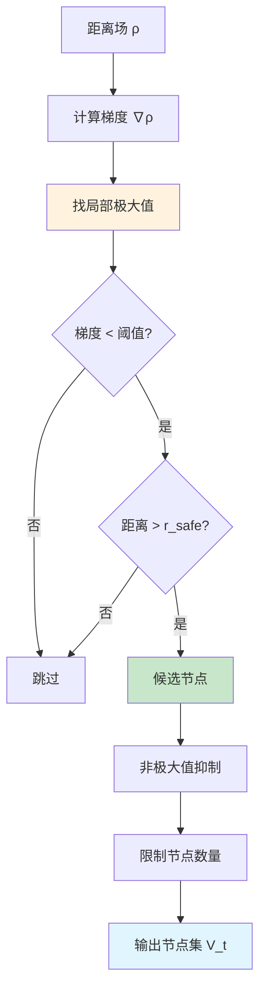

# 拓扑提取模块设计 (topology.py)

## 1. 模块概述

拓扑提取模块是新架构的基石，负责将连续 LiDAR 观测转换为离散拓扑图表征。该模块实现了基于 Voronoi 图的稀疏拓扑骨架提取，包含距离场计算、节点提取、特征编码和不确定性建模四个核心子系统。

### 1.1 模块职责

```mermaid
graph LR
    A[LiDAR 观测<br/>36×4 射线] --> B[TopoExtractor]
    B --> C[拓扑子图<br/>G_t = (V_t, E_t)]
    
    B --> B1[距离场计算]
    B --> B2[Voronoi 节点提取]
    B --> B3[特征编码]
    B --> B4[不确定性建模]
    
    style B fill:#e1f5ff
    style C fill:#c8e6c9
```

### 1.2 理论基础回顾

**核心公式**：

1. **距离场泛函**：
$$\rho(p) = \min_{i=1,\dots,n} d(p, O_i)$$

2. **Voronoi 图定义**：
$$\mathcal{G}_V = \left\{ p \in \mathcal{F} \left| \exists i \neq j, \rho(p) = d(p, O_i) = d(p, O_j) \le d(p, O_k), \forall k \neq i,j \right. \right\}$$

3. **安全节点约束**：
$$\nabla \rho(p_{v_i}) = \mathbf{0}, \quad \rho(p_{v_i}) > r_{safe}$$

4. **协方差传播**：
$$\Sigma_{ik} \approx \mathbf{J}_{ij} \Sigma_{ij} \mathbf{J}_{ij}^T + \mathbf{J}_{jk} \Sigma_{jk} \mathbf{J}_{jk}^T$$

---

## 2. 类结构设计

### 2.1 总体架构

```python
class TopoExtractor:
    """拓扑图提取器"""
    
    def __init__(self, cfg):
        self.max_nodes = cfg.max_nodes          # 最大节点数
        self.safe_radius = cfg.safe_radius      # 安全半径
        self.grad_threshold = cfg.grad_threshold # 梯度阈值
        self.node_feat_dim = cfg.node_feat_dim  # 节点特征维度
        self.edge_feat_dim = cfg.edge_feat_dim  # 边特征维度
        
        # 不确定性参数
        self.prior_cov = torch.eye(3) * cfg.prior_std ** 2
        self.max_trace = cfg.max_cov_trace
    
    def extract_topology(self, lidar_data, dyn_obs, drone_state, target_pos):
        """
        主接口：从传感器数据提取拓扑图
        
        参数:
            lidar_data: (batch, 36, 4) LiDAR 观测
            dyn_obs: (batch, N, 10) 动态障碍物信息
            drone_state: (batch, 8) 无人机状态
            target_pos: (batch, 3) 目标位置
            
        返回:
            graph_dict: {
                'node_features': (batch, max_nodes, node_feat_dim),
                'edge_features': (batch, max_nodes, max_nodes, edge_feat_dim),
                'node_mask': (batch, max_nodes),  # 有效节点标记
                'edge_mask': (batch, max_nodes, max_nodes),  # 有效边标记
            }
        """
        pass
```

### 2.2 类图



---

## 3. 距离场计算

### 3.1 算法原理

距离场 $\rho(p)$ 标量场，表示空间中每个点到最近障碍物的距离。基于 LiDAR 射线hit点，我们构建离散距离场。

**离散化策略**：
1. 将局部空间划分为规则网格
2. 对每个网格点计算到所有障碍物采样点的最小距离
3. 使用插值获得连续距离场

### 3.2 网格采样实现

```python
def compute_distance_field(self, lidar_data, ego_pos):
    """
    计算局部距离场
    
    参数:
        lidar_data: (batch, 36, 4) LiDAR 距离
        ego_pos: (batch, 3) 无人机位置
    
    返回:
        distance_field: (batch, H, W, D) 3D 距离场
        gradient: (batch, H, W, D, 3) 梯度场
    """
    batch_size = lidar_data.shape[0]
    device = lidar_data.device
    
    # 1. 从 LiDAR 重建障碍物点云
    obstacle_points = self._lidar_to_pointcloud(lidar_data, ego_pos)
    # obstacle_points: (batch, N_rays, 3)
    
    # 2. 定义局部网格
    grid_range = 8.0  # 8米x8米x8米
    grid_res = 0.2    # 20cm 分辨率
    n_cells = int(grid_range / grid_res)  # 40x40x40
    
    # 创建网格坐标 (相对于无人机)
    coords = torch.linspace(-grid_range/2, grid_range/2, n_cells, device=device)
    grid_x, grid_y, grid_z = torch.meshgrid(coords, coords, coords, indexing='ij')
    grid_points = torch.stack([grid_x, grid_y, grid_z], dim=-1)  # (H, W, D, 3)
    
    # 扩展到 batch
    grid_points = grid_points.unsqueeze(0).expand(batch_size, -1, -1, -1, -1)
    # (batch, H, W, D, 3)
    
    # 3. 计算每个网格点到所有障碍物点的距离
    # 展平网格进行批量计算
    grid_flat = grid_points.view(batch_size, -1, 3)  # (batch, H*W*D, 3)
    
    # 计算距离矩阵 (batch, H*W*D, N_rays)
    dist_matrix = torch.cdist(grid_flat, obstacle_points)
    
    # 4. 取最小距离
    distance_field, _ = dist_matrix.min(dim=-1)  # (batch, H*W*D)
    distance_field = distance_field.view(batch_size, n_cells, n_cells, n_cells)
    
    # 数值稳定性：添加小量避免零梯度
    distance_field = distance_field + 1e-6
    
    # 5. 计算梯度场（使用中心差分）
    gradient = self._compute_gradient_3d(distance_field, grid_res)
    # gradient: (batch, H, W, D, 3)
    
    return distance_field, gradient, grid_points[:, :, :, :, :3]

def _lidar_to_pointcloud(self, lidar_data, ego_pos):
    """将 LiDAR 数据转换为世界坐标系点云"""
    # lidar_data: (batch, 36, 4)
    # 假设数据格式：水平36个方向，垂直4个层
    
    batch_size, n_horizontal, n_vertical = lidar_data.shape
    device = lidar_data.device
    
    # 生成射线方向
    horizontal_angles = torch.linspace(0, 2*np.pi, n_horizontal, device=device)
    vertical_angles = torch.linspace(-10*np.pi/180, 20*np.pi/180, n_vertical, device=device)
    
    # 网格化角度
    h_ang, v_ang = torch.meshgrid(horizontal_angles, vertical_angles, indexing='ij')
    
    # 射线方向 (局部坐标系)
    dir_x = torch.cos(v_ang) * torch.cos(h_ang)
    dir_y = torch.cos(v_ang) * torch.sin(h_ang)
    dir_z = torch.sin(v_ang)
    directions = torch.stack([dir_x, dir_y, dir_z], dim=-1)  # (36, 4, 3)
    
    # 扩展到 batch
    directions = directions.unsqueeze(0).expand(batch_size, -1, -1, -1)
    
    # 障碍物点 = 无人机位置 + 距离 * 方向
    ego_pos_expanded = ego_pos.view(batch_size, 1, 1, 3)
    lidar_expanded = lidar_data.unsqueeze(-1)  # (batch, 36, 4, 1)
    
    points = ego_pos_expanded + lidar_expanded * directions
    # (batch, 36, 4, 3)
    
    # 展平为点云
    points = points.view(batch_size, -1, 3)  # (batch, 144, 3)
    
    # 过滤无效点（距离过大表示未hit）
    valid_mask = (lidar_data.view(batch_size, -1) < 10.0)  # 假设最大范围10米
    
    return points  # 简化版本，实际需要处理 mask

def _compute_gradient_3d(self, field, resolution):
    """计算3D标量场的梯度（中心差分）"""
    # field: (batch, H, W, D)
    
    # 使用 torch.gradient 或手动实现
    grad_x = (field[:, 2:, 1:-1, 1:-1] - field[:, :-2, 1:-1, 1:-1]) / (2 * resolution)
    grad_y = (field[:, 1:-1, 2:, 1:-1] - field[:, 1:-1, :-2, 1:-1]) / (2 * resolution)
    grad_z = (field[:, 1:-1, 1:-1, 2:] - field[:, 1:-1, 1:-1, :-2]) / (2 * resolution)
    
    # 填充边界（使用前向/后向差分）
    # 简化版本：仅返回内部梯度
    gradient = torch.stack([grad_x, grad_y, grad_z], dim=-1)
    
    # 填充到原始尺寸
    gradient_full = torch.zeros_like(field).unsqueeze(-1).repeat(1, 1, 1, 1, 3)
    gradient_full[:, 1:-1, 1:-1, 1:-1, :] = gradient
    
    return gradient_full
```

### 3.3 数值稳定性处理

```python
def compute_distance_field_safe(self, lidar_data, ego_pos):
    """数值稳定版本的距离场计算"""
    
    # 1. 检查输入有效性
    if torch.isnan(lidar_data).any():
        print("警告：LiDAR 数据包含 NaN")
        lidar_data = torch.nan_to_num(lidar_data, nan=10.0)  # 替换为最大值
    
    # 2. 距离裁剪（避免过大值）
    lidar_data = torch.clamp(lidar_data, min=0.1, max=10.0)
    
    # 3. 计算距离场
    distance_field, gradient, grid_points = self.compute_distance_field(lidar_data, ego_pos)
    
    # 4. 梯度裁剪（避免数值爆炸）
    grad_norm = torch.norm(gradient, dim=-1, keepdim=True)
    grad_norm_clipped = torch.clamp(grad_norm, max=10.0)
    gradient = gradient / (grad_norm + 1e-8) * grad_norm_clipped
    
    # 5. 距离场平滑（可选，减少噪声）
    # distance_field = self._gaussian_smooth_3d(distance_field)
    
    return distance_field, gradient, grid_points
```

---

## 4. Voronoi 节点提取

### 4.1 算法流程



### 4.2 核心实现

```python
def find_voronoi_nodes(self, distance_field, gradient, grid_points):
    """
    提取 Voronoi 图节点
    
    参数:
        distance_field: (batch, H, W, D) 距离场
        gradient: (batch, H, W, D, 3) 梯度场
        grid_points: (batch, H, W, D, 3) 网格坐标
    
    返回:
        nodes: (batch, max_nodes, 3) 节点位置
        clearances: (batch, max_nodes) 节点安全裕度
        node_mask: (batch, max_nodes) 有效节点标记
    """
    batch_size = distance_field.shape[0]
    device = distance_field.device
    
    # 1. 计算梯度模长
    grad_norm = torch.norm(gradient, dim=-1)  # (batch, H, W, D)
    
    # 2. 找局部极大值（距离场局部最大 且 梯度接近零）
    # 使用 3x3x3 最大池化检测局部极大
    from torch.nn import functional as F
    
    # 填充以保持尺寸
    dist_padded = F.pad(distance_field.unsqueeze(1), (1,1,1,1,1,1), mode='replicate')
    
    # 最大池化
    local_max = F.max_pool3d(dist_padded, kernel_size=3, stride=1, padding=0).squeeze(1)
    
    # 判断是否为局部极大
    is_local_max = (distance_field == local_max)
    
    # 3. 应用梯度阈值
    is_low_grad = (grad_norm < self.grad_threshold)
    
    # 4. 应用安全裕度阈值
    is_safe = (distance_field > self.safe_radius)
    
    # 5. 综合条件
    is_candidate = is_local_max & is_low_grad & is_safe
    
    # 6. 提取候选节点
    nodes_list = []
    clearances_list = []
    masks_list = []
    
    for b in range(batch_size):
        # 获取候选索引
        candidate_indices = torch.nonzero(is_candidate[b], as_tuple=False)  # (N_cand, 3)
        
        if candidate_indices.shape[0] == 0:
            # 无候选节点：降级策略
            nodes_list.append(torch.zeros(self.max_nodes, 3, device=device))
            clearances_list.append(torch.zeros(self.max_nodes, device=device))
            masks_list.append(torch.zeros(self.max_nodes, device=device, dtype=torch.bool))
            continue
        
        # 提取节点位置和距离
        node_positions = grid_points[b][candidate_indices[:, 0], 
                                          candidate_indices[:, 1], 
                                          candidate_indices[:, 2]]
        node_clearances = distance_field[b][candidate_indices[:, 0],
                                              candidate_indices[:, 1],
                                              candidate_indices[:, 2]]
        
        # 7. 非极大值抑制（避免过于密集）
        selected_indices = self._non_maximum_suppression(
            node_positions, node_clearances, nms_radius=0.5
        )
        
        node_positions = node_positions[selected_indices]
        node_clearances = node_clearances[selected_indices]
        
        # 8. 限制节点数量
        if node_positions.shape[0] > self.max_nodes:
            # 按距离（clearance）排序，保留最安全的节点
            _, top_indices = torch.topk(node_clearances, self.max_nodes)
            node_positions = node_positions[top_indices]
            node_clearances = node_clearances[top_indices]
        
        # 9. 填充到 max_nodes
        n_nodes = node_positions.shape[0]
        nodes_padded = torch.zeros(self.max_nodes, 3, device=device)
        clearances_padded = torch.zeros(self.max_nodes, device=device)
        mask = torch.zeros(self.max_nodes, device=device, dtype=torch.bool)
        
        nodes_padded[:n_nodes] = node_positions
        clearances_padded[:n_nodes] = node_clearances
        mask[:n_nodes] = True
        
        nodes_list.append(nodes_padded)
        clearances_list.append(clearances_padded)
        masks_list.append(mask)
    
    # 10. 堆叠为 batch
    nodes = torch.stack(nodes_list, dim=0)  # (batch, max_nodes, 3)
    clearances = torch.stack(clearances_list, dim=0)  # (batch, max_nodes)
    node_mask = torch.stack(masks_list, dim=0)  # (batch, max_nodes)
    
    return nodes, clearances, node_mask

def _non_maximum_suppression(self, positions, scores, nms_radius):
    """非极大值抑制，移除过于邻近的节点"""
    # positions: (N, 3)
    # scores: (N,)
    
    if positions.shape[0] == 0:
        return torch.tensor([], dtype=torch.long, device=positions.device)
    
    # 按分数降序排序
    sorted_scores, sorted_indices = torch.sort(scores, descending=True)
    sorted_positions = positions[sorted_indices]
    
    # 贪心选择
    selected = []
    for i in range(sorted_positions.shape[0]):
        pos = sorted_positions[i]
        
        # 检查是否与已选节点距离过近
        if len(selected) == 0:
            selected.append(sorted_indices[i].item())
            continue
        
        selected_positions = sorted_positions[torch.tensor(selected, device=positions.device)]
        distances = torch.norm(pos - selected_positions, dim=-1)
        
        if torch.all(distances > nms_radius):
            selected.append(sorted_indices[i].item())
    
    return torch.tensor(selected, dtype=torch.long, device=positions.device)
```

### 4.3 降级策略

当无法提取有效节点时，使用降级策略保证系统稳定性：

```python
def _fallback_nodes(self, ego_pos, target_pos, device):
    """降级策略：生成备用节点"""
    # 策略1：在 ego 到 target 的直线上采样
    direction = target_pos - ego_pos
    distance = torch.norm(direction, dim=-1, keepdim=True)
    direction_norm = direction / (distance + 1e-6)
    
    # 等间距采样
    num_samples = min(self.max_nodes, 10)
    alphas = torch.linspace(0.1, 0.9, num_samples, device=device)
    
    nodes = ego_pos.unsqueeze(1) + alphas.view(1, -1, 1) * direction.unsqueeze(1)
    
    # 填充剩余
    if num_samples < self.max_nodes:
        padding = torch.zeros(nodes.shape[0], self.max_nodes - num_samples, 3, device=device)
        nodes = torch.cat([nodes, padding], dim=1)
    
    clearances = torch.ones(nodes.shape[0], self.max_nodes, device=device) * self.safe_radius
    mask = torch.zeros(nodes.shape[0], self.max_nodes, dtype=torch.bool, device=device)
    mask[:, :num_samples] = True
    
    return nodes, clearances, mask
```

---

## 5. 边构建与连接

### 5.1 边构建策略

```python
def build_edges(self, nodes, node_mask):
    """
    构建拓扑图的边
    
    策略：
        - K 近邻连接（K=5）
        - 距离阈值过滤（> max_edge_length 则不连接）
        - 使用视线检查（可选，确保边不穿越障碍物）
    
    参数:
        nodes: (batch, max_nodes, 3)
        node_mask: (batch, max_nodes)
    
    返回:
        edges: (batch, max_nodes, max_nodes) bool 邻接矩阵
        edge_lengths: (batch, max_nodes, max_nodes) 边长度
    """
    batch_size, max_nodes, _ = nodes.shape
    device = nodes.device
    
    # 1. 计算成对距离矩阵
    nodes_expanded_i = nodes.unsqueeze(2)  # (batch, max_nodes, 1, 3)
    nodes_expanded_j = nodes.unsqueeze(1)  # (batch, 1, max_nodes, 3)
    
    pairwise_dist = torch.norm(nodes_expanded_i - nodes_expanded_j, dim=-1)
    # (batch, max_nodes, max_nodes)
    
    # 2. K 近邻选择
    k_neighbors = 5
    
    # 将无效节点的距离设为无穷大
    mask_i = node_mask.unsqueeze(2)  # (batch, max_nodes, 1)
    mask_j = node_mask.unsqueeze(1)  # (batch, 1, max_nodes)
    valid_pairs = mask_i & mask_j     # (batch, max_nodes, max_nodes)
    
    pairwise_dist_masked = pairwise_dist.clone()
    pairwise_dist_masked[~valid_pairs] = float('inf')
    
    # 找每个节点的 K 近邻
    _, knn_indices = torch.topk(pairwise_dist_masked, k=k_neighbors+1, dim=2, largest=False)
    # +1 因为包含自己
    
    # 3. 构建邻接矩阵
    edges = torch.zeros(batch_size, max_nodes, max_nodes, dtype=torch.bool, device=device)
    
    for b in range(batch_size):
        for i in range(max_nodes):
            if not node_mask[b, i]:
                continue
            for k_idx in range(1, k_neighbors+1):  # 跳过自己（索引0）
                j = knn_indices[b, i, k_idx]
                if j < max_nodes and node_mask[b, j]:
                    edges[b, i, j] = True
    
    # 4. 对称化（无向图）
    edges = edges | edges.transpose(1, 2)
    
    # 5. 距离阈值过滤
    max_edge_length = 2.0  # 最大边长2米
    long_edges = (pairwise_dist > max_edge_length)
    edges = edges & ~long_edges
    
    # 6. 移除自环
    eye_mask = torch.eye(max_nodes, dtype=torch.bool, device=device).unsqueeze(0)
    edges = edges & ~eye_mask
    
    # 7. 提取边长度
    edge_lengths = pairwise_dist * edges.float()
    
    return edges, edge_lengths
```

---

## 6. 节点特征编码

### 6.1 特征组成

节点特征 $\mathbf{h}_i \in \mathbb{R}^d$ 包含多个维度：

| 特征类别 | 维度 | 说明 |
|---------|------|------|
| 相对位置 | 3 | 节点相对无人机的位置 |
| 相对目标位置 | 3 | 节点相对目标的位置 |
| 安全裕度 | 1 | $\rho(v_i)$ |
| 不确定性 | 6 | 协方差矩阵上三角元素 |
| 几何统计 | 4 | 局部曲率、方向性等 |
| 自身中心标记 | 1 | 是否为 ego 节点 |
| **总计** | **18** | 可根据需要调整 |

### 6.2 实现代码

```python
def encode_node_features(self, nodes, clearances, ego_pos, ego_vel, target_pos, covariances=None):
    """
    编码节点特征
    
    参数:
        nodes: (batch, max_nodes, 3)
        clearances: (batch, max_nodes)
        ego_pos: (batch, 3)
        ego_vel: (batch, 3)
        target_pos: (batch, 3)
        covariances: (batch, max_nodes, 3, 3) 可选
    
    返回:
        node_features: (batch, max_nodes+1, node_feat_dim)
            +1 是因为包含 ego 节点
    """
    batch_size, max_nodes, _ = nodes.shape
    device = nodes.device
    
    # 1. 相对位置特征（相对于 ego）
    rel_pos_ego = nodes - ego_pos.unsqueeze(1)  # (batch, max_nodes, 3)
    
    # 2. 相对目标位置
    rel_pos_target = nodes - target_pos.unsqueeze(1)  # (batch, max_nodes, 3)
    
    # 3. 安全裕度（标准化）
    clearances_norm = clearances.unsqueeze(-1) / 5.0  # 假设最大5米
    
    # 4. 不确定性特征（协方差的上三角）
    if covariances is not None:
        # 提取上三角：(xx, xy, xz, yy, yz, zz)
        cov_feat = torch.stack([
            covariances[..., 0, 0],  # xx
            covariances[..., 0, 1],  # xy
            covariances[..., 0, 2],  # xz
            covariances[..., 1, 1],  # yy
            covariances[..., 1, 2],  # yz
            covariances[..., 2, 2],  # zz
        ], dim=-1)  # (batch, max_nodes, 6)
    else:
        cov_feat = torch.zeros(batch_size, max_nodes, 6, device=device)
    
    # 5. 几何统计特征（简化版本）
    # 可以添加：局部密度、方向性、曲率等
    geom_feat = torch.zeros(batch_size, max_nodes, 4, device=device)
    
    # 6. 自身中心标记（普通节点为0）
    is_ego = torch.zeros(batch_size, max_nodes, 1, device=device)
    
    # 7. 拼接所有特征
    node_features = torch.cat([
        rel_pos_ego,       # 3
        rel_pos_target,    # 3
        clearances_norm,   # 1
        cov_feat,          # 6
        geom_feat,         # 4
        is_ego,            # 1
    ], dim=-1)  # (batch, max_nodes, 18)
    
    # 8. 添加 ego 节点（特殊处理）
    ego_features = self._encode_ego_node(ego_pos, ego_vel, target_pos)
    # (batch, 1, node_feat_dim)
    
    # 拼接 ego 节点作为第0个节点
    node_features = torch.cat([ego_features, node_features], dim=1)
    # (batch, max_nodes+1, node_feat_dim)
    
    return node_features

def _encode_ego_node(self, ego_pos, ego_vel, target_pos):
    """编码自身中心节点（ego）"""
    batch_size = ego_pos.shape[0]
    device = ego_pos.device
    
    # Ego 节点特征
    rel_pos_ego = torch.zeros(batch_size, 1, 3, device=device)  # 相对自己为0
    rel_pos_target = (target_pos - ego_pos).unsqueeze(1)  # 相对目标
    clearances_norm = torch.zeros(batch_size, 1, 1, device=device)  # ego 无 clearance
    cov_feat = torch.zeros(batch_size, 1, 6, device=device)
    geom_feat = torch.cat([
        ego_vel.unsqueeze(1),  # 速度作为几何特征
        torch.zeros(batch_size, 1, 1, device=device)
    ], dim=-1)  # (batch, 1, 4)
    is_ego = torch.ones(batch_size, 1, 1, device=device)  # 标记为 ego
    
    ego_features = torch.cat([
        rel_pos_ego,
        rel_pos_target,
        clearances_norm,
        cov_feat,
        geom_feat,
        is_ego,
    ], dim=-1)
    
    return ego_features
```

---

## 7. 边特征编码

### 7.1 边特征组成

边特征 $\mathbf{e}_{ij} \in \mathbb{R}^{d_e}$ 编码节点对的关系：

| 特征类别 | 维度 | 说明 |
|---------|------|------|
| 相对位置 | 3 | $\mathbf{p}_j - \mathbf{p}_i$ |
| 欧氏距离 | 1 | $\|\mathbf{p}_j - \mathbf{p}_i\|$ |
| 单位方向 | 3 | $(\mathbf{p}_j - \mathbf{p}_i) / \|\cdot\|$ |
| 最短路径距离（可选） | 1 | 图论距离 |
| **总计** | **8** 或 更多 |

### 7.2 实现代码

```python
def encode_edge_features(self, nodes, edges):
    """
    编码边特征
    
    参数:
        nodes: (batch, max_nodes+1, 3) 包含 ego
        edges: (batch, max_nodes+1, max_nodes+1) 邻接矩阵
    
    返回:
        edge_features: (batch, max_nodes+1, max_nodes+1, edge_feat_dim)
    """
    batch_size, num_nodes, _ = nodes.shape
    device = nodes.device
    
    # 1. 计算相对位置
    nodes_i = nodes.unsqueeze(2)  # (batch, num_nodes, 1, 3)
    nodes_j = nodes.unsqueeze(1)  # (batch, 1, num_nodes, 3)
    
    rel_pos = nodes_j - nodes_i  # (batch, num_nodes, num_nodes, 3)
    
    # 2. 欧氏距离
    distances = torch.norm(rel_pos, dim=-1, keepdim=True)  # (batch, num_nodes, num_nodes, 1)
    
    # 3. 单位方向
    directions = rel_pos / (distances + 1e-8)  # (batch, num_nodes, num_nodes, 3)
    
    # 4. 拼接特征
    edge_features = torch.cat([
        rel_pos,      # 3
        distances,    # 1
        directions,   # 3
    ], dim=-1)  # (batch, num_nodes, num_nodes, 7)
    
    # 5. 对于不存在的边，特征置零
    edge_mask = edges.unsqueeze(-1)  # (batch, num_nodes, num_nodes, 1)
    edge_features = edge_features * edge_mask.float()
    
    return edge_features
```

---

## 8. 不确定性建模

### 8.1 协方差初始化

```python
def initialize_covariances(self, nodes, node_mask):
    """
    初始化节点协方差矩阵
    
    策略：使用先验协方差（如传感器噪声水平）
    
    参数:
        nodes: (batch, max_nodes, 3)
        node_mask: (batch, max_nodes)
    
    返回:
        covariances: (batch, max_nodes, 3, 3)
    """
    batch_size, max_nodes, _ = nodes.shape
    device = nodes.device
    
    # 先验协方差（假设各向同性）
    prior_std = 0.1  # 10cm 标准差
    prior_cov = torch.eye(3, device=device) * (prior_std ** 2)
    
    # 扩展到所有节点
    covariances = prior_cov.unsqueeze(0).unsqueeze(0).expand(batch_size, max_nodes, 3, 3).clone()
    
    # 无效节点的协方差置零
    covariances[~node_mask] = 0
    
    return covariances
```

### 8.2 协方差传播

```python
def propagate_covariance(self, cov_prior, jacobian):
    """
    线性化协方差传播
    
    公式：$\Sigma_{post} = J \Sigma_{prior} J^T$
    
    参数:
        cov_prior: (batch, 3, 3)
        jacobian: (batch, 3, 3)
    
    返回:
        cov_post: (batch, 3, 3)
    """
    # 1. 检查半正定性
    eigenvalues = torch.linalg.eigvalsh(cov_prior)
    if torch.any(eigenvalues < -1e-6):
        print("警告：协方差非半正定，重置")
        cov_prior = torch.eye(3, device=cov_prior.device).unsqueeze(0) * 0.1
    
    # 2. 线性传播
    cov_post = jacobian @ cov_prior @ jacobian.transpose(-2, -1)
    
    # 3. 数值对称化
    cov_post = 0.5 * (cov_post + cov_post.transpose(-2, -1))
    
    # 4. 添加正则化
    cov_post = cov_post + torch.eye(3, device=cov_post.device).unsqueeze(0) * 1e-6
    
    # 5. 迹约束（防止发散）
    trace = torch.diagonal(cov_post, dim1=-2, dim2=-1).sum(dim=-1)
    if torch.any(trace > self.max_trace):
        scale = torch.sqrt(self.max_trace / (trace + 1e-6)).unsqueeze(-1).unsqueeze(-1)
        cov_post = cov_post * scale
    
    return cov_post
```

---

## 9. 完整接口实现

### 9.1 主函数整合

```python
def extract_topology(self, lidar_data, dyn_obs, drone_state, target_pos):
    """完整的拓扑提取管道"""
    batch_size = lidar_data.shape[0]
    device = lidar_data.device
    
    # 1. 解析无人机状态
    ego_pos = drone_state[:, :3]  # (batch, 3)
    ego_vel = drone_state[:, 3:6]  # (batch, 3)
    
    # 2. 计算距离场
    distance_field, gradient, grid_points = self.compute_distance_field_safe(
        lidar_data, ego_pos
    )
    
    # 3. 提取 Voronoi 节点
    nodes, clearances, node_mask = self.find_voronoi_nodes(
        distance_field, gradient, grid_points
    )
    
    # 如果没有节点，使用降级策略
    if not node_mask.any():
        nodes, clearances, node_mask = self._fallback_nodes(
            ego_pos, target_pos, device
        )
    
    # 4. 构建边
    edges, edge_lengths = self.build_edges(nodes, node_mask)
    
    # 5. 初始化协方差
    covariances = self.initialize_covariances(nodes, node_mask)
    
    # 6. 编码节点特征（包含 ego）
    node_features = self.encode_node_features(
        nodes, clearances, ego_pos, ego_vel, target_pos, covariances
    )
    
    # 7. 更新节点列表（添加 ego）
    ego_node = ego_pos.unsqueeze(1)  # (batch, 1, 3)
    nodes_with_ego = torch.cat([ego_node, nodes], dim=1)  # (batch, max_nodes+1, 3)
    
    # 8. 更新边（ego 连接到所有节点）
    ego_edges = torch.ones(batch_size, 1, nodes.shape[1]+1, dtype=torch.bool, device=device)
    ego_edges[:, 0, 0] = False  # ego 不连接自己
    
    edges_with_ego = torch.cat([
        ego_edges,
        torch.cat([ego_edges.transpose(1, 2)[:, 1:, :1], edges], dim=2)
    ], dim=1)  # (batch, max_nodes+1, max_nodes+1)
    
    # 9. 编码边特征
    edge_features = self.encode_edge_features(nodes_with_ego, edges_with_ego)
    
    # 10. 更新 mask
    ego_mask = torch.ones(batch_size, 1, dtype=torch.bool, device=device)
    node_mask_with_ego = torch.cat([ego_mask, node_mask], dim=1)
    
    # 11. 返回拓扑图字典
    graph_dict = {
        'node_features': node_features,      # (batch, N+1, d_node)
        'edge_features': edge_features,      # (batch, N+1, N+1, d_edge)
        'node_positions': nodes_with_ego,    # (batch, N+1, 3)
        'node_mask': node_mask_with_ego,     # (batch, N+1)
        'edge_mask': edges_with_ego,         # (batch, N+1, N+1)
        'clearances': torch.cat([
            torch.zeros(batch_size, 1, device=device),  # ego 无 clearance
            clearances
        ], dim=1),  # (batch, N+1)
    }
    
    return graph_dict
```

---

## 10. 与 NavigationEnv 集成

### 10.1 环境修改点

在 `env.py` 中添加拓扑提取调用：

```python
# env.py (修改部分)

class NavigationEnv(IsaacEnv):
    def __init__(self, cfg):
        super().__init__(cfg)
        
        # 添加拓扑提取器
        if cfg.topo.enabled:
            from topology import TopoExtractor
            self.topo_extractor = TopoExtractor(cfg.topo)
    
    def _compute_state_and_obs(self):
        """计算观测（添加拓扑图）"""
        # 原始观测
        obs = self._compute_base_obs()  # LiDAR + 状态 + 动态障碍物
        
        # 如果启用拓扑
        if hasattr(self, 'topo_extractor'):
            lidar_data = obs['lidar']  # (batch, 36, 4)
            dyn_obs = obs['dyn_obs']   # (batch, N, 10)
            drone_state = obs['state'] # (batch, 8)
            target_pos = self.target_pos  # (batch, 3)
            
            # 提取拓扑图
            graph = self.topo_extractor.extract_topology(
                lidar_data, dyn_obs, drone_state, target_pos
            )
            
            obs['topology'] = graph
        
        return obs
```

---

## 11. 测试与可视化

### 11.1 单元测试

```python
def test_topology_extraction():
    """测试拓扑提取模块"""
    # 创建模拟数据
    batch_size = 2
    lidar_data = torch.rand(batch_size, 36, 4) * 5.0  # 随机距离
    drone_state = torch.zeros(batch_size, 8)
    drone_state[:, :3] = torch.tensor([[0., 0., 1.], [1., 1., 1.]])  # 位置
    target_pos = torch.tensor([[5., 5., 1.], [6., 6., 1.]])
    dyn_obs = torch.zeros(batch_size, 5, 10)
    
    # 初始化提取器
    from omegaconf import DictConfig
    cfg = DictConfig({
        'max_nodes': 20,
        'safe_radius': 0.3,
        'grad_threshold': 0.01,
        'node_feat_dim': 18,
        'edge_feat_dim': 7,
        'prior_std': 0.1,
        'max_cov_trace': 1.0,
    })
    
    extractor = TopoExtractor(cfg)
    
    # 提取拓扑
    graph = extractor.extract_topology(lidar_data, dyn_obs, drone_state, target_pos)
    
    # 验证输出
    assert graph['node_features'].shape == (batch_size, 21, 18)  # max_nodes+1
    assert graph['node_mask'].shape == (batch_size, 21)
    assert graph['edge_mask'].shape == (batch_size, 21, 21)
    
    print("✅ 拓扑提取测试通过")
```

### 11.2 可视化工具

```python
def visualize_topology(graph, ego_pos, target_pos, obstacles=None):
    """可视化拓扑图（使用 matplotlib）"""
    import matplotlib.pyplot as plt
    from mpl_toolkits.mplot3d import Axes3D
    
    fig = plt.figure(figsize=(10, 10))
    ax = fig.add_subplot(111, projection='3d')
    
    # 提取数据（取第一个 batch）
    nodes = graph['node_positions'][0].cpu().numpy()  # (N, 3)
    node_mask = graph['node_mask'][0].cpu().numpy()
    edges = graph['edge_mask'][0].cpu().numpy()
    
    valid_nodes = nodes[node_mask]
    
    # 绘制节点
    ax.scatter(valid_nodes[:, 0], valid_nodes[:, 1], valid_nodes[:, 2], 
               c='blue', s=50, alpha=0.6, label='Voronoi Nodes')
    
    # 绘制边
    for i in range(len(nodes)):
        if not node_mask[i]:
            continue
        for j in range(i+1, len(nodes)):
            if not node_mask[j]:
                continue
            if edges[i, j]:
                ax.plot([nodes[i, 0], nodes[j, 0]],
                        [nodes[i, 1], nodes[j, 1]],
                        [nodes[i, 2], nodes[j, 2]],
                        'gray', alpha=0.3, linewidth=0.5)
    
    # 绘制 ego 和 target
    ax.scatter(*ego_pos[0].cpu().numpy(), c='red', s=100, marker='^', label='Ego')
    ax.scatter(*target_pos[0].cpu().numpy(), c='green', s=100, marker='*', label='Target')
    
    # 绘制障碍物（可选）
    if obstacles is not None:
        obs_pos = obstacles[0, :, :3].cpu().numpy()
        ax.scatter(obs_pos[:, 0], obs_pos[:, 1], obs_pos[:, 2], 
                   c='orange', s=30, alpha=0.4, label='Obstacles')
    
    ax.set_xlabel('X')
    ax.set_ylabel('Y')
    ax.set_zlabel('Z')
    ax.legend()
    plt.title('Topology Graph Visualization')
    plt.show()
```

---

## 12. 性能优化

### 12.1 GPU 加速

所有计算均在 GPU 上进行，避免CPU-GPU数据传输。

### 12.2 稀疏存储

对于大规模节点图，使用稀疏张量存储边：

```python
# 稀疏边表示
def build_sparse_edges(nodes, node_mask, k=5):
    """构建稀疏边列表"""
    # 返回 (batch, E, 2) 的边索引对，而非全邻接矩阵
    pass
```

### 12.3 缓存机制

```python
class TopoExtractor:
    def __init__(self, cfg):
        # ...
        self.cache_lifetime = 10  # 缓存10步
        self.cache_counter = 0
        self.cached_graph = None
    
    def extract_topology(self, ...):
        # 如果环境变化不大，复用缓存
        if self.cached_graph is not None and self.cache_counter < self.cache_lifetime:
            self.cache_counter += 1
            return self.cached_graph
        
        # 否则重新计算
        graph = self._compute_topology(...)
        self.cached_graph = graph
        self.cache_counter = 0
        return graph
```

---

## 相关文档

- [返回新架构总览](./06-新架构总览-拓扑图导航系统.md)
- [下一章：图Transformer策略网络设计](./08-图Transformer策略网络设计.md)
