# Task Configurations (任务配置)

## 1. Purpose and Scope (目的与范围)

本文档概述了 NavRL 中 OmniDrones 框架的任务配置系统，该系统定义了强化学习智能体可用的训练场景。任务配置指定了每个训练场景的环境参数、无人机模型、传感器配置、奖励函数和任务特定设置。

---

## 2. Configuration Architecture (配置架构)

### 2.1 Configuration Hierarchy (配置层级)

OmniDrones 中的任务配置遵循基于 Hydra 的层次化组合模式。每个任务配置从基础配置继承设置，然后通过覆盖或扩展添加任务特定参数。

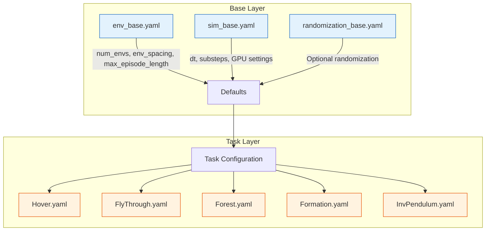

### 2.2 Configuration File Structure (配置文件结构)

```mermaid
graph LR
    subgraph YAML Structure
        NAME[1. name: TaskName]
        DEF[2. defaults:] --> EB2[/base/env_base/]
        DEF --> SB2[/base/sim_base/]
        
        ENV[3. env:] --> OVR[Overrides: num_envs, max_episode_length]
        DRONE[4. drone_model] --> MODEL[Firefly/Hummingbird]
        REWARD[5. Reward Shaping] --> RW1[reward_effort_weight]
        REWARD --> RW2[reward_distance_scale]
        REWARD --> RW3[reward_action_smoothness_weight]
        
        ACTION[6. action_transform] --> AT1[null: raw motor]
        ACTION --> AT2[velocity: high-level]
        
        TASKSPEC[7. Task-Specific Params] --> TS1[gate_moving_range]
        TASKSPEC --> TS2[lidar_range, lidar_vfov]
        TASKSPEC --> TS3[safe_distance, formation]
    end
    
    classDef section fill:#f5f5f5,stroke:#616161;
    class NAME,DEF,ENV,DRONE,REWARD,ACTION,TASKSPEC section;
```

---

## 3. Common Configuration Parameters (通用配置参数)

### 3.1 Parameter Categories (参数分类)

| Category           | Parameters                                                   | Description                                     |
| ------------------ | ------------------------------------------------------------ | ----------------------------------------------- |
| **Environment**    | `env.num_envs`, `env.max_episode_length`                     | 并行环境数量、单集最大步数                      |
| **Drone Config**   | `drone_model`, `force_sensor`, `time_encoding`               | 无人机型号、力传感器、时间编码                  |
| **Reward Shaping** | `reward_effort_weight`, `reward_distance_scale`, `reward_action_smoothness_weight`, `reward_motion_smoothness_weight` | 控制努力惩罚、距离奖励缩放、动作/运动平滑度惩罚 |
| **Action Control** | `action_transform`, `reset_on_collision`                     | 动作变换模式、碰撞后是否重置                    |
| **Task-Specific**  | `lidar_range`, `safe_distance`, `gate_moving_range`          | 任务专属参数                                    |

### 3.2 Environment Parameters (环境参数)

```mermaid
table
    title Environment Parameters
    Parameter --> Type --> Description --> Example Values
    env.num_envs --> int --> Number of parallel simulation environments --> 256, 1024, 2048, 4096
    env.max_episode_length --> int --> Maximum timesteps per episode --> 500 (default), 600, 800
```

### 3.3 Drone Configuration Parameters (无人机配置参数)

| Parameter       | Type    | Description                              | Example Values           |
| --------------- | ------- | ---------------------------------------- | ------------------------ |
| `drone_model`   | string  | Drone model to simulate                  | `Firefly`, `Hummingbird` |
| `force_sensor`  | boolean | Enable force/torque sensor readings      | `false` (typical)        |
| `time_encoding` | boolean | Include time information in observations | `true` (typical)         |

### 3.4 Reward Shaping Parameters (奖励塑造参数)

| Parameter                         | Type  | Description                               | Purpose                            | Typical Value    |
| --------------------------------- | ----- | ----------------------------------------- | ---------------------------------- | ---------------- |
| `reward_effort_weight`            | float | Weight for control effort penalty         | Encourages energy efficiency       | `0.1`            |
| `reward_distance_scale`           | float | Scaling factor for distance-based rewards | Amplifies position tracking reward | `1.0-1.2`        |
| `reward_action_smoothness_weight` | float | Weight for action smoothness penalty      | Encourages smooth control          | `0.0` (disabled) |
| `reward_motion_smoothness_weight` | float | Weight for motion smoothness penalty      | Penalizes jerky movements          | `0.0` (disabled) |

### 3.5 Action Transformation (动作变换)

| Value      | Description                      | Use Case                                                   |
| ---------- | -------------------------------- | ---------------------------------------------------------- |
| `null`     | Direct motor control commands    | Low-level control tasks (e.g., Hover, FlyThrough)          |
| `velocity` | Velocity-based control interface | Navigation tasks requiring smoother control (e.g., Forest) |

---

## 4. Task Categories (任务类别)

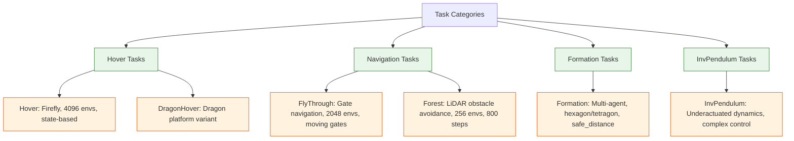

### 4.1 Hover Tasks (悬停任务)

- **目标**：单智能体位置稳定
- **特点**：高并行度 (4096 envs)、简单动力学、快速训练
- **配置示例** (`Hover.yaml`)：

```yaml
name: Hover
defaults:
  - /base/env_base@_here_
  - /base/sim_base@_here_
env:
  num_envs: 4096
drone_model: Firefly
force_sensor: false
time_encoding: true
reward_effort_weight: 0.1
reward_action_smoothness_weight: 0.0
reward_motion_smoothness_weight: 0.0
reward_distance_scale: 1.2
action_transform: null
```

### 4.2 Navigation Tasks (导航任务)

详见 [Navigation Tasks] 文档，核心参数对比：

| Aspect                 | FlyThrough                       | Forest                        |
| ---------------------- | -------------------------------- | ----------------------------- |
| **Primary Challenge**  | Gate navigation with precision   | Obstacle avoidance in clutter |
| **Environments**       | 2048                             | 256                           |
| **Episode Length**     | 500 (default)                    | 800                           |
| **Sensors**            | State-based only                 | LiDAR + state                 |
| **Action Interface**   | `null` (raw motor)               | `velocity` (high-level)       |
| **Time Encoding**      | default `false`                  | `true`                        |
| **Collision Behavior** | `reset_on_collision: false`      | default behavior              |
| **Moving Objects**     | Gates (`gate_moving_range: 1.0`) | Static trees                  |

---

## 5. Configuration Loading and Override (配置加载与覆盖)

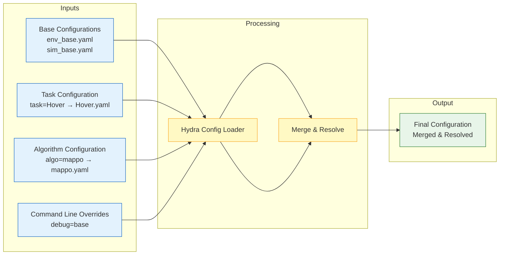

**训练命令示例**：

```bash
cd isaac-training/training
python scripts/train.py task=Hover algo=mappo debug=base
```

**执行流程**：

1. Hydra 加载 `cfg/task/Hover.yaml`
2. 加载 `cfg/algo/mappo.yaml`
3. 合并基础配置 (`env_base.yaml`, `sim_base.yaml`)
4. 应用命令行覆盖参数
5. 输出最终解析配置并启动训练

---

## 6. Environment Scaling Considerations (环境规模考量)

不同任务因计算复杂度和样本效率需求，需要不同数量的并行环境：

| Task Category   | Typical `num_envs` | Reasoning                                        |
| --------------- | ------------------ | ------------------------------------------------ |
| **Hover tasks** | 4096               | Simple dynamics, maximize parallel throughput    |
| **FlyThrough**  | 2048               | Moderate complexity with dynamic gates           |
| **Formation**   | 1024               | Multi-agent coordination overhead                |
| **Forest**      | 256                | LiDAR sensor computation and collision detection |

**影响因素**：

- GPU 内存占用
- 训练吞吐量 (samples/second)
- 经验多样性
- 收敛速度

---

## 7. Task-Algorithm Compatibility (任务-算法兼容性)

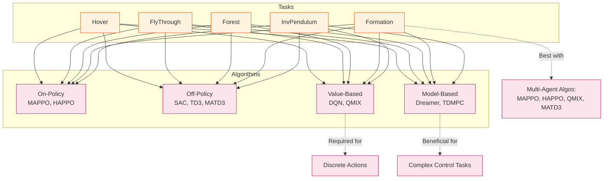

**实用建议**：

- 多智能体任务 (Formation) → 优先选择多智能体算法 (MAPPO, HAPPO, QMIX, MATD3)
- 离散动作空间 → 必须使用值基算法 (DQN, QMIX)
- 复杂控制任务 → 可考虑模型基方法 (Dreamer, TDMPC) 提升规划能力
- 高计算成本仿真 (如 Forest+LiDAR) → Off-policy 算法 (SAC, TD3) 提升样本效率

# Hover Tasks (悬停任务)

## 1. Purpose and Scope (目的与范围)

悬停任务是 NavRL/OmniDrones 框架中的基础控制基准任务，旨在训练智能体在无外部干扰或有限随机化条件下维持稳定的空中位置与航向。这些任务作为强化学习训练流程的"健全性检查"（sanity check），用于验证：

- 策略网络的基本学习能力
- 奖励函数的合理性
- 仿真环境的稳定性
- 算法实现的正确性

**任务变体**：

| Task          | Description                | Use Case                         |
| ------------- | -------------------------- | -------------------------------- |
| `Hover`       | 标准悬停任务，固定目标位置 | 基础算法验证、超参数调优         |
| `HoverRand`   | 带域随机化的悬停任务       | 提升策略鲁棒性、模拟真实扰动     |
| `DragonHover` | 基于 Dragon 平台的悬停任务 | 测试不同无人机动力学模型的适应性 |

---

## 2. Task Hierarchy (任务层级)

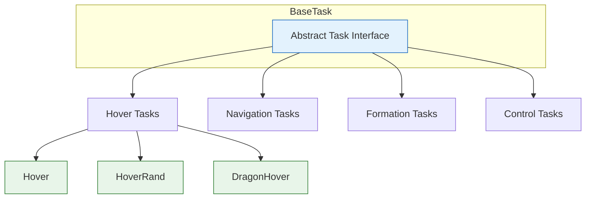

---

## 3. Observation Space (观测空间)

悬停任务的观测向量由以下组件构成：

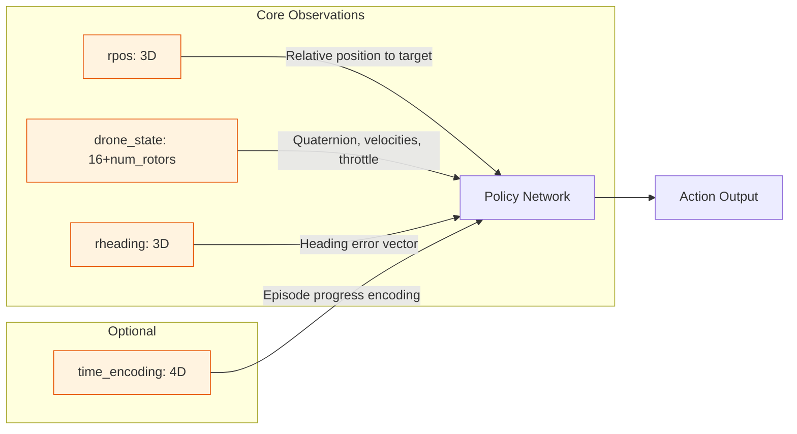

### 3.1 Observation Components Detail

| Component                    | Dimension       | Description                                                  |
| ---------------------------- | --------------- | ------------------------------------------------------------ |
| `rpos`                       | 3               | 无人机当前位置与目标悬停位置的相对偏移 (x, y, z)             |
| `drone_state`                | 16+`num_rotors` | 无人机本体状态：<br>• 姿态四元数 (4)<br>• 线速度 (3)<br>• 角速度 (3)<br>• 航向向量 (3)<br>• 朝上向量 (3)<br>• 当前油门值 (`num_rotors`) |
| `rheading`                   | 3               | 参考航向与当前航向的差异向量                                 |
| `time_encoding` *(optional)* | 4               | 使用正弦/余弦编码的当前时间步进度，帮助策略感知时序          |

---

## 4. Reward Function (奖励函数)

### 4.1 Reward Components

总奖励由多个子奖励项加权组合而成：

```mermaid
flowchart TB
    subgraph Primary Rewards
        POS[pos: position error] -->|exp(-a*‖error‖)| TR
        HEAD[heading_alignment: heading error] -->|cosine similarity| TR
    end
    
    subgraph Stability Penalties
        UP[up: uprightness] -->|discourage tilting| TR
        SPIN[spin: angular velocity] -->|discourage spinning| TR
    end
    
    subgraph Efficiency Terms
        EFF[effort: control effort] -->|penalize high throttle| TR
        SMOOTH[action_smoothness: action delta] -->|encourage smooth control| TR
    end
    
    TR[Total Reward] --> OUT[Scalar Reward Signal]
    
    formula["r = r_pos + r_pos*(r_up + r_spin) + r_effort + r_action_smoothness"]
    
    classDef reward fill:#f3e5f5,stroke:#6a1b9a;
    class POS,HEAD,UP,SPIN,EFF,SMOOT,TR reward;
```

### 4.2 Reward Formulas

| Reward Term | Formula                          | Purpose          | Typical Weight                                    |
| ----------- | -------------------------------- | ---------------- | ------------------------------------------------- |
| `r_pos`     | `exp(-α * ‖p_drone - p_target‖)` | 鼓励接近目标位置 | `reward_distance_scale: 1.2`                      |
| `r_heading` | `cos(θ_ref - θ_current)`         | 保持目标航向对齐 | 隐含在 `r_pos` 乘积项中                           |
| `r_up`      | `dot(up_vector, [0,0,1])`        | 抑制大幅倾斜     | 与 `r_pos` 相乘放大位置奖励                       |
| `r_spin`    | `-‖ω‖` (角速度范数)              | 抑制自旋振荡     | 与 `r_pos` 相乘，位置好时更关注稳定               |
| `r_effort`  | `-‖throttle‖²`                   | 优化能量消耗     | `reward_effort_weight: 0.1`                       |
| `r_smooth`  | `-‖a_t - a_{t-1}‖`               | 鼓励平滑控制     | `reward_action_smoothness_weight: 0.0` (默认关闭) |

> **设计说明**：`r_pos * (r_up + r_spin)` 的乘积结构确保只有在位置接近目标时，姿态稳定性奖励才生效，避免策略"躺平"获得稳定奖励。

---

## 5. Episode Termination (回合终止条件)

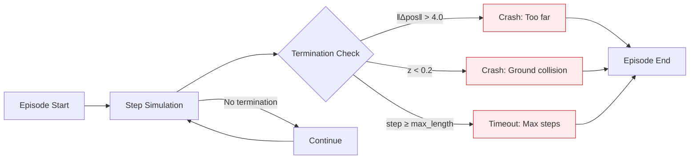

**终止阈值**：

- 位置漂移：`‖p_drone - p_target‖ > 4.0` 米
- 高度过低：`z_world < 0.2` 米（避免地面碰撞）
- 最大步数：`max_episode_length`（默认 500 步，对应 5 秒 @100Hz）

---

## 6. Configuration Parameters (配置参数)

### 6.1 Hover.yaml 核心参数

| Parameter                         | Type     | Default                | Description                                    |
| --------------------------------- | -------- | ---------------------- | ---------------------------------------------- |
| `name`                            | str      | `"Hover"`              | 任务标识符                                     |
| `defaults`                        | list     | `[env_base, sim_base]` | 继承的基础配置                                 |
| `env.num_envs`                    | int      | `4096`                 | 并行环境数量（悬停任务计算轻量，可大规模并行） |
| `env.max_episode_length`          | int      | `500`                  | 单集最大步数                                   |
| `drone_model`                     | str      | `"Firefly"`            | 无人机型号：`Firefly` / `Hummingbird`          |
| `force_sensor`                    | bool     | `false`                | 是否启用力/力矩传感器观测                      |
| `time_encoding`                   | bool     | `true`                 | 是否在观测中包含时间编码                       |
| `has_payload`                     | bool     | `false`                | 是否挂载负载（用于扩展任务）                   |
| `reward_distance_scale`           | float    | `1.2`                  | 位置奖励的缩放因子，放大近距离奖励信号         |
| `reward_effort_weight`            | float    | `0.1`                  | 控制努力惩罚的权重                             |
| `reward_action_smoothness_weight` | float    | `0.0`                  | 动作平滑度惩罚权重（默认关闭）                 |
| `reward_motion_smoothness_weight` | float    | `0.0`                  | 运动平滑度惩罚权重（默认关闭）                 |
| `action_transform`                | str/null | `null`                 | 动作变换：`null`=原始电机指令                  |

### 6.2 HoverRand 扩展参数

```yaml
# HoverRand.yaml 在 Hover.yaml 基础上添加：
randomization:
  drone_mass: {min: 0.9, max: 1.1}      # 质量随机化 ±10%
  motor_constant: {min: 0.95, max: 1.05} # 电机增益随机化
  wind_disturbance: {enabled: true, max_force: 0.5} # 模拟风扰
```

### 6.3 DragonHover 平台参数

```yaml
# DragonHover.yaml 关键差异：
drone_model: "Dragon"                    # 使用 Dragon 平台动力学
env.num_envs: 2048                       # 复杂动力学降低并行度
reward_distance_scale: 1.0               # 调整奖励缩放适应新平台
```

---

## 7. Task Dynamics (任务动态流程)

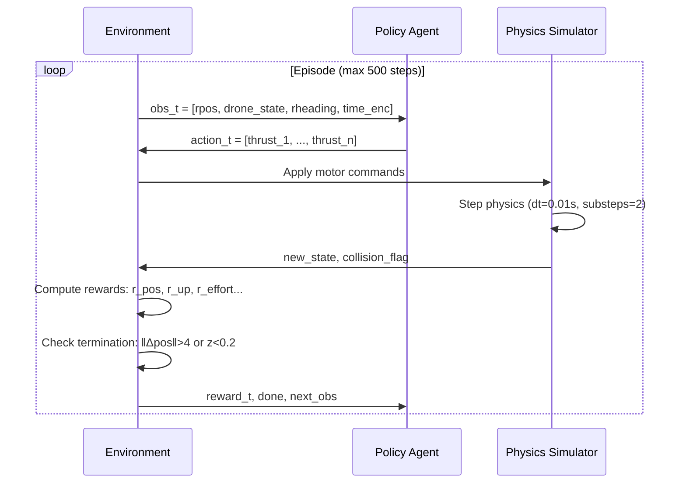

**关键设计决策**：

1. **高并行度**：4096 个并行环境充分利用现代 GPU，加速 On-policy 算法收敛
2. **原始动作空间**：`action_transform: null` 要求策略同时学习底层稳定与高层导航
3. **乘积型奖励结构**：`r_pos * (r_up + r_spin)` 确保位置与姿态奖励的协同优化
4. **时间编码可选**：`time_encoding: true` 帮助策略学习时序依赖行为（如渐进逼近）

---

## 8. Training Examples (训练示例)

### 8.1 基础训练命令

```bash
cd isaac-training/training

# 训练标准 Hover 任务 (MAPPO)
python scripts/train.py task=Hover algo=mappo total_frames=50_000_000

# 训练带随机化的 HoverRand (SAC)
python scripts/train.py task=HoverRand algo=sac total_frames=30_000_000

# 使用 Dragon 平台训练
python scripts/train.py task=DragonHover algo=td3 drone_model=Dragon
```

### 8.2 超参数覆盖示例

```bash
# 调整奖励权重
python scripts/train.py task=Hover \
  task.reward_effort_weight=0.2 \
  task.reward_distance_scale=1.5

# 启用动作平滑度惩罚
python scripts/train.py task=Hover \
  task.reward_action_smoothness_weight=0.05

# 关闭时间编码（测试时序无关策略）
python scripts/train.py task=Hover \
  task.time_encoding=false
```

### 8.3 调试与可视化

```bash
# 启用 headless 模式 + 日志记录
python scripts/train.py task=Hover algo=mappo \
  headless=true \
  debug=base \
  log_dir=logs/hover_mappo_test

# 实时 TensorBoard 监控
tensorboard --logdir logs/hover_mappo_test
```

---

## 9. Algorithm Compatibility (算法兼容性)

```mermaid
graph TD
    HT[Hover Tasks] --> OP[On-Policy]
    HT --> OFF[Off-Policy]
    HT --> VB[Value-Based]
    HT --> MB[Model-Based]
    
    OP -->|MAPPO, HAPPO| REC1[✅ 推荐: 高并行度匹配]
    OFF -->|SAC, TD3| REC2[✅ 推荐: 样本效率高]
    VB -->|DQN| REC3[⚠️ 需离散化动作空间]
    MB -->|Dreamer, TDMPC| REC4[🔬 实验: 模型学习动力学]
    
    classDef rec fill:#e8f5e9,stroke:#2e7d32;
    class REC1,REC2 rec;
    class REC3 fill:#fff9c4,stroke:#f9a825;
    class REC4 fill:#fce4ec,stroke:#c2185b;
```

**推荐搭配**：

- **MAPPO**: 4096 并行环境 + On-policy 稳定性 → 快速收敛基准
- **SAC/TD3**: Off-policy 样本效率 + 连续动作 → 适合资源受限场景
- **DQN**: 仅当使用离散动作变换时适用（需额外配置）
- **Dreamer**: 研究场景，学习隐式动力学模型用于规划

---

## 10. Task Comparison: Hover Variants (悬停任务变体对比)

| Aspect            | Hover                   | HoverRand                                | DragonHover                        |
| ----------------- | ----------------------- | ---------------------------------------- | ---------------------------------- |
| **Primary Goal**  | Stable position holding | Robust stabilization under perturbations | Cross-platform dynamics adaptation |
| **Randomization** | None                    | Mass, motor, wind disturbances           | Platform-specific dynamics         |
| **Environments**  | 4096                    | 4096                                     | 2048                               |
| **Drone Model**   | Firefly (default)       | Firefly                                  | Dragon                             |
| **Difficulty**    | ★☆☆ (Baseline)          | ★★☆ (Moderate)                           | ★★☆ (Platform shift)               |
| **Use Case**      | Algorithm sanity check  | Robust policy training                   | Dynamics generalization test       |

---

## 11. Common Pitfalls & Solutions (常见问题与解决方案)

| Issue                       | Symptom                                     | Solution                                                     |
| --------------------------- | ------------------------------------------- | ------------------------------------------------------------ |
| **Policy divergence**       | Reward oscillates, drone crashes frequently | Reduce learning rate; increase `reward_effort_weight`        |
| **Over-stabilization**      | Drone hovers but never reaches target       | Increase `reward_distance_scale`; check target position initialization |
| **Simulation lag**          | Low FPS with 4096 envs                      | Reduce `num_envs` to 2048; enable GPU physics batching       |
| **Action saturation**       | Thrust commands hit limits constantly       | Verify `action_transform` is `null`; check motor constant calibration |
| **Time encoding confusion** | Policy ignores temporal patterns            | Ensure `time_encoding: true`; verify encoding range [0,1]    |


# Navigation Tasks (导航任务)

## 1. Purpose and Scope (目的与范围)

本页面记录了 NavRL 中 OmniDrones 框架可用的导航任务。导航任务的特点是要求智能体在受限空间中移动并避开障碍物。这些任务包括：

- **FlyThrough**：门框导航（Gate navigation）
- **Forest**：基于 LiDAR 的障碍物规避（Obstacle avoidance with LiDAR）

---

## 2. Overview (概述)

NavRL 中的导航任务挑战智能体在具有空间约束的环境中移动，需要复杂的感知、规划和控制能力。这些任务旨在训练可部署到真实世界导航场景的策略，其中避碰至关重要。

---

## 3. Navigation Task Hierarchy (任务层级与继承关系)

导航任务从基础配置文件中继承核心参数，并根据自身需求覆盖特定设置。

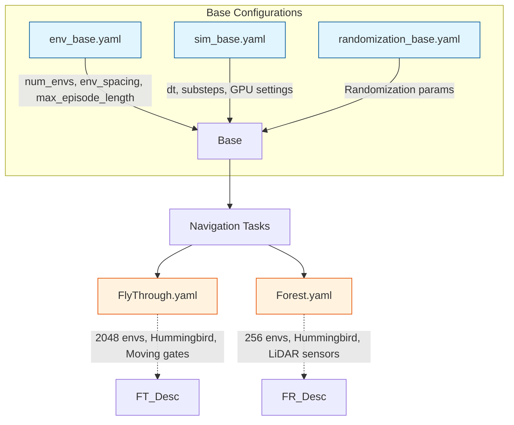

> **注意**：由于 LiDAR 仿真的计算成本较高，Forest 任务使用的并行环境数量较少（256 vs 2048）。

---

## 4. FlyThrough Task

### 4.1 Configuration Parameters

任务定义于 `cfg/task/FlyThrough.yaml`：

| Parameter               | Value           | Description                   |
| ----------------------- | --------------- | ----------------------------- |
| `name`                  | `"FlyThrough"`  | 任务标识符                    |
| `env.num_envs`          | `2048`          | 并行环境数量（覆盖基础配置）  |
| `drone_model`           | `"Hummingbird"` | 具有相应动力学的无人机平台    |
| `force_sensor`          | `false`         | 无需力觉传感                  |
| `reward_effort_weight`  | `0.1`           | 控制努力的惩罚系数            |
| `reward_distance_scale` | `1.0`           | 到门框距离的奖励缩放因子      |
| `visual_obs`            | `false`         | 使用基于状态的观测            |
| `gate_moving_range`     | `1.0`           | 门框运动范围                  |
| `gate_scale`            | `1.1`           | 门框尺寸缩放因子              |
| `reset_on_collision`    | `false`         | 碰撞后 episode 继续（不重置） |
| `action_transform`      | `null`          | 无动作变换（原始电机指令）    |

### 4.2 Task Dynamics (任务动态)

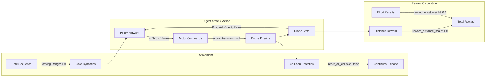

**机制说明**：奖励函数平衡了朝向门框的进度（由 `reward_distance_scale` 缩放）与控制努力惩罚（由 `reward_effort_weight` 缩放）。`reset_on_collision: false` 的设置允许智能体学习从碰撞中恢复的行为，而不是将其视为终端失败。

### 4.3 Key Design Decisions (关键设计决策)

1. **高并行化**：2048 个并行环境使得在任务复杂的情况下仍能高效进行 On-policy 学习。
2. **无动作变换**：设置 `action_transform: null` 提供直接的电机控制，要求策略同时学习底层稳定与导航。
3. **移动门框**：`gate_moving_range: 1.0` 增加了动态性，防止智能体学习固定的轨迹。
4. **非终端碰撞**：`reset_on_collision: false` 鼓励学习具备容错与恢复能力的鲁棒策略。

---

## 5. Forest Task

### 5.1 Configuration Parameters

任务定义于 `cfg/task/Forest.yaml`：

| Parameter                | Value           | Description                           |
| ------------------------ | --------------- | ------------------------------------- |
| `name`                   | `"Forest"`      | 任务标识符                            |
| `env.max_episode_length` | `800`           | 扩展的 episode 长度（覆盖默认的 500） |
| `env.num_envs`           | `256`           | 由于 LiDAR 计算成本，环境数量较少     |
| `drone_model`            | `"Hummingbird"` | 与 FlyThrough 相同的平台              |
| `force_sensor`           | `false`         | 无需力觉传感                          |
| `time_encoding`          | `true`          | 为策略提供时间上下文                  |
| `lidar_range`            | `4.0`           | 最大 LiDAR 探测范围（米）             |
| `lidar_vfov`             | `[-10., 20.]`   | 垂直视场角（度）                      |
| `action_transform`       | `"velocity"`    | 高层速度指令                          |
| `reward_effort_weight`   | `0.2`           | 控制努力惩罚                          |

### 5.2 Sensor Configuration & Control Architecture

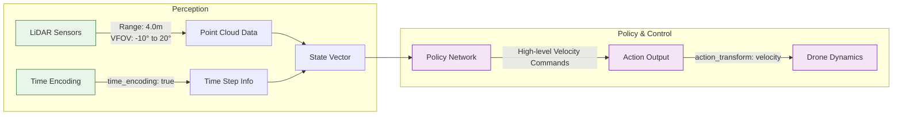

**说明**：Forest 任务使用 LiDAR 在 4 米范围内检测障碍物，垂直视场角为 -10° 至 +20°（非对称设计，更关注前方和上方的障碍物）。时间编码帮助策略理解 episode 进度，对在 800 步限制内到达目标至关重要。

### 5.3 Key Design Decisions (关键设计决策)

1. **速度级控制**：`action_transform: "velocity"` 提供高层控制接口，使策略专注于导航而非底层稳定。
2. **扩展 Episodes**：800 步长度适应穿越障碍物所需的更长路径。
3. **降低并行度**：仅使用 256 个环境，以平衡 LiDAR 仿真的计算开销。
4. **时间编码**：`time_encoding: true` 提供时间感知，辅助学习依赖时间的行为。
5. **LiDAR 配置**：垂直 FOV 不对称设计，针对前向导航中最相关的障碍物区域进行优化。

---

## 6. Task Comparison (任务对比)

| Aspect                   | FlyThrough                  | Forest                  |
| ------------------------ | --------------------------- | ----------------------- |
| **Primary Challenge**    | 精确门框导航                | 杂乱环境中的障碍物规避  |
| **Environments**         | 2048                        | 256                     |
| **Episode Length**       | 500 (默认)                  | 800                     |
| **Sensors**              | 仅基于状态 (State-based)    | LiDAR + 状态            |
| **Action Interface**     | 原始电机指令 (`null`)       | 速度指令 (`"velocity"`) |
| **Visual Observations**  | `false`                     | 未指定 (默认 `false`)   |
| **Time Encoding**        | 未指定 (默认 `false`)       | `true`                  |
| **Collision Behavior**   | `reset_on_collision: false` | 未指定 (默认行为)       |
| **Domain Randomization** | 已注释掉                    | 未指定                  |
| **Moving Objects**       | 门框 (range: 1.0)           | 静态树木                |

---

## 7. Algorithmic Compatibility (算法兼容性)

两种导航任务均兼容所有算法类别。选择取决于具体需求：

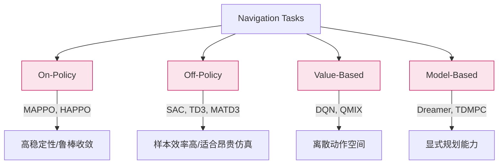

**推荐搭配**：

- **FlyThrough**: `MAPPO`, `SAC`, `TD3`（On-policy 保障 2048 环境下的稳定性；Off-policy 用于精确控制）
- **Forest**: `SAC`, `TD3`, `Dreamer`（Off-policy 提升昂贵 LiDAR 仿真的样本效率；Model-based 用于复杂路径规划）

---

## 8. Configuration Inheritance (配置继承关系)

### 8.1 FlyThrough Inheritance Chain

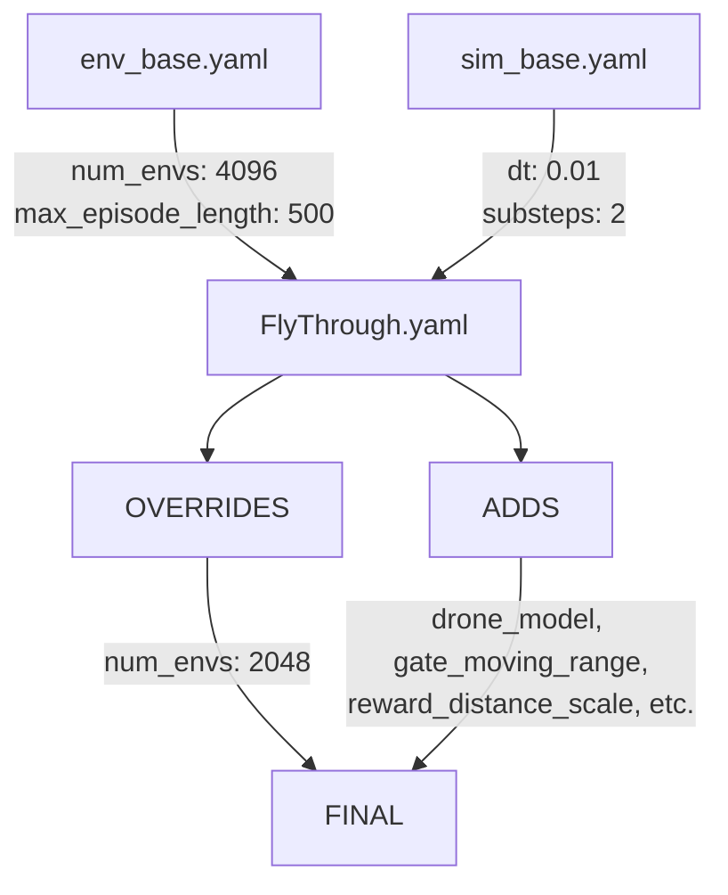

### 8.2 Forest Configuration Composition

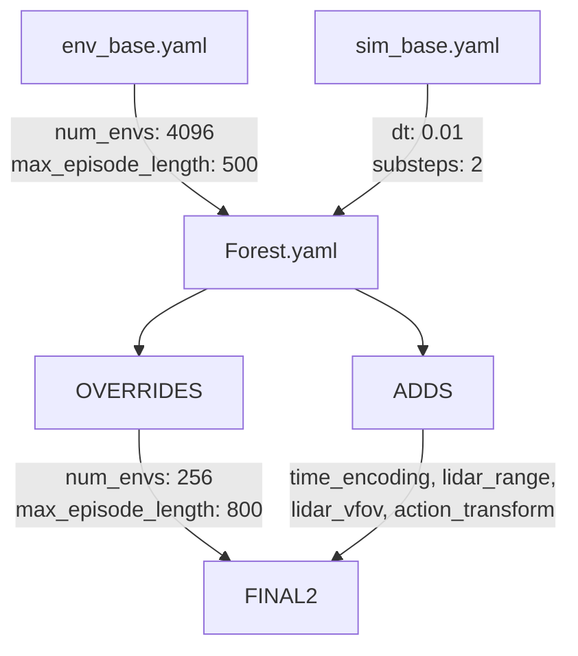

---

## 9. Usage Examples (使用示例)

### 训练 FlyThrough

```bash
cd isaac-training/training
python scripts/train.py task=FlyThrough algo=mappo
```

**执行流程**：

1. 加载 `cfg/task/FlyThrough.yaml`
2. 加载 `cfg/algo/mappo.yaml`
3. 与基础默认配置组合
4. 启动 2048 个并行环境的训练

**调试可视化**：

```bash
python scripts/train.py task=FlyThrough algo=mappo debug=base
```

### 训练 Forest

```bash
cd isaac-training/training
python scripts/train.py task=Forest algo=sac
```

**适用性说明**：Forest 任务非常适合 SAC 等 Off-policy 算法，原因在于：

- 复杂的传感器数据（LiDAR 点云）
- 昂贵仿真下的样本效率优势
- 连续速度型动作空间

**自定义 LiDAR 范围训练**：

```bash
python scripts/train.py task=Forest algo=sac task.lidar_range=6.0
```

（使用 Hydra 覆盖语法将探测范围从 4.0 米调整为 6.0 米）